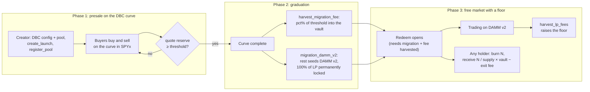
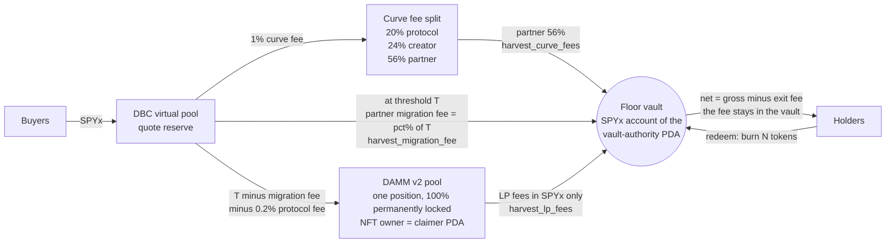
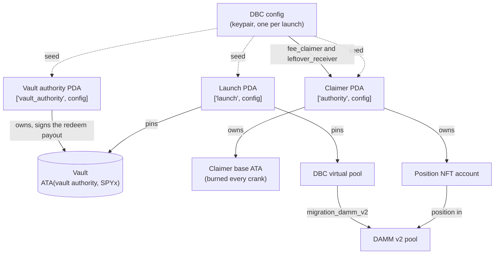

# StockFloor

**A token launchpad on Meteora DBC where every token gets a hard price floor backed by tokenized S&P 500.**

It works like pump.fun, but a large share of the money raised becomes a redeemable floor in SPYx the
moment the market opens. The token can go up without limit, and while the vault holds SPYx and the program is
unchanged, it cannot go to zero. (Those two conditions are real: see
[Who could still hurt the floor](#who-could-still-hurt-the-floor).)

> Everyone else builds a piggy bank that might become a floor someday. We ship the floor on day one.

> Launch mechanics for equity-like assets: the raise is locked in stocks, not burned on hype.

Built for the [Stocklana hackathon](https://hackathons.solana.com/hackathons/stocklana): the Solana
Foundation main track and the Meteora **Best Use of DBC** bounty.

**Nothing is on mainnet yet.** Deploying costs real money that only the project owner can release, and that
approval has not come. So this table says what exists today and where the evidence for it is, instead of promising
what is coming. Every row below is reproducible from this repository.

| | |
|---|---|
| **Status** | The full lifecycle runs on a mainnet fork (real DBC, DAMM v2 and Token-2022 binaries, the real SPYx mint and its DBC token badge) and end to end on a **local Surfpool fork of live mainnet**, driven by the CLI and by the web app. 571 tests pass (`pnpm test`, 2026-09-16), and they also pass from a fresh clone with no `keys/` (97 s). |
| **Program** | `stockfloor` `98NLryxegA9KLsED1TkSQdF2MDt6X8C7B1PmepJN6HpA` (Anchor 1.0.2). **Not deployed to mainnet.** The identical `solana program deploy` (481 transactions, 2.5740 SOL) ran on a local Surfpool fork of live mainnet on 2026-09-16, and `solana program dump` + `cmp` confirmed the deployed ELF byte for byte: [`scripts/e2e/reports/20260916T000744Z.md`](scripts/e2e/reports/20260916T000744Z.md) |
| **Demo launch** | **No mainnet launch yet.** The identical $50 launch ran on a **local Surfpool fork of live mainnet** on 2026-09-16: create, two curve buys, the PartialFill buy that completes the curve, the 5-transaction graduation crank, a DAMM v2 buy and sell, an LP-fee harvest, two redemptions. 495 mainnet-equivalent transactions, no failures, every CLI quote exact to the raw unit, final phase `redeemable` with the on-chain `floor` view equal to the decoded state. Report: [`scripts/e2e/reports/20260916T000744Z.md`](scripts/e2e/reports/20260916T000744Z.md) |
| **Mainnet run (C2)** | Blocked on the owner: approval plus 5.19 SOL and 0.0806 SPYx (≈ $61) to the five repo wallets. The whole sequence is one gated command with a read-only go/no-go preflight: [`docs/c2-runbook.md`](docs/c2-runbook.md) |
| **Live app** | **Not hosted yet.** `pnpm --filter @stockfloor/app dev` runs it on example data with no cluster, and [Run locally](#run-locally) points it at a local mainnet fork with real transactions. |
| **Video** | **Not recorded yet.** Shot list: [`docs/demo-script.md`](docs/demo-script.md) |
| **Audit** | None. This is unaudited hackathon code. |
| **Eligibility** | Not for US persons. See [Eligibility and disclaimers](#eligibility-and-disclaimers). |

### For the Meteora DBC bounty

The DBC configuration *is* the product here, not packaging around it:

1. **The partner migration fee is routed into an admin-less PDA vault** that any holder can redeem against, instead of
   being platform revenue — [Where the money goes](#where-the-money-goes).
2. **One dedicated config per launch**, whose `fee_claimer` and `leftover_receiver` are a **program PDA** that signs
   the DBC CPIs — proven on the fork and with a mainnet precedent — [Why Solana](#why-solana).
3. **An equity-like constant-liquidity curve quoted in a stock token** (SPYx), not a memecoin curve —
   [Phase 1](#phase-1-presale-on-the-dbc-bonding-curve).
4. **100% of migrated liquidity permanently locked in DAMM v2** with quote-only fee collection, so LP fees can only
   raise the floor — [Phase 2](#phase-2-graduation).
5. **`create_launch` enforces that whole shape on-chain**, so a `Launch` account is a fact, not a UI promise —
   [The DBC configuration is the product](#the-dbc-configuration-is-the-product).

## Contents

1. [The problem](#the-problem)
2. [Who pays for this](#who-pays-for-this)
3. [How it works](#how-it-works)
4. [Why Solana, why DBC](#why-solana-why-dbc)
5. [The floor math](#the-floor-math)
6. [On-chain architecture](#on-chain-architecture)
7. [Instructions](#instructions)
8. [Security model and risks](#security-model-and-risks)
9. [Parameters](#parameters)
10. [Testing](#testing)
11. [Run locally](#run-locally)
12. [Prior art and differentiation](#prior-art-and-differentiation)
13. [Open-source components](#open-source-components)
14. [Eligibility and disclaimers](#eligibility-and-disclaimers)
15. [Roadmap](#roadmap)
16. [Repository layout and docs](#repository-layout-and-docs)

---

## The problem

- **Buyers of a new token have no claim on the money they paid.** On a typical launchpad the raise becomes
  market liquidity and creator revenue. When attention moves on, nothing stops the price from going to zero.
- **Existing "floor" tokens start with an empty floor.** The designs we found fund their backing from
  trading taxes, creator fees or LP fees. The floor exists only after a lot of volume, which is exactly when
  buyers need it least. See [Prior art](#prior-art-and-differentiation).
- **Tokenized stocks on Solana need launch mechanics built for them.** We scanned mainnet for it, and the
  scan is in this repository so you can re-run it ([`scripts/research/stock-quoted-dbc-configs.ts`](scripts/research/stock-quoted-dbc-configs.ts)
  → [`docs/research/stock-quoted-dbc-configs.json`](docs/research/stock-quoted-dbc-configs.json), slot
  447,385,123 on 2026-09-16). Of **931 DBC configs that quote an xStock**, **871 (93.6%) set the migration
  fee to 0%** — the whole raise goes straight into the AMM — and **not one** of the 931 pays a migration fee
  to a program rather than to a wallet, which is the minimum a redemption vault would need. Meanwhile
  Solana's share of tokenized-equity volume
  [fell from about 71% to about 30% by late August 2026](https://cryptobriefing.com/solana-tokenized-equity-share-drops-memecoins/),
  and Meteora's bounty asks for DBC launch mechanics tuned for equity-like assets that outlast the
  meme-stock meta.

**StockFloor's answer:** a share of the raise (30–70%, default 50%) is locked in SPYx at graduation. Every
holder can redeem against it pro rata, at any time, forever. No admin can withdraw it.

**Who it is for.** Communities, creators and projects that want to raise from supporters without asking
them to accept a zero-or-moon bet. Buyers get a floor held in real stock exposure and can see their maximum
loss before they buy.

---

## Who pays for this

The money has to come from somewhere, and today it does not come from us or from the creator. Here is the
whole picture, because the arithmetic is small enough to check.

**What the creator earns.** 30% of the non-protocol curve trading fee. With the default 1% curve fee, DBC
takes 20% for itself and the creator takes 30% of the rest: **0.24% of curve volume**, paid in SPYx. The
creator gets no free tokens, no allocation and no share of the raise, and after graduation nothing at all —
DAMM v2 fees are collected in the quote asset only and the position belongs to a program PDA, so every
post-graduation fee goes to the vault.

On a $1,000 raise (the default threshold), with curve volume above the raise coming from buyers selling back
and rebuying before graduation:

| Curve volume | Creator (0.24%) | Vault from curve fees (0.56%) | Vault from the migration fee (50% of a $1,000 raise) |
|---:|---:|---:|---:|
| $1,000 (the raise, bought once) | $2.40 | $5.60 | $500 |
| $10,000 | $24 | $56 | $500 |
| $100,000 | $240 | $560 | $500 |

A bigger *raise* scales the migration fee with it: a $10,000 threshold puts $5,000 in the vault.

So on a default launch a creator earns about the price of a coffee. That is a deliberate trade — the same
fee that a normal launchpad pays out is what makes the floor real — but it is also the honest answer to "why
would a creator pick this": **for a raise you intend to keep working on, not for fee revenue.** A creator who
wants a fee-maximising launch should not use StockFloor.

**What StockFloor earns: nothing.** There is no protocol fee anywhere in the design. The whole partner share
of curve fees, the whole partner migration fee and all DAMM v2 LP fees go into the vault; the exit fee stays
in the vault too. That is not modesty, it is what makes the vault credible: there is no instruction that pays
anyone but a redeeming holder.

**So who funds it after the hackathon?** Two levers exist that do not touch the vault or weaken anything
`create_launch` enforces. Neither is implemented:

1. **A flat launch fee in SOL**, taken in the create transaction outside the DBC config. It never enters the
   curve, the vault or the floor arithmetic.
2. **A platform slice of the creator's 30%**, by making the DBC pool creator a splitter program that pays the
   human creator and the platform. `create_launch` already caps the creator trading share at 30%, so the
   guarantees are unchanged.

**And who runs the crank?** Harvests and migration are permissionless — the destinations are fixed by the
program, so anyone can pay for a crank and nobody can redirect it. In practice we run it: the repo's cranker
wallet is `FhaZVX91912MJTxoPDW3JtmbeDEuZdRjDQ9QfkaWohyC`, and the command is one line:

```bash
# every StockFloor launch, every 60 s; on mainnet the send guard also needs
# --allow-mainnet and STOCKFLOOR_ALLOW_MAINNET=1
bash packages/sdk/scripts/run.sh crank --keypair keys/cli-cranker.json --rpc "$RPC" --loop --interval 60
```

It is cheap to keep running because a pass with nothing due sends **no transaction at all** (`planCrank`
returns an empty plan, and dust is filtered out), so idle cranking costs RPC reads and nothing else. A pass
that finds work pays 7,000–35,000 lamports per transaction (measured per instruction in
[`docs/research/surfpool-e2e.md`](docs/research/surfpool-e2e.md) §8). We will run it for the demo and the
judging window once the mainnet launch exists; until then there is nothing on mainnet to crank, and we are not
claiming otherwise.

---

## How it works

Every token goes through three phases.

### Phase 1: presale on the DBC bonding curve

- The creator launches a token. The app builds a **dedicated Meteora DBC config** for the launch, creates the
  DBC pool (DBC mints the base token and revokes its mint authority), and registers the launch with the
  `stockfloor` program (`create_launch`, `register_pool`).
- Buyers buy from the curve and can sell back to it. The **quote asset is SPYx** by default. The UI accepts
  USDC or SOL and routes them to SPYx through Jupiter. Jupiter is mainnet-only, so on the local fork buyers pay
  SPYx directly.
- The curve is equity-like, not a memecoin curve. It has one constant-liquidity segment whose last price is
  1.2× the first (`gentle`) or 1.01× the first (`flat`).
- No floor and no AMM market exist yet. The partner share of curve trading fees already flows into the vault
  through `harvest_curve_fees`.

### Phase 2: graduation

When the curve's quote reserve reaches the migration threshold (default ≈ $1,000 in SPYx):

1. **The curve completes.** The final buy uses DBC `swap2` in PartialFill mode, because DBC 0.2.1 rejects an
   exact-in buy that crosses the migration price.
2. **The partner migration fee goes to the vault.** DBC computes it from the threshold `T` as
   `T − ceil(T × (100 − pct) / 100)`, with `pct` = 50 by default. Our program claims it with
   `harvest_migration_fee` (a PDA-signed CPI into DBC `withdraw_migration_fee`) straight into the vault.
3. **The rest of the raise migrates.** It moves, together with base tokens, into a **Meteora DAMM v2** pool
   (permissionless `migration_damm_v2`). DBC burns the unsold base tokens.
4. **The liquidity is locked for good.** 100% of the migrated liquidity is **permanently locked** in one
   position whose NFT is owned by our PDA. Nobody can ever remove it. Only its fees can be claimed, and they go
   to the vault.

### Phase 3: free market with a floor

- The token trades freely on DAMM v2, and its price is set by supply and demand.
- **Any holder can redeem at any time.** Burn `N` tokens and receive `N / supply × vault` in SPYx, minus a
  **2% exit fee** that stays in the vault. Redemption is permissionless. The program has no pause, no admin
  and no withdraw instruction.
- **Arbitrage defends the floor, about 3% below it.** A buy on DAMM v2 pays the 1% pool fee out of the quote
  it sends in (fees are quote-only), and redeeming keeps the 2% exit fee, so buying-and-redeeming pays
  whenever the market price is below `floor × (1 − 0.02) × (1 − 0.01) ≈ 0.970 × floor`, before price impact
  and transaction costs. **The effective hard bid is therefore about 97% of the floor, not the floor itself**
  — we would rather name that discount than let a reader find it.
- **The floor never decreases through the program.** It rises from LP fees, curve fees, retained exit fees,
  burned base tokens and donations. SPYx dividends raise its USD value through the Token-2022 ScaledUiAmount
  multiplier.

### Lifecycle



### Where the money goes



### One launch with real numbers (mainnet fork)

These numbers come from `tests/integration/c1-lifecycle.test.ts`, a $1,000 SPYx launch using the default
`gentle` preset, 50% vault share and 2% exit fee (details in [`docs/research/c1-evidence.md`](docs/research/c1-evidence.md)).
SPYx has 8 decimals, the base token 6. Every amount is asserted to the raw unit against a value computed
without the `stockfloor` program.

| Step | Vault (raw SPYx) | Evidence |
|---|---|---|
| Threshold $1,000 at $757.02 × multiplier 1.0057146 | — | `T` = 131,346,320 raw (1.3134632 SPYx) |
| Curve trading fees harvested (4 buys, 2 sells) | +481,750 | = DBC `partner_quote_fee` |
| Curve completes (PartialFill buy), migration to DAMM v2 | unchanged | DAMM v2 receives 65,541,814 = 65,673,160 − 0.2% protocol fee |
| `harvest_migration_fee` | **+65,673,160** | = `T − ceil(T × 50 / 100)`, the SDK preview |
| Curve fees of the completing buy | +490,326 | |
| `harvest_surplus` | +0 | surplus is 1 raw: rounding dust in DBC 0.2.1 |
| `burn_claimer_base` burns a base-token donation to the claimer | unchanged | supply falls by 7,074,133,429,318 raw |
| 4 DAMM v2 swaps, then `harvest_lp_fees` | +681,460 | from DAMM v2 position state |
| Vault before redemptions | **67,326,696** | supply 992,925,866,570,678 raw |
| 4 holders redeem | −18,231,206 paid out | 372,067 in exit fees stays in the vault |

In USD, the floor per token rose from about $5.04e-7 right after the migration fee harvest to about $5.20e-7
at the end of the run, while four holders redeemed.

---

## Why Solana, why DBC

### The DBC configuration is the product

StockFloor turns the DBC **partner migration fee** into buyer protection. Normally that fee is platform
revenue. Here it goes into an admin-less PDA vault that anyone can redeem against. Every launch gets its own
DBC config.

| DBC setting | StockFloor value | Why | Enforced by |
|---|---|---|---|
| Quote mint | **SPYx** (Token-2022, 8 decimals). UI allowlist: SPYx, QQQx, GLDx, NVDAx, AAPLx, MSFTx, GOOGLx, TSLAx | Floor held in an index tracker | UI allowlist. On-chain the vault mint must equal the config's quote mint |
| DBC token badge | `["token_badge", SPYx]` = `D2THzeQLHaDeKBzzmTNuWEWw23WPM8vVhLvUmSPEpNeL`, remaining account 0 of `create_config` and pool init | DBC 0.2.1 requires a badge for Token-2022 quote mints with extensions (SPYx: Pausable, PermanentDelegate, ScaledUiAmount, TransferHook, …) | DBC |
| `fee_claimer`, `leftover_receiver` | **our claimer PDA** `["authority", config]` | Partner fees and the migration fee can only go to the program | `create_launch` |
| `migration_fee_percentage` | **50** (UI 30–70) | The vault share of the raise | `create_launch`: 30–99 (DBC max 99) |
| `creator_migration_fee_percentage` | **0** | The whole migration fee goes to the vault | `create_launch` |
| Liquidity distribution | **100% partner permanently locked**, all other buckets 0, no vesting | LP can never be pulled; the position NFT belongs to our PDA | `create_launch` |
| `collect_fee_mode` (curve) | **QuoteToken** | Curve fees accrue in SPYx and go straight to the vault | `create_launch` |
| Curve fee | **1%** constant fee scheduler | | `create_launch`: fee scheduler with cliff fee ≤ 20%, no dynamic fee; DBC: ≥ 0.25% |
| `creator_trading_fee_percentage` | **30** | Creator revenue, capped so a config cannot divert the vault's share | `create_launch`: ≤ 30 |
| Migration | **DAMM v2**, Customizable option (config `A8gMrEPJkacWkcb3DGwtJwTe16HktSEfvwtuDh2MCtck`), 1% pool fee, no dynamic fee | Flat, predictable post-graduation fee | `create_launch`: migration option DAMM v2 |
| `migrated_collect_fee_mode` | **QuoteToken** (DAMM v2 `OnlyB`) | LP fees are SPYx only and never produce base tokens | `create_launch` |
| Supply | **Dynamic**. Base token SPL, 6 decimals, ≈ 1B tokens at graduation | DBC burns unsold inventory at migration, so `mint.supply` is the true denominator | `create_launch` rejects fixed supply |
| Token metadata | **Immutable** | | `create_launch` |
| Pool creation fee, locked vesting | **0 / none** | Free allocations would drain buyers' money from the vault | `create_launch` |
| Migration threshold | **≈ $1,000** by default (the create form offers $50 / $100 / $1,000 / $10,000 and a custom amount), converted at launch from Jupiter `usdPrice` and the ScaledUiAmount multiplier | Small raises are viable. Meteora keepers reportedly auto-migrate stock-quoted pools from about $750 (off-chain policy, not verified); `migration_damm_v2` is permissionless, so our crank can migrate too | SDK/UI (≥ $1); `create_launch` rejects a threshold so small that the partner migration fee rounds to 0 (`MigrationQuoteThresholdTooSmall`) |

Because `create_launch` checks all of the above on-chain, a `Launch` account means a StockFloor-shaped launch,
not just a UI promise.

### Why Solana

- **xStocks are native Token-2022 tokens on Solana.** SPYx had about $3.9M of Jupiter liquidity on
  2026-09-14. Dividends arrive through the ScaledUiAmount multiplier, so the vault's raw balance stays
  constant while its value rises. No transfer is needed.
- **Composable programs, signed by PDAs.** In one transaction our program CPIs into DBC or DAMM v2 and
  signs with `invoke_signed`. No multisig and no off-chain custodian are involved, and anyone can crank.
  Mainnet already has a precedent for a PDA as the DBC partner fee claimer: program `BLANKpBQ…` claims
  `claim_trading_fee` through CPI.
- **Cheap, atomic cranks and redemptions.** A redemption burns and pays out in one instruction. If SPYx is
  paused, the whole transaction fails and no state changes.

---

## The floor math

Notation: `V` = vault balance in raw SPYx units, `S` = base mint supply (raw), `A` = tokens burned (raw),
`b` = exit fee in basis points. All math uses raw units, so a ScaledUiAmount multiplier change never affects it.

### Floor

```
floor per token = V / S                     (raw quote units per raw base unit)
floor_q64       = (V << 64) / S             (returned by the `floor` view)
floor in USD    = (V / 10^8 × multiplier × SPYx usdPrice) / (S / 10^6)
```

`usdPrice` is Jupiter's price per UI token, and the multiplier is the SPYx ScaledUiAmount multiplier.

There is no price oracle. The floor depends only on the vault's token balance and the mint's supply.

### Redeem

```
gross = floor(V × A / S)              u128 intermediate, rounds down
fee   = ceil(gross × b / 10_000)      rounds up, stays in the vault
net   = gross − fee                   paid with transfer_checked; net = 0 is rejected (NothingToRedeem)
```

Every rounding step favours the vault, which means the remaining holders. After the burn and the transfer
the program reloads both accounts. It fails unless `vault_after == V − net`, `supply_after == S − A` and the
floor did not decrease (`VaultBalanceMismatch`, `SupplyMismatch`, `FloorDecreased`).

### Why the floor never decreases

1. **Redeem cannot lower it.** `(V − net)/(S − A) ≥ V/S` ⟺ `V·A ≥ net·S`, which holds because
   `net ≤ gross ≤ V·A/S`. When `fee > 0` and tokens remain, the floor strictly rises. This is proven in
   `math.rs`, property-tested, and checked again at runtime.
2. **Harvests only add.** Every harvest that runs a CPI into DBC or DAMM v2 reloads the vault afterwards and
   fails if the balance dropped (`VaultDecreased`). Any base tokens the program receives are burned in the
   same instruction.
3. **Supply can only shrink.** DBC revokes the base mint authority at pool creation, and `register_pool`
   refuses a mint that still has a mint or freeze authority.
4. **Nothing else can touch the vault.** No admin, withdraw or sweep instruction exists. The only
   program-signed transfer out of the vault is the payout in `redeem`, and the vault owner PDA signs nothing
   else.
5. **Trading and donations do not hurt.** Swaps on DAMM v2 touch neither `V` nor `S`. Donated SPYx only raises
   `V`, and base tokens sent to the claimer's base account are burned by the next crank.

**The exception is outside the program: the SPYx issuer.** Its permanent delegate can move or burn tokens from
any account, including the vault. See [Security model](#security-model-and-risks).

**Splitting a redemption.** With a zero exit fee, no sequence of small redemptions pays more than one large
one. With a non-zero fee, a split can pay slightly more in total. Each retained fee raises the floor for the
redeemer's remaining tokens, so this is fee redistribution, not a rounding leak. The total stays below the
fee-free pro-rata share and below the continuous limit `V·(1 − ((S−A)/S)^(1−f))`. Both bounds are
property-tested ([`docs/DECISIONS.md`](docs/DECISIONS.md)).

### What raises the floor

| Source | Mechanism | Size |
|---|---|---|
| Partner migration fee | One-time `harvest_migration_fee` at graduation | `pct%` of the threshold (default 50%) |
| Curve trading fees | `harvest_curve_fees` | 56% of the 1% curve fee: DBC takes 20%, then the creator 30% of the rest |
| DAMM v2 LP fees | `harvest_lp_fees` on the permanently locked position | LP share = 80% of the 1% pool fee, pro rata to the position's share of pool liquidity |
| Exit fee | Retained on every redemption | 2% default, 5% cap |
| Burns | Base tokens that reach the program are burned (`S` falls) | Donations and dust |
| Donations | Anyone can send SPYx to the vault | Any amount |
| Dividends | SPYx ScaledUiAmount multiplier rises; raw `V` unchanged, USD value up | Per xStocks corporate action |
| Surplus | `harvest_surplus` | Rounding dust in DBC 0.2.1 (swaps stop at the migration price) |

### It protects from zero, not from loss

The floor is a minimum redemption value, not a guarantee of the price you paid. The app shows this on the buy
button: `Price $X · Floor $Y · Max loss if you buy now: −Z%`, where

```
Z = 1 − floor / price
```

A buyer at 12× the floor can lose 1 − 1/12 ≈ 91.7%. `Z` does not include the 2% exit fee or trading fees. A
holder who exits by redeeming receives `floor × (1 − 2%)`, minus rounding. In USD the floor moves with the S&P 500.

**How strong is the floor, really?** At the defaults it is 31.3% of the opening price — so a buyer at the open
can still lose 68.7%, and we say so on the buy button. The comparison that matters is not with a perfect
instrument, it is with the launch this replaces:

| At the moment the market opens | Floor | Maximum loss | Who holds the raise |
|---|---:|---:|---|
| pump.fun-style launch | $0 | 100% | Market liquidity and creator revenue |
| **StockFloor, `gentle` curve, 50% vault share** | **31.3% of the opening price** | **68.7%** | An admin-less PDA vault, redeemable pro rata, forever |
| StockFloor, `flat` curve, 70% vault share | 53.6% | 46.4% | The same |

And the floor only moves one way: every curve fee, LP fee, retained exit fee and burn raises it, and nothing in
the program can lower it.

**Floor at the opening price.** When the DAMM v2 market opens at the graduation price `p₁`, the floor is:

```
floor / p₁ = f / (√r + 1 − f)          f = vault share, r = last/first curve price
```

The curve sells `T·√r / p₁` base for `T` quote along its constant-liquidity segment. DAMM v2 receives
`(1 − f)·T` quote and `(1 − f)·T / p₁` base. The vault gets `f·T`. The formula ignores the 0.2% protocol
migration fee, fees and rounding. The SDK test `max loss at graduation follows f / (sqrt(r) + 1 - f)` checks
it against `previewLaunch`.

| Preset | Vault share 30% | 50% (default) | 70% |
|---|---|---|---|
| `gentle` (r = 1.2) | floor 16.7% of price, max loss 83.3% | floor 31.3%, max loss 68.7% | floor 50.2%, max loss 49.8% |
| `flat` (r = 1.01) | floor 17.6%, max loss 82.4% | floor 33.2%, max loss 66.8% | floor 53.6%, max loss 46.4% |

A higher vault share means a higher floor and a thinner market, and this trade-off is intended. The creator
chooses the share in the create form, which previews the floor at graduation before launch.

---

## On-chain architecture

### Programs

| Program | Address | Role |
|---|---|---|
| **stockfloor** (ours, Anchor 1.0.2) | `98NLryxegA9KLsED1TkSQdF2MDt6X8C7B1PmepJN6HpA` | Launch registry, vault, permissionless harvest cranks, redemption |
| Meteora DBC (0.2.1 line) | `dbcij3LWUppWqq96dh6gJWwBifmcGfLSB5D4DuSMaqN` | Bonding curve, migration fee, migration to DAMM v2 |
| Meteora DAMM v2 (0.2.4) | `cpamdpZCGKUy5JxQXB4dcpGPiikHawvSWAd6mEn1sGG` | Post-graduation AMM, permanently locked LP position |
| Token-2022 | `TokenzQdBNbLqP5VEhdkAS6EPFLC1PHnBqCXEpPxuEb` | SPYx (quote) |
| SPL Token | `TokenkegQfeZyiNwAJbNbGKPFXCWuBvf9Ss623VQ5DA` | Launched base token |

The CPI interfaces come from the DBC and DAMM v2 IDLs through Anchor `declare_program!`. External program IDs
and PDAs are constants that unit tests check against `find_program_address`.

### Accounts per launch: the two-PDA model

| Account | Seeds / derivation | Role |
|---|---|---|
| `Launch` | `["launch", config]` | Registry: config, creator, committed base mint, canonical DBC pool, quote mint, vault, exit fee, flags (`migration_fee_harvested`, `surplus_harvested`, `migrated`), informational counters. No admin field. |
| **Claimer PDA** | `["authority", config]` | DBC `fee_claimer` and `leftover_receiver`; owner of the DAMM v2 position NFT. **Signs the CPIs into DBC and DAMM v2** and burns base tokens from its own base ATA. Owns no quote funds. |
| **Vault authority PDA** | `["vault_authority", config]` | Owns the vault. **Signs only the payout transfer in `redeem`.** It never signs into an external program. |
| Vault | ATA(vault authority, SPYx, Token-2022) | The floor backing |
| Claimer base ATA | ATA(claimer, base mint, SPL Token) | Transit account for base tokens, always emptied (burned) in the same instruction |
| DBC config | Keypair account, one per launch; signs `create_launch` | Curve, fee and migration parameters |
| DBC virtual pool | DBC PDA `["pool", config, max(base, quote), min(base, quote)]` | Presale market, pinned in `Launch.pool` |
| DAMM v2 pool and position | Created by `migration_damm_v2` | Market after graduation; position NFT owned by the claimer PDA |

The split of the signer PDA into a claimer and a vault authority landed in M2
([`docs/DECISIONS.md`](docs/DECISIONS.md)); the C1 fork run at commit `3620335` used a single
`["authority", config]` PDA for both roles, and every C1 amount is unchanged by the split.

**Why two PDAs.** DBC and DAMM v2 are upgradeable by Meteora. When a PDA signs a CPI, the callee can use that
signature. If the vault's owner signed into DBC, a compromised DBC upgrade could move the vault. With the
split, the only signature that reaches external programs belongs to a PDA that owns nothing of value.



More detail, including sequence diagrams of every instruction and the invariant-to-test map:
[`docs/architecture.md`](docs/architecture.md).

---

## Instructions

All harvest cranks are **permissionless**: any key can pay the transaction fee, and the destinations are
fixed by the program.

| Instruction | Caller | What it does | Key guards (error names) |
|---|---|---|---|
| `create_launch(exit_fee_bps)` | Creator; **the DBC config keypair must sign** | Validates the DBC config shape, commits the base mint, creates `Launch` and the empty vault | `InvalidDbcConfig`, `FeeClaimerMismatch`, `LeftoverReceiverMismatch`, `MigrationFeePercentageOutOfRange`, `CreatorMigrationFeeNotZero`, `LiquidityNotFullyPartnerLocked`, `LiquidityVestingNotAllowed`, `LockedVestingNotAllowed`, `CollectFeeModeNotQuote`, `MigratedCollectFeeModeNotQuote`, `MigrationOptionNotDammV2`, `BaseTokenTypeNotSplToken`, `FixedTokenSupplyNotAllowed`, `CreatorTradingFeeTooHigh`, `CurveFeeTooHigh`, `DynamicFeeNotAllowed`, `TokenUpdateAuthorityNotImmutable`, `PoolCreationFeeNotZero`, `MigrationQuoteThresholdTooSmall`, `ExitFeeTooHigh`, `QuoteMintMismatch`, `InvalidBaseMint`, `VaultEncumbered` (pre-created vault) |
| `register_pool()` | Anyone | Records the one DBC pool of the committed base mint | `PoolAlreadyRegistered`, `InvalidDbcPool`, `PoolConfigMismatch`, `BaseMintMismatch`, `PoolTypeNotSplToken`, `BaseMintDecimalsMismatch`, `BaseMintAuthorityNotRevoked`, `BaseMintHasFreezeAuthority` |
| `harvest_curve_fees()` | Anyone | CPI DBC `claim_trading_fee` (claimer signs): SPYx into the vault, any base burned | `PoolNotRegistered`, pinned pool/vault, `QuoteMintPaused`, `QuoteMintTransferHookUnsupported`, `VaultFrozen`, `VaultDecreased`, `VaultEncumbered` |
| `harvest_migration_fee()` | Anyone, once | CPI DBC `withdraw_migration_fee(0)` into the vault. Opens redemption together with migration | `CurveNotComplete`, `MigrationFeeAlreadyHarvested`, plus the checks above |
| `harvest_surplus()` | Anyone, once | CPI DBC `partner_withdraw_surplus` into the vault | `CurveNotComplete`, `SurplusAlreadyHarvested` |
| `sync_migration()` | Anyone, idempotent | Latches `Launch.migrated` once DBC reports the migration, so `redeem` stops reading DBC state. Reads nothing when already latched | `PoolNotRegistered`, `InvalidDbcPool`, `MigrationNotComplete` |
| `burn_claimer_base()` | Anyone | Burns whatever the claimer base ATA holds, for example donated base tokens. DBC `withdraw_leftover` never applies, because fixed supply is rejected | canonical claimer ATA, `BaseMintMismatch` |
| `harvest_lp_fees()` | Anyone | CPI DAMM v2 `claim_position_fee` for a position whose NFT the claimer owns: SPYx into the vault, base burned | `InvalidDammPool`, `InvalidDammPosition`, `PositionPoolMismatch`, `DammPoolMintMismatch`, `PositionNftNotOwnedByClaimer`, vault checks |
| `redeem(amount)` | Any holder | Burns `amount`, pays `net` from the vault (vault authority signs) | `MigrationNotComplete`, `MigrationFeeNotHarvested`, `ZeroAmount`, `InsufficientBaseBalance`, `NothingToRedeem`, `QuoteMintPaused`, `QuoteMintTransferHookUnsupported`, `VaultFrozen`, `DestinationIsVault`, post-conditions `VaultBalanceMismatch`, `SupplyMismatch`, `FloorDecreased` |
| `floor()` | Anyone (simulate) | Returns `{vault_raw, supply, exit_fee_bps, floor_q64}` as return data and emits `FloorSnapshot` | `FloorAccountMismatch` |

Crank order after the curve completes: `harvest_curve_fees` (again, for the completing buy),
`harvest_migration_fee`, `harvest_surplus`, `migration_damm_v2` (DBC), `sync_migration`, then
`harvest_lp_fees` periodically. `burn_claimer_base` is only needed when someone sends base tokens to the
claimer. The SDK crank (`planCrank`) plans exactly this order, and it harvests LP fees only for positions on
the launch's own DAMM v2 pool, above a minimum pending fee and capped per pass, because anyone can hand the
claimer dust positions on a pool they control. `harvest_curve_fees` and a standalone `burn_claimer_base` have
the same kind of dust minimum, so a 1-raw transfer into the claimer's base ATA — a derivable address anyone
can pay into — cannot make a `crank --loop` operator send a transaction every pass.

---

## Security model and risks

### What the program guarantees

- **Quote leaves the vault only through `redeem`,** pro rata, with the exit fee retained. No admin, pause,
  withdraw or sweep instruction exists.
- **Redemption is always open once the floor exists.** `redeem` is open to every holder after migration and
  the migration fee harvest. No StockFloor role can pause it. Only the SPYx issuer's controls can block it,
  plus our program's upgrade authority until it is revoked (see below).
- **Harvests pay only into this launch's vault,** whoever sends them. Base tokens are burned.
- **The creator cannot withhold the floor.** Registration is permissionless, and the committed base mint
  identifies the one pool.
- **What is deliberately not on-chain:** the quote-asset allowlist and how large the raise is in fiat terms.
  Both need a list or a price oracle that the program does not have, so they are UI/SDK policy.
  `create_launch` enforces the *shape* — including that the partner migration fee cannot round to zero, so no
  `Launch` can reach the redeemable phase with a provably empty vault — but a third party indexing `Launch`
  accounts directly must still check the quote mint and the threshold itself.

### Who could still hurt the floor

| Party | Power | Can it move vault funds? | What we do |
|---|---|---|---|
| **SPYx issuer** (xStocks) | Pause authority and freeze authority `JDq14…`; permanent delegate `5aMNN…`; authority to set a transfer hook `5aMNN…`; ScaledUiAmount authority `S7vYFF…` | **Yes.** The permanent delegate can move or burn tokens in any account, including the vault | Disclosed on every token page. Pause, frozen vault and active hook fail cleanly (`QuoteMintPaused`, `VaultFrozen`, `QuoteMintTransferHookUnsupported`) with no state change; retry after restore. UI-level allowlist only |
| **Meteora** (DBC and DAMM v2 upgrade authorities; both programs are upgradeable, checked 2026-09-15) | A malicious or breaking upgrade | Not by design: the vault authority is a separate PDA that never signs into them. An upgrade could stop or divert fees that are not harvested yet. That includes an unharvested migration fee, which would keep redemption closed | Migration latch, post-CPI vault checks, strict account validation, two-PDA split (below) |
| **stockfloor upgrade authority** | Upgrade our program | Yes, with a malicious upgrade | Revoke the upgrade authority before production. **Not revoked, and deliberately not revoked yet:** revoking makes two failures permanent — an issuer-enabled transfer hook on the quote mint (below) and any future DBC or DAMM v2 change that breaks a harvest CPI. The app reads the live upgrade authority from chain and shows it on every token page, so a holder can see exactly who holds this power and when it goes away |
| Launch creator | Chooses parameters within on-chain bounds | No | `create_launch` enforces the shape; the base mint is committed |
| Crankers, other users | Call any permissionless instruction | No | Destinations and pools are pinned; covered by adversarial tests |

### Mitigations against upgradeable dependencies

1. **Migration latch.** `Launch.migrated` is set the first time the program sees the DBC pool migrated, which
   the permissionless `sync_migration` does right after the migration (the one-shot DBC harvests run before it
   and cannot latch anything). After that `redeem` never decodes DBC state, so a DBC account-layout change
   cannot brick redemptions.
2. **Post-CPI vault check.** After every harvest CPI the program reloads the vault. The harvest fails if the
   balance decreased (`VaultDecreased`) or the vault gained a delegate, a close authority, a different owner,
   CPI Guard or required memos (`VaultEncumbered`).
3. **Two-PDA split.** The vault owner never signs into DBC or DAMM v2.
4. **Account validation.** External accounts are decoded only after owner-program, discriminator and minimum
   length checks, and the decoders tolerate grown accounts. Accounts bound to a launch are pinned by address
   (`launch.pool`, `launch.vault`, `launch.base_mint`, `launch.quote_mint`). The DBC `claim_trading_fee`
   instruction does not constrain its destination accounts, so our constraints carry that check. CPI program
   IDs are constants.
5. **Launch-level attacks, each covered by a fork test.** A rogue second pool on the same config. Front-running
   `create_launch`: the config keypair must sign. A creator withholding registration, including through a
   sock-puppet creator key. A random signer redirecting a harvest. A double harvest. Out-of-shape configs:
   fixed supply, creator fee share above 30%, curve fee above 20%, dynamic fee, LP fees not in quote, mutable
   metadata, pool creation fee, vesting, LP not 100% locked, creator migration fee. A base mint with a live
   mint authority. A payout into the vault itself.

### Known limitations

- **Quote-mint transfer hooks are not supported.** If the issuer activates one (the SPYx TransferHook
  authority `5aMNN…` can, at any time), harvests and redemptions fail with
  `QuoteMintTransferHookUnsupported`. The vault stays intact, and DBC and DAMM v2 transfers would fail as
  well, but no transaction shape can redeem: only a program upgrade that resolves the hook's extra accounts
  can reopen redemptions. **After the upgrade authority is revoked, that failure is permanent.** The choice
  between shipping hook support and keeping an upgrade path (multisig or timelock) is part of the revocation
  decision ([`docs/research/program-design.md`](docs/research/program-design.md) §10).
- **Duplicate `Launch` accounts.** `create_launch` does not reserve a base mint, so anyone can create a
  pool-less `Launch` that commits a live launch's mint. It holds nothing and can never get a pool (a mint has
  exactly one DBC pool), but clients must resolve a mint to the launch that owns its pool, as the SDK does.
- **Thinner market liquidity.** Part of the raise goes to the floor instead of the pool. This is the intended
  trade-off.
- **The denominator is conservative.** `mint.supply` includes base tokens sitting in the DAMM v2 pool and
  DBC's 0.2% protocol migration base fee, so the floor is computed conservatively. At the defaults that is
  `(1 − f)/(√r + 1 − f)` ≈ 31.3% of the supply sitting inside the permanently locked position, backed by the
  vault but owned by no holder. It is not stranded: as holders redeem, supply falls and the floor per token
  rises, and once the floor exceeds the pool price net of the 1% pool fee and the 2% exit fee, buying those
  tokens out of the locked pool and redeeming them is profitable. Arbitrage drains the locked inventory the
  same way it defends the floor, and until it does, the conservative denominator only ever **understates** the
  floor.
- **Some edge cases lower or strand value.**
  - Base tokens sent to a non-ATA account owned by the claimer cannot be burned. They stay in the supply and
    lower the floor slightly.
  - Lamports sent to the PDAs are stranded.
  - Partner fees of rogue pools on the same config stay in DBC forever.
- **Dust creator position.** In rounding edge cases DBC can create a dust-sized unlocked creator position at
  migration. This was not observed on the fork.
- **CPI depth.** stockfloor → DBC → Token-2022 plus DBC's event self-CPI reaches depth 3. Wrapping our
  instructions in another CPI layer, such as a multisig, is close to the limit.
- **Fork fidelity.** The test fork is LiteSVM, not a validator. The C2 sequence was additionally rehearsed on
  a local Surfpool fork of live mainnet, with mainnet rent and production compute limits
  ([`docs/research/surfpool-e2e.md`](docs/research/surfpool-e2e.md)).
- **No audit.** This is hackathon code.

---

## Parameters

Defaults come from the SDK (`packages/sdk/src/presets.ts`). Bounds are enforced by `create_launch` unless
noted. Rationale lives in [`docs/DECISIONS.md`](docs/DECISIONS.md).

| Parameter | Default | Allowed | Enforced by |
|---|---|---|---|
| Quote asset | SPYx | UI allowlist: SPYx, QQQx, GLDx (calm); NVDAx, AAPLx, MSFTx, GOOGLx, TSLAx (volatile). Leveraged and hyper-volatile names excluded | UI / SDK |
| Migration threshold | $1,000 | ≥ $1 (SDK/UI, ≤ $10M in the app); > 0 (DBC); on-chain, large enough that the partner migration fee is not 0 | SDK, DBC, `create_launch` |
| Vault share (`migration_fee_percentage`) | 50% | UI 30–70%; on-chain 30–99% | UI, `create_launch` |
| Creator migration fee | 0% | must be 0 | `create_launch` |
| Exit fee | 200 bps | 0–500 bps, immutable per launch | `create_launch` |
| Curve preset | `gentle` (last price 1.2× first) | `gentle`, `flat` (1.01×); start price solved for ≈ 1B tokens at graduation | SDK |
| Curve trading fee | 1% constant | fee scheduler (linear or exponential), cliff fee ≤ 20%, no dynamic fee; DBC minimum 0.25% | `create_launch`, DBC |
| Creator trading fee share | 30% | ≤ 30% | `create_launch` |
| Curve fee collection | QuoteToken | must be QuoteToken | `create_launch` |
| Base token | SPL Token, 6 decimals, immutable metadata | SPL only, Immutable, decimals must match the config; no mint or freeze authority at registration | `create_launch`, `register_pool` |
| Supply | Dynamic | fixed supply rejected | `create_launch` |
| Migration target | DAMM v2, Customizable, 1% pool fee | must be DAMM v2; DBC allows 0.1–10% for Customizable | `create_launch`, DBC |
| Migrated LP fee collection | QuoteToken (DAMM v2 `OnlyB`) | must be QuoteToken | `create_launch` |
| Migrated liquidity | 100% partner permanently locked | exactly 100% partner permanent; no liquidity vesting | `create_launch` |
| Token allocations and vesting | none | locked vesting rejected | `create_launch` |
| Pool creation fee | 0 | must be 0 | `create_launch` |
| Activation type | Timestamp | — | SDK |

---

## Testing

### Counts (`pnpm test`, 2026-09-16)

| Suite | Command | Result |
|---|---|---|
| Program unit and property tests (Rust, proptest with 4,096 cases per property) | `cargo test -p stockfloor` | 44 passed |
| SDK unit and property tests (fast-check) | `pnpm --filter @stockfloor/sdk test` | 214 passed (14 files) |
| Mainnet-fork integration (LiteSVM) | `pnpm --filter @stockfloor/tests test` | 113 passed (17 files) |
| Web app (vitest, jsdom) | `pnpm --filter @stockfloor/app test` | 200 passed (23 files) |
| Typecheck of the SDK and the fork tests | `tsc --noEmit` | pass |
| **Total** | `pnpm test` | **571 passed** |

The 113 fork tests break down as follows:
- C1 lifecycle: 20, adversarial: 17, M1 review regressions: 11
- instruction validation: 8, vault authority: 3, redeem splits: 3, floor property (40 fast-check runs): 1
- SDK presets on the real programs: 7, LP positions: 4, compute-budget limits: 1
- SDK-driven: product flow 9, crank races 3, migration latch 3, base-mint lookup 2
- M1 spike: 21

Beyond `pnpm test`, the C2 sequence runs on a **local Surfpool fork of live mainnet**
(`bash scripts/e2e/rehearsal.sh`, report in `scripts/e2e/reports/`), and the app has a local-fork
end-to-end driver (`pnpm --filter @stockfloor/app e2e:local`). Both need Surfpool and a mainnet RPC for
reads, so they are not part of the offline suite.

### The fork approach

- **Real mainnet binaries in an in-process SVM.** [LiteSVM](https://github.com/LiteSVM/litesvm) loads the
  mainnet ELFs of DBC, DAMM v2, Token-2022, SPL Token, ATA and Metaplex Token Metadata. They were dumped from
  mainnet program data by `tests/fixtures/dump.ts`. The files are **byte-identical to the deployed programs**:
  sha256 values are in `tests/fixtures/manifest.json`, and a reviewer re-checked them against live program
  data. Version-specific error strings identify the DBC binary as the 0.2.1 line and DAMM v2 as 0.2.4.
- **Real mainnet accounts.** The fixtures include the SPYx mint, the DBC and DAMM v2 token badges for SPYx, the
  DBC pool authority (migration pays DAMM v2 rent from it), the DAMM v2 pool authority and the DAMM v2
  migration configs. They were dumped at slots 447,312,190–447,312,193 and take 6.6 MB.
- **Our program as built.** Tests load `target/deploy/stockfloor.so` built by
  `scripts/build-programs.sh`. The test runner refuses to run the fork suite after a failed build.
- **Cheatcodes.** SPYx balances, the pause flag, the ScaledUiAmount multiplier, a frozen vault, a transfer-hook
  program id, clock warps and account patches.
- **Independent expected values.** Each expected amount comes from DBC or DAMM v2 source formulas, DBC events,
  DAMM v2 account state or SDK math, never from the `stockfloor` program itself.
- **Continuous invariant checking.** `FloorTracker` checks the floor invariants after each of the 26 lifecycle
  steps. A self-check test proves it rejects violations.
- **Deterministic and offline.** Keys are random on every run, but every token amount is identical across runs.

**Covered:**
- **The full lifecycle.** SDK-built SPYx config, pool, `create_launch`, `register_pool`, buys and sells, curve
  fee harvest, PartialFill completion, migration, migration fee, surplus, donation burn, DAMM v2 trades, LP fee
  harvest, and four redemptions, each exact to the raw unit.
- **Adversarial.**
  - Redeem before migration, and before the fee harvest.
  - A rogue second pool that is traded, completed and migrated.
  - Every harvest with substituted accounts, and direct DBC or DAMM v2 claims signed by an attacker.
  - The migration fee harvested twice.
  - A paused SPYx, a frozen vault and an active transfer hook on every quote-moving instruction.
  - Multiplier changes.
  - A vault donation.
  - Exit fees of 0 and 500 bps, split redemptions, dust amounts, and redeeming the entire supply.
  - Out-of-shape configs, creator withholding, a grown or re-typed DBC pool after the latch, and an encumbered
    vault.
- **SDK against chain.** The SDK presets × vault shares 30/50/70% produce exactly the config and graduation
  amounts that DBC stores. Fifteen invalid configs fail in the SDK port and in the real DBC with the same error
  name.
- **Properties.** Exact redeem formula, floor monotonicity, rounding direction, split bounds, and donations
  never hurting, in Rust and TypeScript.

**Not covered yet:**
- migration through a fixed-fee DAMM v2 config (the Meteora keeper path);
- a substitute malicious DBC or DAMM v2 binary (the tests forge the signer privilege such a program would
  receive through a CPI, which is the privilege that matters);
- a quote mint with a live transfer-hook program (hooks are unsupported; only the clean failure is tested);
- Jupiter routing (USDC or SOL → SPYx) against the live API: the app tests mock `fetch`, and the local fork
  has no Jupiter.

### Run the tests

```bash
pnpm install
pnpm test          # builds the programs, then runs every suite and prints a summary
```

`pnpm test` builds the programs first. The program keypairs in `keys/` are gitignored, so a fresh clone does
not have them; `scripts/build-programs.sh` then builds with `anchor build --ignore-keys`, which produces the
same `.so` and IDL. **A fresh clone with no `keys/` runs the whole suite** (verified 2026-09-16: `git clone`, `pnpm install --frozen-lockfile`, `pnpm test` — all steps passed in 97 s).

Every fork suite runs offline against `tests/fixtures/`; only the fixture dump and the Surfpool runs need a
network.

```bash
cargo test -p stockfloor                                        # program unit and property tests
pnpm --filter @stockfloor/sdk test                              # SDK
pnpm --filter @stockfloor/tests test                            # fork tests (need target/deploy/*.so)
cd tests && npx vitest run integration/c1-lifecycle.test.ts     # the lifecycle alone
pnpm --filter @stockfloor/app test                              # web app
pnpm fixtures                                                   # re-dump mainnet fixtures (read-only RPC; rewrites committed files)
```

---

## Run locally

### Prerequisites

- Node ≥ 22 and pnpm 10.30
- Rust 1.89.0 (pinned in `rust-toolchain.toml`), Anchor CLI 1.0.2 and the Solana CLI
- [Surfpool](https://github.com/txtx/surfpool) 1.5.0, only for the live local fork

### Web app on mock data

```bash
pnpm install
pnpm --filter @stockfloor/app dev       # http://localhost:3000, NEXT_PUBLIC_DATA_SOURCE=mock by default
```

Pages:
- `/`: launch list
- `/create`: form with a live floor preview
- `/t/[mint]`: phase stepper, curve trade panel, floor meter, max-loss buy label, redeem panel, vault stats,
  permissionless crank panel and disclosures

Mock data needs no cluster. See [`app/README.md`](app/README.md) for the chain data source, the wallet
actions and every environment variable.

### Live local mainnet fork with Surfpool

Surfpool runs a **local** simnet that forks mainnet state on demand. It executes transactions in-process and
uses the mainnet RPC only for reads. The SDK CLI and the app refuse to send anywhere else unless both
mainnet switches are set (`--allow-mainnet` plus `STOCKFLOOR_ALLOW_MAINNET=1`), which is reserved for C2.

```bash
# 1. Start the fork, deploy target/deploy/stockfloor.so with keys/deployer.json, fund wallets with SOL and SPYx
FUND_WALLETS="<pubkey> <pubkey>" FUND_SOL=10 FUND_SPYX=3 bash scripts/surfpool/up.sh
# (bash scripts/surfpool/start.sh | stop.sh for the fork alone;
#  bash scripts/surfpool/run.sh fund <wallet> --sol 10 --token SPYx --amount 5 for one wallet)

# 2. Create a launch, trade, crank and redeem with the SDK CLI (keypairs must live under keys/)
bash packages/sdk/scripts/run.sh create-launch --keypair keys/cli-creator.json --name "Floor Demo" \
  --symbol FLOOR --uri https://example.com/floor.json --quote SPYx --threshold-usd 1000 --first-buy 0.1 \
  --out launch.json                     # writes keys/launches/<config>.json; --resume finishes it after a failure
bash packages/sdk/scripts/run.sh buy    --keypair keys/cli-buyer1.json  --launch <addr> --amount 0.3
bash packages/sdk/scripts/run.sh crank  --keypair keys/cli-cranker.json --launch <addr>   # harvests, migration, latch
bash packages/sdk/scripts/run.sh redeem --keypair keys/cli-buyer1.json  --launch <addr> --all
bash packages/sdk/scripts/run.sh status --launch <addr> --live-price

# 3. The web app against the same fork
NEXT_PUBLIC_DATA_SOURCE=chain NEXT_PUBLIC_RPC_URL=http://127.0.0.1:8899 pnpm --filter @stockfloor/app dev

# 4. The whole C2 sequence in one go (deploy, launch, buys, crank, DAMM v2 trades, redemptions, cost report)
bash scripts/e2e/rehearsal.sh --restart

# 5. The same sequence through the gated C2 runner, as a dry run (it cannot reach mainnet: a dry run
#    never sets the override switches, so the SDK guard accepts only a loopback surfnet)
bash scripts/c2/run.sh --yes
```

On the local fork buyers pay SPYx directly, because Jupiter routing is mainnet-only. `NEXT_PUBLIC_*`
variables are **inlined into the client bundle**: never point `NEXT_PUBLIC_RPC_URL` at a keyed provider URL
that must stay private; use a domain-restricted key, or serve reads from the server route with
`STOCKFLOOR_RPC_URL`.

Details and recorded runs: [`packages/sdk/scripts/README.md`](packages/sdk/scripts/README.md),
[`docs/research/surfpool-e2e.md`](docs/research/surfpool-e2e.md), [`app/README.md`](app/README.md).

---

## Prior art and differentiation

Every individual mechanism exists somewhere. **In our research (2026-09-15, re-checked on chain 2026-09-16
by [the scan above](#the-problem)) we did not find the combination:**
- Meteora DBC;
- a curve quoted in a stock token;
- the **raise** funding an admin-less vault through the partner migration fee;
- a permanent pro-rata burn floor in S&P 500 exposure that grows from fees, the exit fee and dividends;
- DAMM v2 trading above that floor.

| Project | What it does | Difference from StockFloor |
|---|---|---|
| Basket (basketrwa.fun, Solana, pump.fun) | Creator fees go to an xStock vault with burn redemption of the unassigned balance | Fee-funded and mostly paid out, so the floor stays near zero; not DBC |
| $BACKED (backed.is, Robinhood Chain) | A 3% tax buys stocks; burn for a pro-rata share; 5% exit fee retained | Fee-funded (starts at zero), single token, EVM |
| FLOOR $FLR (floorfi.app, Robinhood Chain / Pons) | The same idea as a plugin for Pons launches | Fee-funded; deployment status unclear |
| Robinpad (robinpad.app, Robinhood Chain) | "Hard NAV floor" from LP fees, buyback | Fee-funded; redemption unclear |
| hookit (github.com/deadpouule/hookit, Ink) | FloorVault `V/S` ratchet, wrapped xStock quote option | Funded by swap tax (starts at zero), admin-controlled, EVM |
| Solum (github.com/BallastSystems/solum, Solana) | Stock vault with burn redemption, fee-grown | Abandoned; never shipped; not raise-funded |
| Amplestocks (github.com/camdengrieh/amplestock, EVM) | Auction proceeds become a stock vault with NAV redemption and a 2.5% retained fee | Single index token, not a launchpad; undeployed |
| GluedLaunch / Glue (EVM testnet) | Curve raise becomes redeemable ETH collateral, then Uniswap | ETH, not stocks; dormant |
| Nautilus (github.com/zungrymukkury/nautilus, Solana) | SOL treasury; sell price = treasury / supply | No DEX market, SOL-denominated, dormant |
| Star (star.fun, Solana, DBC) | 50% DBC migration fee goes to a futarchy DAO treasury | Spendable treasury, no redemption |
| daos.fun | Part of the raise goes to a fund; redemption at expiry only | Not a floor while trading; SOL |
| Juicebox cash-outs / Revnets, Baseline, NOTCH, RISE, Nirvana, MetaDAO bid wall, Moloch ragequit | The floor / cash-out mechanism family | Not stocks, not DBC |
| Stock-quoted DBC operators: Ember (embercurve.fun, about 2,720 markets, 81 graduated), StockLaunch, Lattice | Stock-quoted launches with dividends, buybacks or fee rewards | No floor |
| **StockFloor** | **Raise-funded SPYx vault from day one, DBC partner migration fee → PDA vault, permissionless pro-rata redemption, 100% locked DAMM v2 LP, quote-only fees into the vault** | — |

Fee-funded floors start at zero and fill with volume. Ours starts with 30–70% of the raise.

The table is a manual review; the reproducible part of the claim is the scan: of the 931 stock-quoted DBC
configs on mainnet, 153 name an off-curve (program-controlled) `fee_claimer`, and **every one of those sets
the migration fee to 0%** — so no config on mainnet today both takes a migration fee and hands it to a
program. What that program then does with it, a scan cannot tell you; that part is the table.

---

## Open-source components

StockFloor's own code is the `stockfloor` program, the TypeScript SDK, the test harness and the web app in this
repository. It builds on the following components. License is shown where declared in the package metadata or
repository.

| Component | Version | Used for | License |
|---|---|---|---|
| [Anchor](https://github.com/solana-foundation/anchor) (`anchor-lang`, `anchor-spl`) | 1.0.2 | Program framework, `declare_program!` CPI clients | Apache-2.0 |
| `@coral-xyz/anchor` | 0.31.1 | TypeScript coder and client (SDK, tests) | MIT OR Apache-2.0 |
| [Meteora Dynamic Bonding Curve](https://github.com/MeteoraAg/dynamic-bonding-curve) | program 0.2.1 (mainnet binary), IDL in `idls/` | Launch curve, migration fee; CPI target; binary loaded as a test fixture | Meteora Non-commercial Licence (`license.md` in the repo) |
| [Meteora DAMM v2](https://github.com/MeteoraAg/damm-v2) (cp-amm) | program 0.2.4 (mainnet binary), IDL in `idls/` | Post-graduation AMM; CPI target; test fixture | Meteora Non-commercial Licence (`license.md` in the repo) |
| `@meteora-ag/dynamic-bonding-curve-sdk` | 1.5.12 | Config types, validation reference | MIT |
| `@meteora-ag/cp-amm-sdk` | 1.4.8 | DAMM v2 client | not declared in `package.json` |
| SPL Token, Token-2022, Associated Token Account programs | mainnet binaries | Test fixtures | see upstream |
| Metaplex Token Metadata program | mainnet binary | Test fixture (DBC calls it at pool creation) | see upstream |
| `@solana/web3.js` | 1.x | RPC and transactions | MIT |
| `@solana/spl-token` | 0.4 | Token helpers | Apache-2.0 |
| [LiteSVM](https://github.com/LiteSVM/litesvm) (`litesvm` npm) | 1.4.1 | In-process mainnet-fork test harness | MIT |
| [Surfpool](https://github.com/txtx/surfpool) | 1.5.0 | Local mainnet-fork simnet for interactive runs | see upstream |
| Next.js, React, Tailwind CSS | 16.3, 19.3, 4.3 | Web app | MIT |
| `@solana/wallet-adapter-react`, `-base`, `-react-ui` | 0.15 / 0.9 | Wallet connection (wallet-standard detection) | Apache-2.0 |
| TanStack Query, decimal.js, bn.js | 5.x, 10.6, 5.2 | App data and number handling | MIT |
| vitest, fast-check, Testing Library, jsdom, tsx | 3.2, 3.23, 16.3, 26.1, 4.x | Tests | MIT |
| proptest, bytemuck | 1.11, 1.25 | Rust property tests, zero-copy decoding | MIT OR Apache-2.0; Zlib OR Apache-2.0 OR MIT |
| TypeScript, Prettier | 5.x, 3.x | Tooling | Apache-2.0, MIT |

**External services and assets:**
- **Jupiter Price API V3** (`lite-api.jup.ag`, read-only) for SPYx prices and multipliers.
- **Jupiter swap API** (mainnet) for USDC/SOL → SPYx routing.
- **xStocks tokens** (SPYx and the other allowlisted mints) as quote assets.
- **The public Solana mainnet RPC** for the read-only fixture dump.

---

## Eligibility and disclaimers

- **Not for US persons.**
  - xStocks are not offered to US persons. Per Kraken, they are also not offered in the UK, Canada and
    Australia.
  - Every token page requires a non-US self-attestation before the trade buttons work. The attestation
    covers restricted jurisdictions as well.
- **SPYx and the other xStocks are tracker certificates.** They track the underlying (for example the S&P 500
  ETF SPY), give no voting rights and no direct ownership of the shares. The issuer can pause, freeze and move
  tokens.
- **The floor protects from zero, not from loss.** It moves with the underlying in USD.
- **Nothing here is an offer or investment advice.** StockFloor is unaudited hackathon software. Smart-contract
  bugs can lose funds.

---

## Roadmap

Three things we are committed to, in order. Everything else we thought of is in
[`docs/BRIEF.md`](docs/BRIEF.md) and stays there until these are done.

| # | What | Why it is next | Status |
|---|---|---|---|
| 1 | **Mainnet: deploy and run the $50 demo launch**, then put the Solscan links in this table | Nothing else matters until a judge can click a transaction | Rehearsed to the transaction and the lamport; blocked only on the owner's approval and 5.19 SOL + 0.0806 SPYx ([`docs/c2-runbook.md`](docs/c2-runbook.md)) |
| 2 | **Transfer-hook support in `redeem`, or a multisig/timelock upgrade path** | It is the one failure that can freeze a vault permanently, and it decides whether the upgrade authority can be revoked | Designed, not implemented ([`docs/research/program-design.md`](docs/research/program-design.md) §10); the clean failure is tested today |
| 3 | **Run the crank continuously and publish it as a service** | A launch that graduates while nobody is watching leaves holders unable to redeem until someone cranks | The command exists and is permissionless (see [Who pays for this](#who-pays-for-this)); what is missing is uptime, not code |

Not committed, and deliberately not started: an external audit (needed before this is used with other
people's money, and not something a hackathon can produce), basket vaults across several stock tokens, yield
on the vault, issuer tooling, floor-history charts, one-transaction Jupiter routing into curve buys, and the
anti-snipe fee schedule in the create form (`create_launch` already accepts exponential 20% → about 1% over
30 minutes).

---

## Repository layout and docs

| Path | Content |
|---|---|
| `programs/stockfloor/` | The Anchor program (`src/instructions/*`, `math.rs`, `external.rs`, `token_utils.rs`) |
| `programs/spike/` | M1 spike program that proved the PDA fee claimer |
| `packages/sdk/` | TypeScript SDK: presets and floor math, instruction builders and decoders for stockfloor, DBC and DAMM v2, exact swap quotes, launch composer, crank, senders, mainnet send guard, Jupiter helpers, and the CLI in `scripts/` |
| `tests/` | LiteSVM mainnet-fork harness (`src/`), fixtures (`fixtures/`), integration suites (`integration/`, `sdk/`, `spike/`) |
| `app/` | Next.js web app |
| `idls/` | DBC 0.2.1 and DAMM v2 0.2.4 IDLs |
| `scripts/` | `build-programs.sh`, `test-all.sh`, `surfpool/` (local fork helpers), `e2e/` (mainnet-fork rehearsal and cost reports), `c2/` (read-only mainnet preflight, gated run script), `research/` (the DBC market scan) |
| [`docs/architecture.md`](docs/architecture.md) | Accounts, sequence diagrams of every instruction, invariants mapped to tests |
| [`docs/demo-script.md`](docs/demo-script.md) | 2–3 minute video shot list |
| [`docs/DECISIONS.md`](docs/DECISIONS.md) | Every design decision with alternatives and reasons |
| [`docs/STATUS.md`](docs/STATUS.md) | Current milestone and test results |
| [`docs/research/`](docs/research/) | C1 evidence, M1 spike, DBC/DAMM v2 fact check, program design, the Surfpool rehearsal, the DBC stock-quote scan |
| [`docs/c2-runbook.md`](docs/c2-runbook.md) | What the mainnet run does, what it costs, how it is approved and how it aborts |
| [`LICENSE`](LICENSE) | MIT, for StockFloor's own code |

License: **MIT** ([`LICENSE`](LICENSE)), matching the root `package.json`. It covers StockFloor's own code only.
The Meteora program binaries in `tests/fixtures/` and the IDLs in `idls/` are third-party artifacts under their
upstream licences — see [`tests/fixtures/README.md`](tests/fixtures/README.md) and
[Open-source components](#open-source-components).
