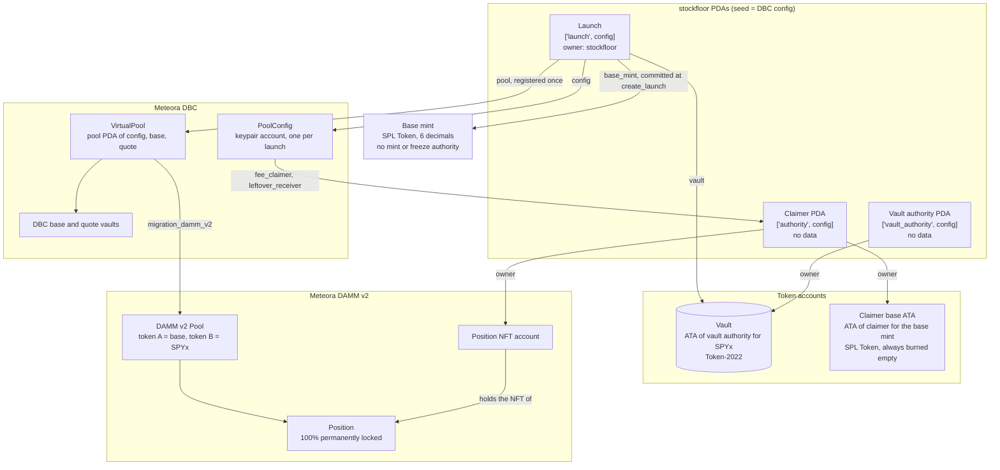
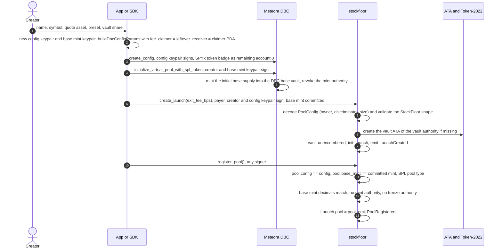
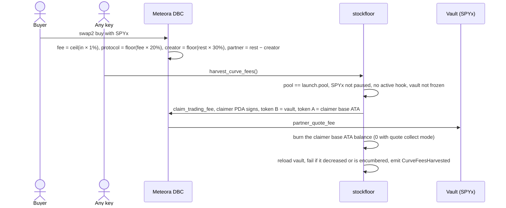
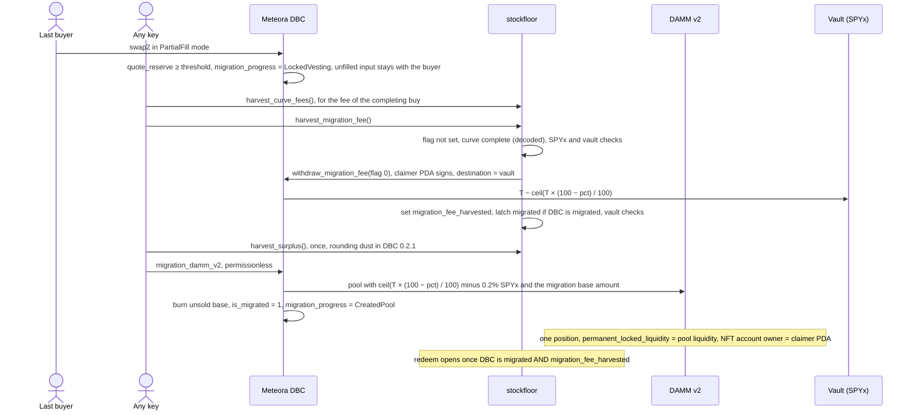
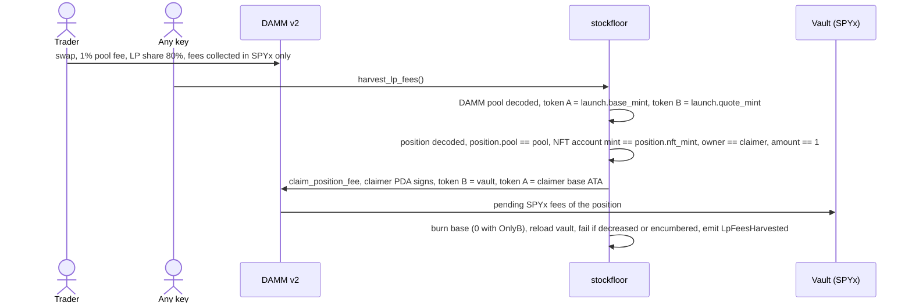
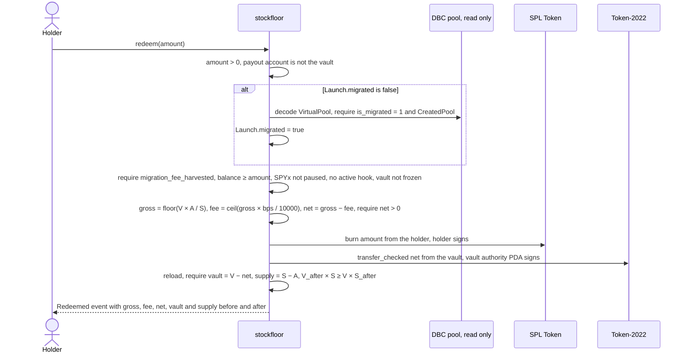

# StockFloor architecture

This is the technical companion to the [README](../README.md). It covers the accounts, the flow of every
instruction, the math, the on-chain checks, and each invariant with the tests that prove it.

**Status of this document (2026-09-15).**
- **Design version.** It describes the **M2 design**: two signer PDAs (claimer and vault authority), and
  `burn_claimer_base` replacing `harvest_leftover`. M2 is being implemented in the working tree right now.
- **Where the evidence comes from.** The C1 fork evidence ([`research/c1-evidence.md`](research/c1-evidence.md))
  was produced with the M1 layout at commit `3620335`, which had a single `["authority", config]` PDA. Every
  token amount in that run is independent of the PDA split.
- **Test names.** They are taken from `tests/integration/*.test.ts` and `programs/stockfloor/src/*.rs` as of
  the M2 working tree. If they drift, `grep -n "it(" tests/integration/*.ts` and
  `cargo test -p stockfloor -- --list` show the current names.

Sources:
- [`research/program-design.md`](research/program-design.md): M1 program design; parts are superseded by
  [`DECISIONS.md`](DECISIONS.md)
- [`research/dbc-facts.md`](research/dbc-facts.md): DBC and DAMM v2 behaviour, with source line references
- [`research/m1-spike.md`](research/m1-spike.md): PDA fee claimer proof, CPI account lists
- [`research/c1-evidence.md`](research/c1-evidence.md): exact amounts of the fork lifecycle

---

## 1. Programs and fixed addresses

| Name | Address | Notes |
|---|---|---|
| stockfloor | `98NLryxegA9KLsED1TkSQdF2MDt6X8C7B1PmepJN6HpA` | Anchor 1.0.2. CPI clients generated by `declare_program!` from `idls/dynamic_bonding_curve.json` and `idls/cp_amm.json` |
| Meteora DBC | `dbcij3LWUppWqq96dh6gJWwBifmcGfLSB5D4DuSMaqN` | Mainnet binary of the 0.2.1 line (identified by 0.2.1-only error strings; source `f552f20`). Upgradeable |
| DBC pool authority | `FhVo3mqL8PW5pH5U2CN4XE33DokiyZnUwuGpH2hmHLuM` | Constant in the program, unit-tested against derivation |
| DBC event authority | `8Ks12pbrD6PXxfty1hVQiE9sc289zgU1zHkvXhrSdriF` | |
| Meteora DAMM v2 | `cpamdpZCGKUy5JxQXB4dcpGPiikHawvSWAd6mEn1sGG` | Mainnet binary of the 0.2.4 line (identified by a 0.2.4-only error). Upgradeable |
| DAMM v2 pool authority | `HLnpSz9h2S4hiLQ43rnSD9XkcUThA7B8hQMKmDaiTLcC` | |
| DAMM v2 event authority | `3rmHSu74h1ZcmAisVcWerTCiRDQbUrBKmcwptYGjHfet` | |
| DAMM v2 config, `MigrationFeeOption::Customizable` (6) | `A8gMrEPJkacWkcb3DGwtJwTe16HktSEfvwtuDh2MCtck` | Remaining account 0 of `migration_damm_v2`; pool fees come from the DBC config's `migrated_*` fields |
| SPYx mint | `XsoCS1TfEyfFhfvj8EtZ528L3CaKBDBRqRapnBbDF2W` | Token-2022, 8 decimals. Pausable, PermanentDelegate, TransferHook (program null), ScaledUiAmount, DefaultAccountState = initialized, ConfidentialTransferMint, no TransferFee |
| DBC token badge for SPYx | `D2THzeQLHaDeKBzzmTNuWEWw23WPM8vVhLvUmSPEpNeL` | `["token_badge", SPYx]` under DBC. DBC checks owner, discriminator and `token_mint`, not the address |
| DAMM v2 token badge for SPYx | `CzLLYiZcDXavJoS6wp9sgMU599qYWj2zPEh58fj9k1AK` | Not needed: migration configs skip mint validation |

---

## 2. Accounts per launch

### 2.1 Diagram



### 2.2 Table

| Account | Derivation | Owner program | Created by | Role |
|---|---|---|---|---|
| `Launch` | `["launch", config]` | stockfloor | `create_launch` | Registry. There is no admin field |
| Claimer PDA | `["authority", config]` | none (never allocated) | — | DBC `fee_claimer` and `leftover_receiver`; DAMM v2 position NFT owner; signs CPIs into DBC and DAMM v2; burns its base ATA |
| Vault authority PDA | `["vault_authority", config]` | none (never allocated) | — | Owns the vault; signs only the `redeem` payout |
| Vault | ATA(vault authority, quote mint, quote token program) | Token-2022 | `create_launch` (`init_if_needed`, rejected if pre-created and encumbered) | Floor backing |
| Claimer base ATA | ATA(claimer, base mint, SPL Token) | SPL Token | `init_if_needed` by `harvest_curve_fees` and `harvest_lp_fees` | Transit for base tokens; burned in the same instruction |
| DBC config | Keypair (signs `create_config` and `create_launch`) | DBC | DBC `create_config` | Curve, fees, migration parameters. No DBC instruction mutates it |
| DBC VirtualPool | `["pool", config, max(base, quote), min(base, quote)]` under DBC | DBC | DBC `initialize_virtual_pool_with_spl_token` (base mint keypair signs) | Presale market |
| DAMM v2 pool | `["pool", damm_config, max(mintA, mintB), min(mintA, mintB)]` under DAMM v2 | DAMM v2 | DBC `migration_damm_v2` | Post-graduation market |
| Position and NFT account | `["position", nft_mint]`, `["position_nft_account", nft_mint]` under DAMM v2 | DAMM v2 / Token-2022 | DBC `migration_damm_v2` | Permanently locked LP; NFT account owner set to the claimer |

**Canonical ATAs.** Both the vault and the claimer base ATA are canonical associated token accounts.
Their addresses derive from the owner, the mint and the token program. A third party can pre-create them,
but cannot substitute a different account. SPYx ATAs carry `ImmutableOwner`.

### 2.3 `Launch` fields (M2)

`version: u8`, `bump: u8`, `claimer_bump: u8`, `vault_authority_bump: u8`, `exit_fee_bps: u16`,
`migration_fee_harvested: bool`, `surplus_harvested: bool`, `migrated: bool`, `config`, `creator`,
`pool` (default until `register_pool`), `base_mint` (committed by `create_launch`), `quote_mint`,
`quote_token_program`, `vault`, `created_at: i64`, and the informational saturating counters
`total_harvested_quote`, `total_burned_base`, `total_redeemed_base`, `total_redeemed_quote`,
`total_exit_fees` (`u64`). Then `reserved: [u8; 62]`.

The counters are never used for access control or math. A donation straight to the vault is not counted.

### 2.4 Signer scope

This table is the core of the security design. Together, the rows are the complete list of what each key
can sign in this program.

| Signer | Instruction | Signs | Into | Destinations (constrained by stockfloor) |
|---|---|---|---|---|
| Claimer PDA | `harvest_curve_fees` | DBC `claim_trading_fee(u64::MAX, u64::MAX)` | DBC | token B → `launch.vault`; token A → canonical claimer base ATA |
| Claimer PDA | `harvest_migration_fee` | DBC `withdraw_migration_fee(flag = 0)` | DBC | `token_quote_account` → `launch.vault` |
| Claimer PDA | `harvest_surplus` | DBC `partner_withdraw_surplus` | DBC | `token_quote_account` → `launch.vault` |
| Claimer PDA | `harvest_lp_fees` | DAMM v2 `claim_position_fee` | DAMM v2 | token B → `launch.vault`; token A → canonical claimer base ATA |
| Claimer PDA | `harvest_curve_fees`, `harvest_lp_fees`, `burn_claimer_base` | SPL `burn` | SPL Token | From its own base ATA only |
| **Vault authority PDA** | `redeem` | Token-2022 `transfer_checked(net)` | Token-2022 | From `launch.vault` to the holder's quote account (never the vault itself) |
| Holder | `redeem` | SPL `burn(amount)` | SPL Token | From the holder's own base account |

DBC `claim_trading_fee` constrains neither the owner nor the mint of its destination accounts
([`research/dbc-facts.md`](research/dbc-facts.md) §A). The stockfloor constraints in the last column are
therefore load-bearing.

The vault is passed to DBC and DAMM v2 as a **writable destination, never with its owner's signature**. A
token program debits an account only with the signature of its owner, its delegate or the mint's permanent
delegate (for SPYx, the issuer). The vault authority never
signs those CPIs, and the vault never has a delegate (checked after every CPI). So a malicious upgrade of DBC
or DAMM v2 cannot debit the vault inside a harvest.

---

## 3. Instruction flows

### 3.1 Launch creation

The SDK builds the DBC config (`buildDbcConfigParams`) with the claimer PDA as `fee_claimer` and
`leftover_receiver`. `create_launch` can run before or after the pool exists; both orders are tested. The fork
lifecycle uses the order shown.



**Why the config keypair signs `create_launch`.** Nothing in a DBC config identifies its creator. Without the
signature, anyone could front-run `create_launch` for a freshly created config.

**Why `register_pool` is permissionless.** DBC derives the pool from `(config, base_mint, quote_mint)`. Pool
creation needs the base mint keypair's signature, which only the creator's client holds. So exactly one pool
can match the committed mint, and a creator cannot hold the migration fee hostage by never registering.
`pool.creator` is deliberately not compared: DBC lets the creator role be transferred, and the committed mint
already identifies the pool.

### 3.2 Presale trading and `harvest_curve_fees`



`harvest_curve_fees` can run at any time. The completing buy accrues partner fees after earlier claims, so the
crank calls it again after completion.

### 3.3 Graduation



`harvest_migration_fee` needs only a complete curve, not a finished migration. DBC allows the withdrawal
before migration. That is why `redeem` checks both conditions. Migrating after an early fee harvest yields
identical DAMM v2 reserves; see the test "fee harvested after completion but before migration: redeem stays
closed until migration completes".

### 3.4 `harvest_lp_fees`



Any position whose NFT the claimer holds, on a DAMM v2 pool with mints (base, SPYx), qualifies. That covers
the migrated position or a position someone donates. DBC does not store the DAMM v2 pool address, so the
program does not pin it. Harvesting another pool with the same mints can only add to the vault.

### 3.5 `redeem(amount)`



### 3.6 `floor()` view and `burn_claimer_base()`

- **`floor()`** is read-only; call it with `simulateTransaction`. It takes `launch`, `vault` and `base_mint`,
  returns `FloorInfo { vault_raw: u64, supply: u64, exit_fee_bps: u16, floor_q64: u128 }` as 34 bytes of
  little-endian return data, and emits `FloorSnapshot`. Before `register_pool`, pass any account as
  `base_mint`; the supply is then reported as 0. `floor_q64 = (vault_raw << 64) / supply`, or 0 when the supply
  is 0.
- **`burn_claimer_base()`** is permissionless and needs no external program. It burns everything in the
  canonical claimer base ATA, for example base tokens someone sent there, and emits `ClaimerBaseBurned`. It
  replaces M1's `harvest_leftover`. That instruction's DBC `withdraw_leftover` CPI was unreachable, because
  `withdraw_leftover` requires fixed supply and `create_launch` rejects fixed supply.

### 3.7 Crank order

1. `harvest_curve_fees`: any time during the presale, and again after the curve completes.
2. `harvest_migration_fee`: once the curve is complete.
3. `harvest_surplus`: once the curve is complete (dust).
4. DBC `migration_damm_v2`: permissionless. Meteora's keepers may also run it; their policy is off-chain and
   was not verified.
5. `harvest_lp_fees`: periodically.
6. `burn_claimer_base`: only when base tokens have been sent to the claimer.

Operational notes:
- **The final curve buy must use `swap2` PartialFill,** or be sized exactly. An exact-in buy that crosses the
  migration price fails with `InsufficientLiquidity`.
- **Every SPYx transfer fails while SPYx is paused,** including swaps, claims, migration and redemptions. The
  failure is atomic, so the crank retries later. xStocks asks venues to pause about ±15 minutes around a
  multiplier activation (00:30 UTC on the day after the ex-date).
- **CPI depth.** stockfloor → DBC → Token-2022, plus the DBC event self-CPI, reaches depth 3. Invoking
  stockfloor from yet another program is close to the limit.

**Compute units** measured on the fork during M1, before the review fixes (to be re-measured after M2):
- `create_launch` ≈ 41–64k
- `harvest_curve_fees` ≈ 66–75k, including creating the base ATA
- `harvest_migration_fee` ≈ 35k
- `harvest_lp_fees` ≈ 51–54k
- `redeem` ≈ 26k
- DBC `migration_damm_v2` ≈ 158k

---

## 4. On-chain validation

### 4.1 `create_launch`

The config is decoded only if all of these hold: owner = DBC, the `PoolConfig` discriminator (which rejects
`ConfigWithTransferHook`), and a minimum length. Then each check has its own error:

| Check | Error |
|---|---|
| `exit_fee_bps ≤ 500` | `ExitFeeTooHigh` |
| `config.quote_mint == quote_mint` | `QuoteMintMismatch` |
| `fee_claimer == claimer PDA` | `FeeClaimerMismatch` |
| `leftover_receiver == claimer PDA` | `LeftoverReceiverMismatch` |
| `creator_migration_fee_percentage == 0` | `CreatorMigrationFeeNotZero` |
| `migration_fee_percentage ∈ [30, 99]` | `MigrationFeePercentageOutOfRange` |
| partner permanent-locked liquidity = 100, partner unlocked = creator permanent = creator unlocked = 0 | `LiquidityNotFullyPartnerLocked` |
| no partner or creator liquidity vesting | `LiquidityVestingNotAllowed` |
| no locked vesting (amount per period, cliff unlock, number of periods all 0) | `LockedVestingNotAllowed` |
| `collect_fee_mode == QuoteToken` | `CollectFeeModeNotQuote` |
| `migration_option == DammV2` | `MigrationOptionNotDammV2` |
| `token_type == SplToken` | `BaseTokenTypeNotSplToken` |
| `fixed_token_supply_flag == 0` | `FixedTokenSupplyNotAllowed` |
| `creator_trading_fee_percentage ≤ 30` | `CreatorTradingFeeTooHigh` |
| base fee mode is a fee scheduler (linear or exponential) and `cliff_fee_numerator ≤ 200,000,000` (20%) | `CurveFeeTooHigh` |
| dynamic fee not initialized | `DynamicFeeNotAllowed` |
| `migrated_collect_fee_mode == QuoteToken` | `MigratedCollectFeeModeNotQuote` |
| `token_update_authority == Immutable` | `TokenUpdateAuthorityNotImmutable` |
| `pool_creation_fee == 0` | `PoolCreationFeeNotZero` |
| committed base mint is not the default pubkey or the quote mint | `InvalidBaseMint` |
| a pre-existing vault ATA has no delegate, close authority, CPI Guard or required memos | `VaultEncumbered` |

The quote allowlist is intentionally UI-level. DBC itself enforces the token badge, the fee minimum (0.25%),
the curve shape and the other `create_config` rules ([`research/dbc-facts.md`](research/dbc-facts.md) Q9).

### 4.2 `register_pool`

| Check | Error |
|---|---|
| Launch has no pool yet | `PoolAlreadyRegistered` |
| `pool` owner = DBC, `VirtualPool` discriminator (rejects `TransferHookPool`), minimum length | `InvalidDbcPool` |
| `pool.config == launch.config` | `PoolConfigMismatch` |
| `base_mint == launch.base_mint` and `pool.base_mint == base_mint` | `BaseMintMismatch` |
| `pool.pool_type == SplToken` | `PoolTypeNotSplToken` |
| `base_mint.decimals == config.token_decimal` | `BaseMintDecimalsMismatch` |
| `mint_authority == None` | `BaseMintAuthorityNotRevoked` |
| `freeze_authority == None` | `BaseMintHasFreezeAuthority` |

### 4.3 Quote-asset and vault checks, shared by the quote-moving instructions

| Check | Where | Error |
|---|---|---|
| SPYx mint not paused (Token-2022 Pausable) | every harvest that moves quote, `redeem` | `QuoteMintPaused` |
| Transfer hook program id is null | same | `QuoteMintTransferHookUnsupported` |
| Vault not frozen | same | `VaultFrozen` |
| After the CPI: vault balance did not decrease | harvests | `VaultDecreased` |
| After the CPI: vault owner = vault authority, no delegate, no close authority, no CPI Guard, no required memos | harvests, `create_launch` | `VaultEncumbered` |
| Malformed Token-2022 mint or account data | helpers | `InvalidQuoteMintData`, `InvalidTokenAccountData` |

### 4.4 Decoding external accounts

DBC `PoolConfig` and `VirtualPool`, and DAMM v2 `Pool` and `Position`, are decoded with `bytemuck` into owned
copies. Decoding happens only after the owner program, discriminator and minimum length checks. Because the
length check is a minimum, a later realloc does not break decoding. Field offsets are unit-tested against the
vendored sources and, independently, against the IDL JSON. During research they were also cross-checked
against live mainnet accounts.

---

## 5. Math

Notation: `V` vault (raw quote), `S` supply (raw base), `A` amount burned, `b` exit fee bps, `f = b / 10_000`.

```
gross = floor(V × A / S)          u128 product; gross ≤ V because A ≤ S
fee   = ceil(gross × b / 10_000)
net   = gross − fee               NothingToRedeem when net == 0
```

**Monotonicity.** `(V − net)·S − V·(S − A) = V·A − net·S ≥ V·A − gross·S ≥ 0`. The difference is strictly
positive when `fee > 0`, so `V/S` never decreases and strictly rises when a fee is kept and tokens remain. At
runtime the program checks the cross product `V_after · S_before ≥ V_before · S_after`.

**Splits.**
- **With `b = 0`,** any split of `A` into sequential redemptions pays at most `floor(V·A/S)`.
- **With `b > 0`,** a split can pay slightly more than a single redemption. Each retained fee raises the floor
  for the redeemer's remaining tokens. The bounds that hold:
  - per step, `net·S_k·10_000 ≤ V_k·a_k·(10_000 − b)`;
  - in total, `T ≤ floor(V·A/S)`;
  - in total, `T ≤ V·(1 − ((S − A)/S)^(1 − f))`, via Bernoulli's inequality.

**Floor at graduation.**
- The curve is a single constant-liquidity segment from price `p₀` to `p₁ = r·p₀`. Buying it out costs
  `T = L(√p₁ − √p₀)` quote and yields `L(1/√p₀ − 1/√p₁) = T/√(p₀p₁) = T·√r/p₁` base.
- DAMM v2 opens at `p₁` with `(1 − f)·T` quote and `(1 − f)·T/p₁` base.
- The vault holds `f·T`.

Hence

```
floor / p₁ = f·T / (T·√r/p₁ + (1 − f)·T/p₁) / p₁ = f / (√r + 1 − f)
```

This ignores the 0.2% protocol migration fee, trading fees and rounding. `gentle` (r = 1.2) at f = 0.5 gives
0.313, so a buyer at the opening price has a maximum loss of about 68.7%. The SDK test `max loss at graduation
follows f / (sqrt(r) + 1 - f)` asserts this to 5 decimals against `previewLaunch`. On the real programs,
`sdk-presets-fork.test.ts` shows the vault equals the preview exactly and the supply is at most 1,000 raw
below it.

**Start price.** The SDK solves the start price so that the supply at graduation is about 1,000,000,000 base
tokens (6 decimals). The curve liquidity is `ceil((T << 128) / (√p₁ − √p₀))` in Q64 sqrt-price units. The
threshold in raw units is `ceil(usd × 10^8 / (usdPrice × multiplier))`, where `usdPrice` is Jupiter's price per
UI token.

---

## 6. Invariants and the tests that prove them

Test file abbreviations:
- `life` = `tests/integration/c1-lifecycle.test.ts`
- `adv` = `tests/integration/c1-adversarial.test.ts`
- `reg` = `tests/integration/review-regressions.test.ts`
- `presets` = `tests/integration/sdk-presets-fork.test.ts`
- `spike-life`, `spike-edge` = `tests/spike/lifecycle.test.ts`, `tests/spike/edge-cases.test.ts`
- `sdk-math` = `packages/sdk/test/math.test.ts`, `sdk-presets` = `packages/sdk/test/presets.test.ts`
- Rust tests are `module::tests::name` in `programs/stockfloor/src/`.

`FloorTracker` (`tests/src/floor-invariants.ts`) runs its checks around every step of the lifecycle: 26
tracked states in the C1 run.

| # | Invariant | Enforcement | Proving tests |
|---|---|---|---|
| 1 | Quote leaves the vault only through `redeem`, and exactly the net amount | No other program-signed vault transfer; `VaultDecreased` after harvest CPIs; `VaultBalanceMismatch` in redeem | `life` › "12. floor invariants held after every step; Launch counters reconcile with the vault" (FloorTracker check 2); `adv` › FloorTracker self-check › "rejects quote leaving the vault outside redeem", "rejects a redeem whose vault outflow differs from the declared net, and a redeem declared as no-outflow" |
| 2 | The floor `V/S` never decreases, and strictly rises on a redeem with a fee | Math; runtime `FloorDecreased` | `math::tests::prop_floor_monotonic`, `math::tests::donation_only_raises_floor`; `sdk-math` › "property: the floor never decreases after a redemption, and rises when a fee is charged", "property: over random sequences the floor is monotone and redeemers never get more than their starting pro-rata share"; `life` › "11. several holders redeem; each payout, fee and burn is exact and the floor rises"; `adv` › "rejects a floor decrease, a supply that does not reconcile, and base left at the Authority" |
| 3 | Rounding never favours the redeemer | `gross` floors, `fee` ceils | `math::tests::gross_rounds_down`, `fee_rounds_up`, `fee_ceil_table`, `prop_formula_exact`, `prop_net_bounded_by_rational_pro_rata`, `overflow_safety_at_u64_max`; `sdk-math` › "property: rounding is exactly floor for gross and ceil for fee" |
| 4 | Splitting: at 0 fee no split beats one redemption; with a fee every split stays within the fee-free share and the continuous limit | Math | `math::tests::many_tiny_redemptions_zero_fee_never_beat_one_large`, `prop_split_never_beats_single_without_fee`, `prop_split_never_beats_single_without_fee_small`, `many_tiny_redemptions_with_fee_bounded_by_continuous_limit`, `prop_split_with_fee_bounded`; `sdk-math` › "property: with a zero exit fee, many tiny redemptions never extract more than one large one", "documents that with an exit fee, splitting can return more than one large redemption (fee rebate), yet stays below the fee-less share"; `adv` › "exit fee 0: net = gross = floor(V*a/S); a redemption split into 10 parts never pays more than one redemption of the total" |
| 5 | A redemption never burns tokens for nothing | `NothingToRedeem` when `net == 0` | `math::tests::zero_net_is_rejected`, `full_fee_bps_is_valid_but_pays_nothing`; `life` › 11 (1-raw redemption rejected) |
| 6 | Redemption opens only after DBC migration **and** the migration fee harvest | `MigrationNotComplete`, `MigrationFeeNotHarvested` | `life` › "5a. adversarial: harvest_curve_fees for the rogue pool or into a non-vault account fails; redeem and harvest_migration_fee before completion fail", "6. a PartialFill buy completes the curve at the migration price; surplus = quote_reserve - threshold", "8a. adversarial: redeem after migration but before harvest_migration_fee is rejected"; `adv` › "fee harvested after completion but before migration: redeem stays closed until migration completes" |
| 7 | `redeem` accepts only the launch's base mint and pays only from the launch's vault | `address =` constraints on the pool, base mint, vault and quote mint; launch PDA seeds | `adv` › "rogue pool fees, migration fee, surplus, leftover and LP position are unreachable; its tokens cannot redeem" |
| 8 | Harvests pay only into the launch's vault, whoever signs | Pinned vault, canonical claimer ATA, PDA seeds, constant CPI program ids | `adv` › "harvest_curve_fees: substituted vault, base account, pool, config, launch or claimer are rejected", "harvest_migration_fee and harvest_surplus: substituted vault, pool, launch or claimer are rejected", "burn_claimer_base and harvest_lp_fees: substituted accounts and foreign positions are rejected", "direct DBC / DAMM v2 claims signed by the attacker fail: only the claimer PDA can claim", "cranking honestly, the attacker pays only SOL; every harvest pays exact amounts into the vault"; `spike-life` › "rejects a random signer claiming the partner trading fee directly from DBC", "rejects a random signer calling DBC withdraw_migration_fee(flag=0) directly" |
| 9 | The claimer never owns or controls the vault; the vault is the vault authority's SPYx ATA with no delegate or close authority | Vault derivation; `VaultEncumbered` in `create_launch` and after harvest CPIs | `adv` › FloorTracker self-check › "rejects a vault owned by the claimer, a vault with a delegate and a vault with a close authority"; `reg` › "delegate, close authority or a foreign owner on the vault: every harvest fails atomically; redeem still works"; `token_utils::tests::clean_vault_passes`, `encumbered_vault_is_rejected` |
| 10 | The vault's quote mint is the config's quote mint | `create_launch` `QuoteMintMismatch`; vault is the ATA for that mint | `external::tests::every_config_check_has_its_error`; `life` › "3a. create_launch validates the config, commits the base mint and creates the Launch registry and the empty floor vault" |
| 11 | Base tokens the program holds are burned in the same instruction; `mint.supply` equals the sum of all base accounts | `burn_all_signed` in every base-receiving instruction; `burn_claimer_base` | `life` › 12 (FloorTracker checks 3 and 4), "7. permissionless migration to DAMM v2 burns the unsold base; the claimer PDA owns the permanently locked position", "8f. burn_claimer_base: nothing to burn (DBC leftover never applies to dynamic supply), then burns a base donation to the claimer exactly"; `adv` › "rejects a floor decrease, a supply that does not reconcile, and base left at the Authority" |
| 12 | Donations only raise the floor | Math; live balances | `math::tests::prop_donation_never_hurts`; `adv` › "SPYx donated straight to the vault raises the floor and is paid out pro rata" |
| 13 | The floor uses no price oracle; market trades cannot change it | Only `vault.amount` and `mint.supply` are read | `life` › "9. several wallets trade on the migrated DAMM v2 pool (quote-only fees)" (FloorTracker no-outflow step, vault unchanged by trading) |
| 14 | A paused SPYx, a frozen vault or an active transfer hook fail cleanly, with no state change | Pre-checks; atomic transactions | `adv` › "each harvest and redeem fails with a clear error and no state change, works after restore; a multiplier change leaves raw math exact"; `token_utils::tests::paused_mint_is_rejected`, `active_transfer_hook_is_rejected_null_hook_passes`; `spike-edge` › "paused SPYx: curve trades and the PDA harvest fail atomically; after unpause the harvest succeeds" |
| 15 | A ScaledUiAmount multiplier change never changes raw math | Raw units only | `adv` › the issuer-controls test above (multiplier set to 1.5, then 0.8); `spike-edge` › "ScaledUiAmount multiplier change mid-lifecycle leaves raw amounts unchanged" |
| 16 | The migration fee (and surplus) is harvested once, for exactly the DBC formula amount | Program flags plus DBC status bits | `life` › "8b. harvest_migration_fee moves exactly the partner migration fee into the vault", "8c. adversarial: harvest_migration_fee twice is rejected and leaves the vault unchanged", "8e. harvest_surplus moves exactly 80% x (100 - 30)% of the surplus (DBC formula) and only once"; `adv` › "pays exactly floor(floor(surplus * 80%) * (100 - 30)%) of DBC's surplus into the vault" |
| 17 | Curve and LP fee harvests move exactly the partner / position amounts | DBC and DAMM v2 state | `life` › "5b. harvest_curve_fees by a random key moves exactly the partner share into the vault", "8d. harvest_curve_fees again collects exactly the completing buy's partner fee", "10. harvest_lp_fees moves exactly the position's pending quote fee into the vault; base side is zero" |
| 18 | Only StockFloor-shaped DBC configs become launches | `validate_launch_config` | `reg` › "the real DBC accepts each out-of-shape config; create_launch rejects it and creates nothing", "a fixed-supply config really leaves DBC leftover base in the supply after migration (why it is rejected)", "the brief's anti-snipe schedule (exponential 20% -> ~1%, creator share 30%) is accepted at the bound", "the committed base mint must be a real candidate: default pubkey or the quote mint are rejected"; `external::tests::valid_config_passes`, `every_config_check_has_its_error` |
| 19 | No rogue pool can be registered, and the creator cannot withhold registration | Committed base mint; permissionless `register_pool` | `life` › "3b. adversarial: a second pool on the same config can never be registered, whoever sends register_pool", "3c. register_pool by a random key (permissionless) records the canonical pool; floor invariants tracking starts"; `reg` › "the creator never registers; a random wallet registers, harvests the migration fee and holders redeem", "a creator who creates the committed pool under another creator key still cannot block registration", "create_launch can commit the base mint before the pool exists; registration works once DBC creates it" |
| 20 | A second pool on the same config never feeds or drains the vault | Every instruction pins `launch.pool` and the base mint | `adv` › "rogue pool fees, migration fee, surplus, leftover and LP position are unreachable; its tokens cannot redeem"; `spike-edge` › "anyone can create a second pool on the same DBC config (fee claimer PDA is shared)" |
| 21 | Once migration is latched, `redeem` does not depend on DBC state | `Launch.migrated` | `reg` › "after harvest_migration_fee latches Launch.migrated, a grown or re-typed DBC VirtualPool cannot lock redemptions", "without the latch (fee harvested before migration) the first redeem decodes DBC, then latches" |
| 22 | External accounts are decoded safely | Owner, discriminator and minimum length checks; offsets cross-checked | `external::tests::decoders_check_owner_discriminator_and_size`, `dbc_layout_matches_idl`, `damm_layout_matches_idl`, `dbc_offsets_match_vendored_layout`, `generated_sizes_match_vendored_sources`, `migration_and_curve_predicates`; `constants::tests::external_pdas_are_correct`, `external_ids_match_declared_programs` |
| 23 | Edge redemptions: entire supply, maximum exit fee | Math and runtime checks | `adv` › "redeeming the entire supply (cheatcode: one holder owns all base) pays vault minus fee and leaves only the fee", "exit fee 500 bps (the cap): fee = ceil(gross * 5%) stays in the vault"; `math::tests::redeeming_entire_supply` |
| 24 | A PDA works as DBC partner `fee_claimer` and DAMM v2 NFT owner with a badged Token-2022 quote | `invoke_signed` | `spike-life` › "claims the partner trading fee via spike CPI (PDA signer) into the PDA SPYx ATA", "withdraws the partner migration fee via spike CPI into the PDA SPYx ATA (exact amount)", "withdraws the partner surplus via spike CPI (80% x (100 - 30)% of surplus; rounding-only here)", "stretch: claims DAMM v2 LP fees for the PDA-owned position via spike CPI" |
| 25 | The SDK config equals what DBC stores, and the vault equals the preview | SDK port of DBC math | `presets` › "gentle / 50%: DBC stores what the SDK port predicts; the vault gets the preview amount at graduation" (and the other preset × share combinations), "each mutated SDK config fails in the port and on-chain with the same PoolError name"; `sdk-presets` › "max loss at graduation follows f / (sqrt(r) + 1 - f)" |
| 26 | The floor view is consistent | `floor_q64 = (V << 64) / S` | `reg` › "floor_q64 = (vault << 64) / supply, 0 before registration and with an empty vault"; `math::tests::prop_floor_q64_consistent` |

**Not tested yet** (planned in M2 and before C2):
- many small redemptions at 200 bps on the fork against the continuous bound;
- a random multi-holder redemption property test on the fork;
- a second DAMM v2 position donated to the claimer;
- migration through a fixed-fee DAMM v2 config;
- a Surfpool run against live mainnet state.

---

## 7. Test harness

- **Fork.** `tests/src/fork.ts` wraps LiteSVM (node `litesvm` 1.4.1).
  - It loads every fixture program and account, plus `target/deploy/stockfloor.so` and `spike.so`.
  - Each transaction has a 1.4M compute-unit budget. The blockhash expires after every send, and transaction
    history is off.
  - The clock starts at the fixture dump time, so the SPYx `newMultiplier` 1.005714560286254 is in effect.
- **Fixtures.** `tests/fixtures/` holds 6.6 MB dumped by `tests/fixtures/dump.ts` from mainnet at slots
  447,312,190–447,312,193, with sha256 values in `manifest.json`.
  - Programs: DBC, DAMM v2, Token-2022, SPL Token, ATA, Metaplex Token Metadata.
  - Accounts: the SPYx mint, both SPYx token badges, the DBC pool authority (58 SOL, needed by the migration's
    flash rent), the DAMM v2 pool authority, and the DAMM v2 Customizable and FixedBps100 configs.
- **Cheatcodes** (`tests/src/token.ts` and the test files): token balances and mint supply, `setMintPaused`,
  `setScaledUiMultiplier`, frozen accounts, transfer-hook program id, account patching, clock warp.
- **Builders.** `tests/src/dbc.ts`, `damm.ts` and `stockfloor.ts` build instructions from the IDLs.
  `anchor.ts` decodes events, including `emit_cpi!` events taken only from the inner instructions of the given
  program.
- **Independent expected values.** Every expected amount comes from DBC or DAMM v2 source formulas, events,
  account state or SDK math, never from the stockfloor program.
- **One command.** `pnpm test` runs `scripts/test-all.sh`. It builds the programs, runs `cargo test`, type
  checks, then runs the SDK, fork and app suites, and never runs fork tests on a stale binary.

## 8. Known limitations

See [README › Known limitations](../README.md#known-limitations).

In short:
- quote-mint transfer hooks are unsupported (clean failure);
- the issuer's permanent delegate can move or burn vault funds;
- the floor denominator includes base tokens in the DAMM v2 pool and DBC's protocol migration base fee
  (conservative);
- base tokens in non-canonical claimer accounts and lamports sent to the PDAs are stranded;
- partner fees of rogue pools stay in DBC;
- a dust-sized unlocked creator position can appear at migration in rounding edge cases;
- LiteSVM is not a validator;
- the code is unaudited;
- the upgrade authority is not yet revoked (user decision, TBD (C2)).
