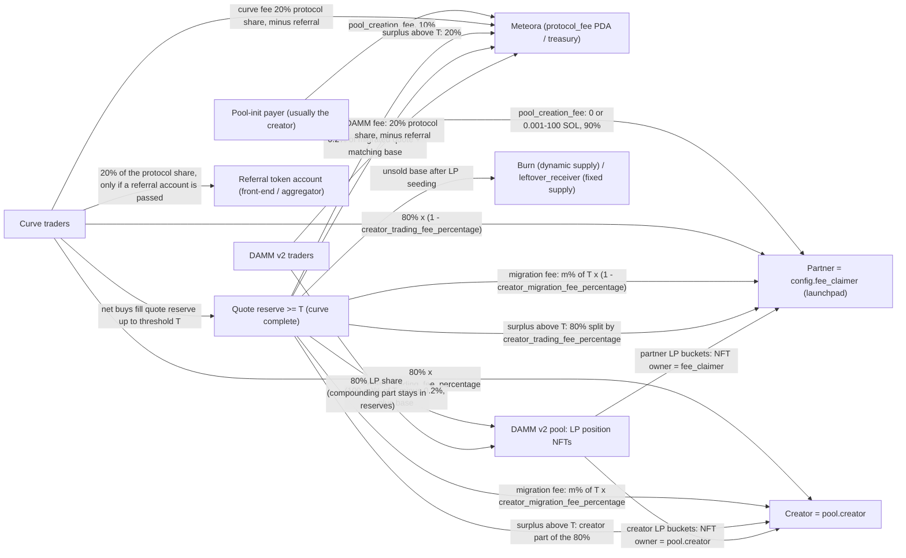
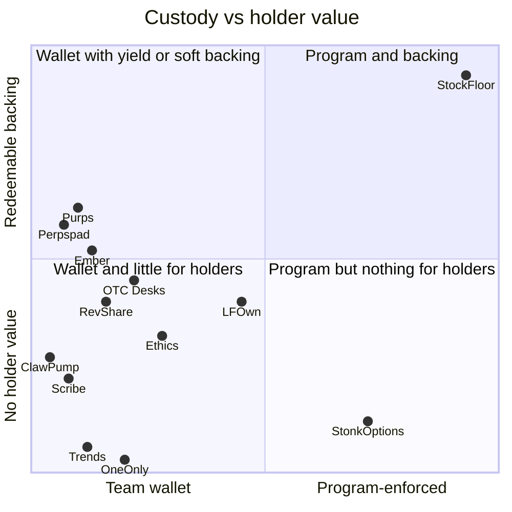

# Meteora DBC launchpads: who resembles StockFloor, and how they make money

**Date:** 2026-09-21

**Scope.** The 12 launchpads listed on the Meteora DBC screener [new.meteora.fyi](https://new.meteora.fyi/) on 2026-09-21: Ember, LFOwn, StonkOptions (Star), Perpspad, ClawPump, Ethics, RevShare, OTC Desks, Purps, Trends, OneOnly and Scribe. For scale, we also benchmark large DBC launchpads that are not on the screener (Bags, Jupiter Studio, Moonshot, Believe and smaller pads) and some non-DBC reference points (pump.fun, Raydium LaunchLab, StonkFun, Rise.rich).

**Questions answered.**
1. Which of these pads resemble StockFloor, and in what exactly? (§4, §5)
2. How does each platform make money? What do token creators and holders get, and what does Meteora take? (§4, §6)
3. What are the economics of this kind of platform, and what do they mean for StockFloor's positioning and business model? (§6, §7)

**Method.**
- **Profiles.** One agent profiled each pad from its site, docs, public APIs and JS bundles. It also decoded the pad's DBC configs and pools from mainnet, read-only, with [`scripts/research/dbc_inspect.py`](../../scripts/research/dbc_inspect.py) (`mint`, `config`, `pools`, `creator`, `claimer-stats`). Market data came from Jupiter, DexScreener, GeckoTerminal, the Meteora DAMM v2 datapi and DefiLlama.
- **Adversarial fact-check.** A second agent then checked every profile: it re-ran the on-chain commands and re-fetched the APIs. **This report uses the corrected profiles**, and flags the corrections that change a conclusion. The check covered the 12 screener profiles only. The off-list benchmarks (§6.7, §8) come from DefiLlama adapters and third-party docs, were **not** adversarially checked, and are tagged 3P.
- **Similarity score.** The profiles score similarity on a 0–5 scale, where 0 = unrelated and 5 = the same product.
- **Money-flow rules.** These come from the program sources: DBC 0.2.1 and DAMM v2 0.2.4, recorded in [`dbc-facts.md`](dbc-facts.md).
- **Prices.** Dollar amounts are in USD at the price each source used, mostly SOL ≈ $113. Many "lifetime" totals value past fees at today's quote prices.
- **Safety.** Nothing was sent on-chain.

**Evidence levels.** Strongest first. Every rate and amount in the tables carries one of these tags.

| Tag | Level | Meaning |
|---|---|---|
| **OC** | on-chain | Decoded from DBC or DAMM v2 accounts, token mints or pool state |
| **DOC** | official docs | Meteora docs and program source, or the platform's own docs and terms |
| **SITE** | site claim | The platform's UI, API or ledger, not reconciled against transactions |
| **3P** | third party | News, aggregator labels, other people's APIs about the platform |
| **INF** | inferred | Our own derivation from the levels above |

A *parameter* such as `creator_trading_fee_pct = 0` is usually OC. The *dollar amount* that flowed through it is usually SITE or INF. We never upgrade a site claim to a fact. Where a fact-checker marked a claim unverifiable, this report says so.

---

## 1. TL;DR

- **No pad on the screener has a redeemable floor.** None lets a holder burn tokens against backing, and none sends the DBC migration fee anywhere but a wallet. The nearest mechanisms are fee-funded stock floors off DBC: Basket (Solana/pump.fun: an xStock vault with burn redemption), $BACKED and FLOOR (Robinhood Chain). They start at zero and grow from fees; StockFloor's floor is seeded from the raise at graduation. On-chain, 0 of 931 xStock-quoted DBC configs send a migration fee to a program ([`stock-quoted-dbc-configs.json`](stock-quoted-dbc-configs.json)). See §8.
- **Stock quotes are a commodity.** 10 of 12 pads have DBC configs quoted in tokenized stocks, and 6 have SPYx-quoted configs (Ember, Ethics, RevShare, Purps, Scribe, OneOnly). Demand on DBC pads is weak: ≈2.6% of Ember's volume and 2 of its 87 graduations; 3 of Scribe's 340 coins; 0 pools on OneOnly's current SPYx, QQQx and NVDAx configs; 0 organic stock-pair launches on Trends. StonkOptions, which quotes almost only stocks, collapsed about 48 hours after launch. Where stock-paired demand exists, it has concentrated on StonkFun (Raydium LaunchLab), driven by its STONK token rather than any holder claim. **The floor has to be the pitch, not the quote asset.**
- **Custody is a team wallet almost everywhere.** The fee claimer is a plain wallet or keypair on 11 of 12 pads. The exception, StonkOptions, uses a per-market PDA of an unpublished program and splits the money off-chain. All 8 pads that route fee money to holders pay it from a team wallet or keeper. StockFloor would be the only pad where holder value is enforced by a program, with one caveat: its upgrade authority is still held by the deployer key, and revoking it is planned for C3 at the earliest, as the user's decision (§6.5).
- **How platforms earn.** First, the DBC partner share of the curve fee: 0.24–2.4% of curve volume gross on-chain (up to 4% on RevShare's 10%-tax configs), with a stated net take of 0–1.6% and a median of ≈0.38%. Second, fees from a partner-locked DAMM v2 LP position after graduation: ≈68% of Ember's current inflow (≈77% counting EMBER's own pool). Four pads also take a migration fee, usually 2–15% of the threshold (6 RevShare configs use 40–50%), always into a wallet. **None charges a DBC pool creation fee.** Off DBC, pads earn from cuts of pump.fun creator fees, distribution skims, SaaS and perp performance fees.
- **On most pads that launched a platform token on DBC, that token's own pool is the largest fee stream.** Only Ember's is realized: EMBER is 84% of its ≈$181K take. Scribe (≈$114K accrued to the locked SCRIBE position, owner inferred), Trends (≈$41–46K of accrued LP fees) and Purps (≈827 SOL-equivalent, if the HpHd keypair is the team's) are accrued or inferred. Pads whose business is mostly off DBC earn mainly from third-party pump.fun or tax-token volume: OTC Desks (≈$414K), ClawPump, RevShare.
- **Creators.** StockFloor's 0.24% of curve volume is the lowest deal among pads that pay creators on-chain (LFOwn, Ethics, Trends, OneOnly, Scribe's old config), and unlike four of those five it gives the creator no locked LP after graduation. OTC Desks (0), Scribe's current config (0) and StonkOptions (0.10–0.15%, off-chain) pay creators less. Realized fee income is tiny for almost every creator on every pad (≈$40 each on Ember and LFOwn). Creators will not choose StockFloor for income (§6.2, §7.2b).
- **Holders get discretionary rewards:** pushed dividends or airdrops, buyback-and-burn, or buybacks of the platform token. All are keeper-run, and splits changed after launch on at least five pads (Ember, OTC Desks, Scribe, LFOwn, ClawPump).
- **Meteora takes about 20% of everything, whatever the config:** 20% of curve fees, of DAMM v2 fees and of any surplus, 0.2% of migrated liquidity and 10% of any creation fee. It also gains MET demand where MET is the quote (about 575 Ember coins).
- **Scale on DBC is small and short-lived.** Users paid $1.03M of DBC curve fees in 30 days across all launchpads (pools quoted in SOL, USDC or JUP only), and Meteora kept $0.19M of it (3P, DefiLlama). Screener pads lost roughly 85–99% of their activity within 1–2 weeks of launch. StonkFun booked $14.71M of revenue in 30 days on Raydium LaunchLab and has not decayed (≈$5.0M in the last 7 days; 3P), but its figure also counts locked-LP harvests and creator fees its operator claims (§8).
- **What this means for StockFloor.** A floor funded once, at graduation, fits a market where fee income decays within days. The pitch is buyer protection plus program custody. At the defaults, a graduated launch puts ≈$591 into the vault in its first month, and the floor sits at ≈31% of the graduation price (§7.2). Four revenue levers take nothing from the floor: a flat launch fee (A), a slice of the creator share (B), a routing fee (F) and the DBC/DAMM referral fee (H). A 10% slice of the partner curve share costs the floor about 0.2–0.6% at the default threshold; a slice of the migration fee is the costly one (−10% of the seed per 5 points).

### At a glance

"Stated take" is what each pad says it keeps, as a share of curve volume. Revenue is in USD; the evidence tag of each figure is in §4 and §6.7.

| Pad | Similar to StockFloor in | Platform earns from | Stated take | Creator gets | Holders get | Platform revenue to date | Run rate per day |
|---|---|---|---|---|---|---|---|
| StonkOptions | xStock quote, config per launch, PDA claimer and LP owner | 15–20% of non-protocol fees | 0.15–0.20% | 0.10–0.15%, off-chain | 0 (employees: 0.70%) | ≈$5–7K, attributable | <$1 |
| Ember | Stock-paired dividends, Stock Basket, locked LP | Partner curve fee, partner-locked LP, its own token | 0.96% booked at a 2% tax (≈0.11% realized) | 32% of the tax off-chain, plus creator-locked LP | Dividends, burns, lotto (keeper) | ≈$181K, 84% from EMBER | $2.8–4.2K of sweeps |
| Perpspad | Per-coin fee treasury, "floor" wording, locked LP | 20% of claims, 15% of take-profits | 0.40% | 0.30%, off-chain | Burns, perp collateral | ≈$24K, low confidence | ≈$0–310 |
| OTC Desks | DBC config shape (100% partner-locked LP), stock payouts | 5% of claims, mostly pump.fun | 0.08% | 0 | 67.5% of fees, pushed in the pair asset | ≈$414K, mostly pump.fun | ≈$290 |
| Purps | Per-token NAV, fees to holders | 100 bps of curve fee, 2% migration fee, pump.fun cut | ≈0.8% | creatorFee × 0.8, held by the operator | Buybacks, airdrops, perps | ≈$38.4K gross, plus ≈$83–94K accrued to HpHd | ≈$113 |
| Ethics | Live SPYx config, "market-backed" | Partner 30%, its own token's CLMM LP | 0.36% | 0.84% on-chain, plus 70% of LP | Rewards-mode airdrops | ≤$7–20K a month, mostly its own token | ≤$230–650 |
| LFOwn | "Backed" quote allowlist, program-enforced split | Partner 40%, to the DAO | 1.0% (DAO) | 0.25–1.0% on-chain, plus 50% of LP | Optional DFS share, airdropped | ≈$2.3K to the DAO | tens of dollars or less |
| RevShare | Fees to holders, xStock configs | 0.2 SOL launch fee, 9% skim, partner entitlement | ≈0.22% skim (2.4% entitlement, retention unverified) | 2.4% to a distribution wallet, then dev % | Rewards after the skim | ≈$10.6K a month reported | ≈$350 |
| Scribe | Per-xStock configs, migration fee, buybacks | Partner 80% → SCRIBE buybacks; its own token's LP | 0 (all to buybacks) | 0 now (0.40% on the old config) | Nothing (SCRIBE holders: buybacks) | ≈$15.5K launchpad (spent on buybacks), plus ≈$114K own-token LP accrued | ≈$8K own-token LP, mostly non-organic volume |
| ClawPump | Stock-quoted DBC, per-launch USD threshold | 25% of fees (32% realized), SaaS | 0.25% | 0.75%, off-chain | Opt-in | ≈$128K from the Clawrena cohort (pump.fun) | ≈$500–1,400 (pump.fun) |
| Trends | Stock-pair option, locked LP | Partner 40%, partner LP, its own token | 1.6% | 1.6% on-chain, plus 50% of LP | 0 | ≈$47–52K, mostly its own token | ≈$2.0–2.2K |
| OneOnly | xStock configs (unused), locked LP | Partner 40%, partner LP, its own token | 0.5% | 0.5% on-chain, plus 50% of LP | 0 | ≈$1.3K, ≈60% its own token | ≈$29 |
| **StockFloor** | — | Nothing | **0** | 0.24% on-chain | 0.56% of curve volume, 50% of T and the LP fees, in a redeemable vault | 0 | 0 |

---

## 2. Screener snapshot (new.meteora.fyi, 2026-09-21)

The screener's own figures come first. The last column is what the profiles found in each pad's API and on-chain. Where it disagrees with the screener, the screener is wrong or only partial. "—" means the figure was not in the snapshot we captured.

| Pad | Coins | Bonding | Graduated | Coins mcap | 24h vol | Liquidity | Platform token (mcap) | What the profiles found |
|---|---|---|---|---|---|---|---|---|
| Ember | 2,889 | 2,803 | 86 | $21.3M | $1.6M | $728K | EMBER ($10.7M) | 2,894 launches, 87 graduated (SITE); 2,905 configs (OC) |
| LFOwn | 126 | 121 | 5 | $22.8K | — | $22.8K | LFOWN ($187.0K) | 126 coins; the mcap equals liquidity and could not be reproduced |
| StonkOptions | 78 | 76 | 2 | $73.6K | $432 | — | STAR ($720.8K), parent star.fun | 78 markets (indexer) |
| Perpspad | 186 | 0 | 186 | $3.9M | — | $76.1K | PERPSPAD ($2.8M) | **Screener wrong:** 139 native DBC launches (7 graduated, 132 on curve), plus 47 pool-paired coins with no curve and 54 adopted pump.fun coins |
| ClawPump | 19 | 19 | 0 | $89.0K | $595.90 | $2.7K | CLAW ($6.5M) | 19 pools on 21 configs (OC); DBC is 0.56% of ClawPump's launches |
| Ethics | 97 | 42 | 55 | $286.0K | $6.4K | $32.1K | ETHICS ($218.4K) | **The "55 graduated" are non-DBC venues.** Only 1 of 42 DBC pools graduated |
| RevShare | 477 | 476 | 1 | $556.9K | $5.6K | $111.5K | none listed (REVS ~$390K, not a DBC token) | 1,194 DBC tokens in the API, 89 migrated (all created in 2025) |
| OTC Desks | 29 | 29 | 0 | $83.7K | $274.91 | $4.1K | OTC ($4.4M) | 36 DBC pools, 35 of them from one wallet (OC) |
| Purps | 192 | 180 | 12 | $1.7M | $157.2K | $2.0M | PURPS ($811.8K) | 102 configs (OC); about $66K of the 24h volume is the PURPS pool itself |
| Trends | 71 | 69 | 2 | $70.5K | $158.3K | $18.9K | TRENDS ($489.7K) | 76 pools on 6 configs (OC); TRENDS is most of the volume |
| OneOnly | 5 | 4 | 1 | $47.6K | $5.7K | $9.6K | ONEONLY ($6.1K) | 19 launches (API), 18 pools found on-chain |
| Scribe | 107 | 106 | 1 | $54.4K | $256.2K | $16.1K | SCRIBE ($511.3K) | **This is one config out of 119.** The pad has 340 coins in total, 11 graduated |

Ember alone accounts for 2,889 of the screener's 4,276 coins (68%) and most of its 24h volume. Most pads went live on DBC in September 2026, riding the "paired / stock memecoin" meta. The exceptions:
- RevShare has been live since 2025-03; its DBC launches date from about 2025-06 (all 89 migrated DBC tokens were created 2025-06 to 2025-12).
- Perpspad has been live since 2026-07.
- Ethics has run DBC launches since 2026-08-06.
- Trends has run DBC launches since 2026-08-07.
- Purps has run DBC launches since 2026-08-20, when PURPS launched.

---

## 3. How money moves in a DBC launch

This section is a condensed version of the source-verified primer. It was checked against DBC 0.2.1 (`f552f20`) and DAMM v2 0.2.4 (`a85c926`). Both matched the mainnet binaries byte for byte on 2026-09-15 ([`dbc-facts.md`](dbc-facts.md)). **Both programs are upgradeable**, so any rate below can change.

Citation prefixes: `dbc:` = `vendor/dbc/programs/dynamic-bonding-curve/src/`, `damm:` = `vendor/damm-v2/programs/cp-amm/src/`, `sdk:` = `vendor/dbc-sdk/packages/dynamic-bonding-curve/src/`, `facts:` = [`dbc-facts.md`](dbc-facts.md). **[unverified]** marks items that are off-chain policy, third-party claims, or derived rather than measured.

**The parties.**
- **Partner** = `config.fee_claimer`, normally the launchpad. It is an unchecked pubkey, so it can be a wallet, a multisig or a program PDA. Anyone can create a config (`dbc:lib.rs:89-94`). On mainnet, 175,528 of 503,159 configs use an off-curve fee claimer (`facts:` §A).
- **Creator** = `pool.creator`, whoever signed pool initialization. The role can be transferred (`dbc:instructions/creator/ix_transfer_pool_creator.rs:40-92`). **Anyone can create a pool on any config** (`facts:` Q2).
- **Protocol** = Meteora. It claims through the `protocol_fee` PDA into a Squads treasury.
- **Referrer** = any `referral_token_account` passed in a swap. It is paid inside the swap, out of Meteora's share.

**The rules that matter for the economics.**
1. **Curve fee.**
   - Size: a base fee plus an optional dynamic fee. The base fee is either fixed or a decaying linear or exponential scheduler. After the last period it must be at least 0.25%, and the total is capped at 99% (`dbc:constants.rs:75-82`).
   - Split: the protocol always takes 20% of the fee, a hard-coded constant (`dbc:constants.rs:94`). A referrer, if present, takes 20% of that protocol share, i.e. 4% of the gross fee. Of the remaining 80%, the creator gets `creator_trading_fee_percentage` (0–100) and the partner gets the rest (`dbc:state/config.rs:1014-1033`).
   - Fee token: `collect_fee_mode` 0 charges every fee in the quote token. Mode 1 charges buy fees in the base token.
2. **Pool creation fee.** Either 0 or between 0.001 and 100 SOL; the partner gets 90% and the protocol 10% (`dbc:constants.rs:98-104`).
3. **Completion and migration.** The curve is complete once `quote_reserve ≥ T`. `migration_damm_v2` is permissionless, and whoever calls it pays the rent for the new DAMM accounts.
   - **Migration fee:** m% of T, with m ≤ 99. It is split between partner and creator by `creator_migration_fee_percentage`. Each side claims once, as soon as the curve is complete (`dbc:state/config.rs:846-874`).
   - **Protocol liquidity migration fee:** Meteora keeps 0.2% of the migrated quote plus the matching base (`dbc:constants.rs:107`). That is about 0.4% of the quote-to-LP amount in value (derived, **[unverified]**).
   - **Surplus:** quote above T is split 80% to partner and creator, by the *trading* creator percentage, and 20% to the protocol (`dbc:state/virtual_pool.rs:1130-1166`).
   - **Leftover base tokens:** with dynamic supply they are all burned. With fixed supply, up to `pre − post` supply is burned and the rest goes to `leftover_receiver` (`dbc:state/config.rs:931-945`).
4. **After graduation.**
   - The migrated LP is split into six buckets. At least 10% must still be locked one day after migration. DBC has enforced this since 0.1.8, in both `create_config` and pool initialization (`dbc:constants.rs:60`), so older configs can carry less (§8).
   - Position NFTs go to `fee_claimer` (partner buckets) and to `pool.creator` (creator buckets). **A permanently locked position earns fees forever for whoever holds its NFT** (`damm:state/position.rs:247-272`).
   - DAMM v2 takes a 20% protocol share of every swap fee, with a referrer taking 20% of that share (`damm:constants.rs:146-151`).
   - Migration options 0–5 point to Meteora's static configs. All six collect fees in the quote token only and have the dynamic fee on. Option 6 ("Customizable") allows a fee from 0.1% to 10%.
   - **DAMM v2 operators can change a live pool's fees.** The public docs do not say so (`damm:lib.rs:193-199`).
5. **Trust.** DBC checks only that the claim signer is the right account (`dbc:access_control.rs:25-33`), and the claim instructions let that signer pick any destination. So any promise to "share with creators or holders" is off-chain policy unless the fee claimer or LP-NFT owner is a program PDA. Even a PDA still depends on Meteora's upgrade authority and DAMM v2 operator fee powers.

**Flow table.**

| Flow | Payer | Receiver | Rate / cap | Claim mechanics | Citation |
|---|---|---|---|---|---|
| Curve fee: protocol share | curve traders | Meteora | 20% of each swap fee (fixed constant); fee 0.25–99% base + dynamic, total ≤ 99% | `claim_protocol_fee2` via the protocol_fee PDA, anytime | `dbc:constants.rs:75-94`, `dbc:state/config.rs:119-172` |
| Curve fee: referral | curve traders | any `referral_token_account` passed in the swap | 20% of the protocol share (4% of gross) | paid inside the swap; not allowed on the min-fee first swap | `dbc:constants.rs:96`, `dbc:.../process_swap.rs:312-339` |
| Curve fee: partner | curve traders | `config.fee_claimer` | 80% × (1 − `creator_trading_fee_percentage`) | `claim_trading_fee(2)`, anytime, destination chosen by the signer | `dbc:state/config.rs:1014-1033`, `dbc:access_control.rs:25-33` |
| Curve fee: creator | curve traders | `pool.creator` | 80% × `creator_trading_fee_percentage` (0–100) | `claim_creator_trading_fee(2)`, anytime | `dbc:lib.rs:178-202` |
| Pool creation fee | pool-init payer | partner 90% / Meteora 10% | 0 or 0.001–100 SOL | each side claims once | `dbc:constants.rs:98-104`, `dbc:state/config.rs:1035-1044` |
| Migration fee | buyers' quote (out of T) | partner and creator | m = 0–99% of T; creator share 0–100% of it | `withdraw_migration_fee(flag)`, once per side, after the curve completes (migration not required) | `dbc:state/config.rs:846-874`, `dbc:.../ix_withdraw_migration_fee.rs:89-128` |
| Protocol liquidity migration fee | migrated liquidity | Meteora | 0.2% of migrated quote + matching base (≈ 0.4% of quote-to-LP in value, **[unverified]**, derived) | `claim_protocol_fee2` | `dbc:constants.rs:107`, `dbc:migration_handler/concentrated_liquidity.rs:36-61` |
| Surplus above T | the last buyer's overshoot | partner / creator / Meteora | 80% × (1−c) / 80% × c / 20% (c = trading creator %) | each side once, after the curve completes | `dbc:state/virtual_pool.rs:1130-1166` |
| Unsold base | supply | burned (dynamic supply) or `leftover_receiver` (fixed supply) | fixed: up to `pre − post` burned, the rest to the receiver | `withdraw_leftover`: permissionless, once | `dbc:state/config.rs:931-945`, `dbc:.../withdraw_leftover.rs:27-108` |
| LP principal | buyers' quote + base | partner / creator buckets | 6 buckets sum to 100; ≥ 10% locked at day 1; vesting ≤ 2 years | unlocked: removable anytime; permanent: never | `dbc:state/config.rs:951-1012`, `damm:instructions/ix_remove_liquidity.rs:122-126` |
| DAMM LP fees | DAMM traders | position NFT owner (locked positions included) | 80% of the fee; fixed 0.25/0.3/1/2/4/6% or custom 0.1–10%, plus dynamic | `claim_position_fee`, anytime | `damm:state/position.rs:247-272,566-595` |
| DAMM protocol share | DAMM traders | Meteora (a referrer takes 20% of it) | 20% of the fee | protocol claim | `damm:constants.rs:146-151` |

**Worked example: who ends up with the money.** Both configs share the same assumptions:
- 1% quote-only curve fee
- $1M of curve volume
- threshold T = $100K, with a $1K surplus
- a 0.05 SOL creation fee
- DAMM v2 at 1%, with $5M of volume after graduation
- no referrer and no outside LPs

| | A: "shared" config | B: "partner-max" config |
|---|---|---|
| Creator share of the curve fee | 50% | 0% |
| Migration fee | 5% (half to the creator) | 50% (all to the partner) |
| LP ownership | 50/50 partner/creator, all permanently locked | 100% partner, 90% of it unlocked |
| **Meteora fee income** | ≈ $12,580 | ≈ $12,400 |
| **Partner fee income** | $26,900 | $98,800 |
| **Creator fee income** | $26,900 | $0 |
| Pool at migration | ≈ $189.6K TVL, nothing withdrawable | ≈ $99.8K TVL; the partner can pull 90% at once |

Meteora's take barely moves between the two configs. **Every other dollar is allocated by the partner's config.** That is why the per-pad tables in §4 hinge on the fee claimer, the creator percentage, the migration fee and who owns the LP.

**The levers a launchpad pulls** (the rows used throughout §4 and §6):

| Lever | Config field(s) | What to look for |
|---|---|---|
| Curve fee level and anti-sniper schedule | `base_fee`, `dynamic_fee` | A 50–99% opening fee that decays is a tax on snipers, and 80% of it goes to partner and creator |
| Creator share of trading fees | `creator_trading_fee_percentage` | At 0 the partner keeps 80% of gross fees and 80% of any surplus |
| Pool creation fee | `pool_creation_fee` | A flat per-launch charge; 90% goes to the partner |
| Migration fee | `migration_fee_percentage`, `creator_migration_fee_percentage` | Paid out of the threshold, so out of pool depth |
| Partner LP | partner unlocked / permanent-locked / vesting % | Unlocked LP is principal the partner can withdraw; locked LP is a perpetual fee stream |
| Post-migration fee | `migration_fee_option`, `migrated_*` | A higher DAMM fee means more income for whoever owns the locked LP |
| Leftovers | fixed supply + `leftover_receiver` | With a wallet as receiver, unsold tokens become sellable inventory |
| Quote asset | `quote_mint` | A platform-token quote forces buyers to buy the token, and all fees accrue in it |
| Custodial creator | the signer of pool init | If the platform signs as creator, the "creator" flows go to the platform too |

---

## 4. Platform by platform

The pads are ordered from most to least similar to StockFloor. The order is a judgment that puts architecture and the buyer promise first; §5 explains it through three lenses and also gives an unweighted matrix score. On the profiles' 0–5 scale (0 = unrelated, 5 = the same product), every fact-checker scored every pad **2**: it shares parts of StockFloor's machinery but not the product, a redeemable floor. The OTC Desks score was lowered from 3. What changes down the list is how much of the machinery each pad shares.

Rates are given as a percentage of trading volume unless marked otherwise. "Partner" means the DBC `fee_claimer`.

### 4.1 StonkOptions (stonkoptions.xyz, "powered by Star"): closest architecture

**What it is.** Anyone can launch a community memecoin paired against a company's tokenized stock: MCDx, AMZNx or AAPLx, plus one GSon market and one SOL market. The platform earmarks 70% of the non-protocol fees for the company's employees, paid in the stock. Employees must opt in and pass verification. StonkOptions is a satellite of star.fun, a futarchy fundraising pad. It started trading on 2026-09-13.

**How it works.**
- The creator connects an external wallet and picks a company token. A dev buy is optional, and there is no creation fee (OC).
- **Each launch gets its own DBC config.** One account plays three roles at once: pool creator, `fee_claimer` and `leftover_receiver`. That account is a 628-byte, off-curve **PDA of program `3Q36RR…`**, so no private key can sign for it (OC).
- **Curve.**
  - Anti-snipe fee: starts at 50% and decays exponentially over 90 periods to ≈1.257%.
  - Dynamic fee on; fees charged in the quote token only; fixed supply of 1B.
  - Threshold ≈$20K, set per quote asset: 78 MCDx, 79 AMZNx, 60 AAPLx, 203 SOL (OC).
- **Graduation.**
  - Target: DAMM v2 at 1.25% (option 6, dynamic fee, quote-only fees).
  - **Migration fee is 0.**
  - LP split 30/0/70/0 (partner locked / partner unlocked / creator locked / creator unlocked). The PDA owns both LP positions (OC).
- **Payout.** A keeper harvests fees through the PDA; FRIES shows 17 claims. After that, the split is off-chain.
  - The indexer policy is 70% employees / 15% creator / 15% platform.
  - The site FAQ says 70/10/20 and "20 bps" for the platform.
  - Neither split is enforced by anything visible on-chain (SITE).
- **Employee verification.** Employees verify by a work-email one-time code or by manual review of a pay stub or badge. They are paid in the stock into gas-sponsored Privy wallets. Day-one fees are released gradually over about a month.

| Who | Stream | Rate / amount | Ev. |
|---|---|---|---|
| Meteora | DBC protocol share (20%) | ≈0.25% of curve volume at 1.257%; up to 10% inside the 50% cliff. ≈$4,184 lifetime | OC |
| Meteora | DAMM v2 protocol share (20%) | ≈0.25% of DAMM volume; ≈$4.3K implied | INF |
| Meteora | 0.2% migration liquidity fee | ≈$40 per graduation, ≈$80 in total | INF |
| Employees (non-holders) | Creator lane plus 70% of LP fees | ≈0.70% of curve volume and ≈0.70% of DAMM volume. $23,799 "earned"; **payouts unknown** (the analytics page is empty) | SITE |
| Creator | Half of the partner lane (indexer) or a third of it (site) | ≈0.15% (15%) or ≈0.10% (10%) of volume. ≈$5.1K lifetime at 15% | SITE |
| Platform | "20 bps" (site) or 15% of non-protocol fees (indexer) | 15–20 bps of volume. ≈$5.1–6.8K lifetime. 80% is promised to STAR buybacks; none were found | SITE |
| Holders | — | 0: no fee share, no redemption. The ToS denies redemption rights | OC + DOC |
| Platform | Migration fee / pool creation fee | 0 / 0 | OC |

**Parent: Star (star.fun).**
- Fee claimer: `SpFjnSAa…`, an on-curve keypair with 303 USDC configs.
- Creator trading fee: `creator_trading_fee_pct` 0 (OC).
- **Migration fee: 50%, all to the partner. This is "the raise".** It is forwarded off-chain to the project's futarchy treasury (OC for the config, DOC for the forwarding). Star's docs say it takes no cut of the raise.
- Curve fee split: 0.8% Star / 0.2% Meteora. After graduation: 0.7% founder / 0.1% Star / 0.2% Meteora (DOC).
- Team allocation: 20% of supply, released through DBC locked vesting to a pool-creator PDA (OC).
- LP: 0/89/0/0. The remaining 11% is most likely a partner-vested position (INF).

**Custody.** Program-controlled at the DBC level. The per-market PDA receives both fee lanes, any surplus and leftovers, and the fees of both locked LP positions, and no private key can sign for it (OC). After a harvest everything is platform-run and off-chain: the split, employee eligibility, the Privy reward wallets and the keeper. The program's source, its upgrade authority and where harvested fees land are unpublished; the indexer reports `platformFeeWallet=null` (SITE).

**Traction and revenue.**
- 78 markets and 23,709 trades.
- Lifetime fees:
  - DBC non-protocol: $16.74K
  - DBC protocol: $4.18K
  - DAMM LP: $17.26K
- Implied volume is at most ≈$3.4M, almost all of it in the first ~48 hours. The indexer now shows ≈$401 a day, though it probably undercounts DAMM trading.
- 2 markets graduated: BAG (≈$61.3K mcap) and IBD.
- 64 employee sign-ups in total.
- Solana's official X account amplified the project around 2026-09-14 (3P).
- **Platform revenue ≈ $5–7K lifetime**: $34.0K of non-protocol fees × 15–20%. This is attributable, not confirmed withdrawn. The current run rate is ≈$0.65–0.86 a day (INF).

**Why it resembles StockFloor.**
- xStocks as the quote asset
- one config per launch
- a true PDA as `fee_claimer`, `leftover_receiver` and pool creator
- 100% permanently locked LP owned by that PDA
- quote-only fees on both DBC and DAMM v2

**Why it still scores only 2.**
- No migration fee, no holder backing and no redemption.
- The beneficiaries are employees verified off-chain, not holders.
- The split and the payouts are off-chain.
- The program's source and upgrade authority are unpublished, and so is where the harvested fees go. The indexer reports `platformFeeWallet=null` and `partnerHeldBy='unknown'`.

**Borrow.**
- **Make our PDA the pool creator as well as the fee claimer.** Our program then holds both fee lanes and pays the creator on-chain; their split is off-chain.
- Add an anti-snipe fee schedule whose partner share funds the floor.
- Set thresholds per quote asset in USD terms.
- Run a public indexer, and make sure it is populated on demo day.
- Publish the program ID, a verified build and the upgrade authority. StockFloor has not done this yet either: the repo stays local until the user approves publishing, and the deployer key still holds the upgrade authority.
- Handle stock-specific cases: a trading-halted flag, a liquidity floor for price sourcing, Token-2022 extensions.

**Red flags.**
- The site says 70/10/20; the indexer applies 70/15/15.
- The $23.8K "earned" by employees cannot be verified.
- There is no policy for unclaimed rewards.
- Eligibility review is manual, which invites Sybil attacks.
- The branding says "powered by Star", while the ToS calls StonkOptions an independent entity.
- It uses McDonald's, Amazon and Apple brand names without approval.
- Activity collapsed within about 48 hours.
- The 50% anti-snipe fee also hits the creator's own dev buy.

### 4.2 Ember (embercurve.fun): the stock-paired dividend pad

**What it is.** A gamified memecoin pad that launched on 2026-09-09. A coin can pair with SOL, USDC, EMBER, MET or any token Meteora approves, about 150 tokenized stocks among them. Every coin carries a 1–3% trade tax. A keeper routes a "creator side" of that tax to a module the creator picks: keep, holders, burn, lotto, bounty, stock basket, and others.

**How it works.**
- **Launch.** The user's wallet signs as pool creator (OC). Ember's markets API lists 1,531 distinct creator wallets for 2,893 coins (SITE). Each launch gets a fresh config: 2,905 configs for 2,894 launches, so configs are mostly per launch and occasionally reused (OC).
- **Config (OC):**
  - `fee_claimer` = `leftover_receiver` = **GZjY…, a System-owned wallet**
  - `creator_trading_fee_pct` 0
  - fees charged in the quote token only
  - pool creation fee 0
  - fixed supply of 1B
- **Curve (OC):**
  - Opens at a $4K mcap and graduates at $25K, $35K or $40K.
  - Tax: 1% (286 configs), 2% (1,586) or 3% (703).
  - Optional "Shield" anti-snipe with cliffs of 50–90% (330 configs); dynamic fee on 398.
- **Graduation (OC).**
  - Target: DAMM v2 with **100% of LP locked**.
  - Partner/creator LP split: 50/50 (2,022 configs), 70/30 (662), 80/20 (196), 60/40 (25).
  - DAMM fee: 1% on 2,561 configs, otherwise 2–3%.
  - Migration fee: 10% (170 configs) or 15% (5), **all to GZjY**.
- **Keeper (SITE).** It claims every 5–15 minutes and books a split from the server setting: Meteora 20 / creator side 32 / platform 48, as percentages of the tax. The split has changed over time (see red flags).
- **Council.** Holders can vote off-chain to switch a coin's module or hand its creator side to a new wallet.

| Who | Stream | Rate / amount | Ev. |
|---|---|---|---|
| Platform | Partner curve fee (gross inflow) | 80% of the tax = 0.8 / 1.6 / 2.4% of curve volume. Curve claims now ≈$2.7K a day | OC |
| Platform | Partner-locked DAMM v2 LP | 1–3% fee × 0.8 × a 50–80% partner share. In the last 24h, 84 graduated third-party coins produced $7.95K of the $11.6K of claims (**≈68% of inflow**); ≈77% counting EMBER's own DAMM pool ($1.0K), whose LP is 100% Ember's | OC rate / SITE $ |
| Platform | Retention as booked by the server | 48% of the tax (60% of each claim) | SITE |
| Platform | Retention actually realized | Treasury sweeps of $29.6K (since 09-13), plus **EMBER's own creator side of $151.3K** ≈ $181K, which is 25% of $733K of claims. Only ≈7% of third-party claims | SITE |
| Platform | Migration fee | 10–15% of the threshold on 175 configs; at most ≈$0.7K a day | OC rate / INF $ |
| Platform | Surplus and leftovers | 80% of any surplus, plus the leftover supply (the 5/10/15% airdrop reserve), goes to GZjY | DOC / OC |
| Creator | Off-chain "creator side" | 32% of the tax = 0.32 / 0.64 / 0.96% of volume. Legacy copy promised 80%. ≈$63K has reached third-party creators | SITE |
| Creator | Creator-locked LP | 20–50% of the LP; roughly $2–4K a day across all creators | OC (by DBC design; the NFTs were not read) / INF $ |
| Creator | On-chain curve fee | 0 | OC |
| Holders | Dividends, burns, lotto, basket | Up to the full creator side. All-time: holders $322.6K, burns $44.4K, lotto $19.2K, jackpot $78.3K, basket $6.6K, airdrops $10.8K | SITE |
| Meteora | DBC protocol share (20%), of which a referrer can take 4% of the tax | 0.2–0.6% of curve volume. ≈$150–180K all-time, DBC and DAMM protocol fees together, approximate (claims mix curve and LP fees) | DOC / INF |
| Meteora | MET demand | ≈575 coins are MET-quoted: $42.0M of formula volume | SITE |

**Custody.** One hot wallet, GZjY, receives every flow, and the module pots inside it are commingled.
- **Phantom balance:** $163K is booked as "owed" to the platform while the wallet shows **0 free balance**, and 98% of all claims have already been paid out.
- **Split changed, including for existing coins:** the creator-side share is a server setting. It moved from "80% of every tax" (legacy copy) to a 50/30 bundle default, and then to 32/48. The change applies to coins that already exist, and a regex in the site bundle rewrites the old copy to match.

**Traction and revenue.**
- 2,894 launches; 87 graduated (≈3%); 1,531 creators.
- Claims $733.3K all-time.
- Launches fell from 1,154 on 09-11 to 20 on 09-20. Daily claims fell from $330.5K to $9.9K (−97% in 9 days).
- Graduations: 7 in the last 7 days.
- The stated "volume" of $65.8M is a formula (claims × 100), not a measurement.
- EMBER: mcap $10.7M, 20,187 holders. Jupiter counts only $379K of $3.09M of 24h volume as organic.
- **Realized platform take: ≈$181K over 13 days, 84% of it from its own token.** Current sweeps run at $2.8–4.2K a day; the booked figure is $6–8K a day (SITE).

**Why it resembles StockFloor.**
- 430–480 coins are stock-quoted (NVDAx 128, SPYx 43…), so fees accrue in the stock.
- Sending fees to holders is its core product.
- Its Stock Basket module (9 coins) buys stocks for holders.
- Its LP is locked.
- It is the most visible "stock-paired DBC pad" on the screener.

**Why only 2.**
- There is no vault, no redemption and no program custody.
- It is positioned as a meme and casino product: SuperLotto, a wheel, simulated perps.
- Its curve is steep.
- Stock pairs are ≈2.6% of volume, and only 2 of 87 graduations were stock-quoted (the screener shows 86).

**Borrow.**
- Use the contrast on custody in the pitch: Ember's split changed after launch, and its books show balances it does not hold.
- Publish a ledger that reconciles against the chain, unlike Ember's formula stats.
- Use DBC referral links. They pay 4% of the fee out of Meteora's share, so they cost the vault nothing.
- Add a partial anti-snipe fee whose partner share funds the floor.
- Put post-graduation LP fees up front in the pitch: graduated third-party coins' partner-locked LP is ≈68% of Ember's current inflow (≈77% with EMBER's own pool).
- Borrow the line "a coin paired with NVDAx pays NVDAx".

**Red flags.**
- Full custody in one wallet.
- A $163K "owed" balance booked against future inflows.
- The fee split changes silently.
- 0% of curve fees reach creators on-chain.
- Self-dealing: GZjY is the pool creator of EMBER, and the treasury created 10 coins.
- Gambling features.
- Activity fell 97% in 9 days (09-11 → 09-20).
- Only ≈12% of EMBER's 24h volume is organic.

### 4.3 Perpspad (perpspad.fun): per-coin treasuries and "a floor" in marketing

**What it is.** A memecoin pad in which each coin gets its own custodial sub-wallet. Fees fund a leveraged Phoenix perp (through Imperial) plus buyback-and-burn. It also offers:
- pool-paired DAMM v2 launches, including 21 stock-paired coins
- fee routing for 54 adopted pump.fun coins

It has been live since July 2026; PERPSPAD launched on 2026-07-06.

**How it works.**
- **Prefund.** The creator funds a per-token sub-wallet: the dev buy plus 0.13 SOL for a curve launch, or ≈0.05 SOL for a pool launch.
- **The sub-wallet (DOC for the key scheme, OC for the roles).** It is a keypair derived as HMAC-SHA256(master secret, token id), and it is the DBC pool creator, `fee_claimer` and `leftover_receiver`.
- **Per-coin config (OC):**
  - `creator_trading_fee_pct` 0; migration fee 0.
  - LP 50/0/50/0. Both sides belong to the same sub-wallet, so **100% of the LP sits with the sub-wallet**.
  - Fixed supply of 1B.
  - Curve fee: 4% decaying to 2.5% over 60×5 seconds. PERPSPAD itself launched at 95%, and its curve filled in 3.6 minutes.
  - Threshold 93–110 SOL; DAMM v2 FixedBps100.
- **Keeper split of each claim (DOC):**
  - 15% to the creator
  - 20% to the master treasury
  - 65% by preset (at least 25% to perp collateral; the default is 50% perp / 15% burn)
- **Take-profits (DOC):** 70% to the coin's buyback reserve, 15% to the creator, 15% to the treasury.
- **Pool-paired launches.** The full 1B supply is seeded single-sided into DAMM v2 at a $5K mcap. **Whether that position is locked is not stated anywhere.**

| Who | Stream | Rate / amount | Ev. |
|---|---|---|---|
| Platform | 20% treasury share of each claim | 16% of gross curve fees = 0.40% of curve volume at 2.5%. ≈$23.8K lifetime and ≈$15.1K over 30 days (0.2 × the site's claimUsd; low confidence). ≈$310 a day on Sep 15–19, then ≈0 on Sep 20–21 | SITE |
| Platform | 15% of perp take-profits | Unknown (realized PnL is not reported) | DOC |
| Platform | The team as creator of 19 coins | The creator share on top, so 35% of claims on those coins | INF |
| Platform | PERPSPAD anti-snipe fees (95% fee; the curve filled in 3.6 min) | Unknown, plausibly tens of SOL | INF |
| Platform | Prefund margin | At most 0.13 SOL per launch; ≤≈17.7 SOL per 30 days as an upper bound | SITE |
| Platform | 20% of pump.fun creator fees (54 adopted coins) | Not reported separately | DOC |
| Creator | 15% of each claim, paid off-chain | 0.30% of curve volume at 2.5%. The site shows $24.7K + $6.2K (in stock) paid = **25.9% of claims, against the stated 15%** | DOC / SITE |
| Holders | Buyback and burn | 0.30% of curve volume by default. $60.9K bought back. PERPSPAD supply is down 26.6% on-chain | SITE; OC for PERPSPAD supply |
| Holders | Perp "backing" | 1.0% of curve volume by default. $38.4K of collateral; it can be liquidated, and holders have no claim on it | DOC / SITE |
| Meteora | DBC and DAMM v2 protocol shares (20% each) + 0.2% at migration | Bounded by < ≈$30K lifetime | OC / INF |

**Custody.** Fully custodial. One master secret controls every sub-wallet. The master treasury address is still "published at mainnet launch", although the product has been live since July.

**Traction and revenue.**
- 240 listed coins: 186 native, 54 pump.fun. They come from 141 creators; the team wallet is #2 with 19 coins.
- Native coins: 7 graduated, 132 on the curve, 47 pool-paired.
- The median native coin's mcap is $3.9K. PERPSPAD makes up 73% of native mcap.
- $119.1K claimed lifetime (SITE; remarked at the current SOL price).
- Daily fees: a spike of $24.2K on 09-13, then $1.4–1.8K a day on Sep 14–19, then $129 on 09-20.
- The dashboard does not reconcile: it shows a $103M "raised" figure (a unit bug), two fee totals 20× apart, and outflows larger than claims.
- **Revenue: ≈$24K lifetime, low confidence; the realistic range is $10–40K.**

**Why it resembles StockFloor.** One config per coin with a platform-controlled claimer (a per-coin "treasury"), locked LP, the pitch that fees put "something underneath" the coin, and the word "floor" on its homepage.

**Why only 2.**
- There is no redemption.
- Its "backing" is a leveraged position that can be liquidated.
- It is custodial.
- Its migration fee is 0.
- Its stock-paired coins skip DBC entirely.

**Borrow.**
- **Adopt existing coins:** point a pump.fun creator-fee receiver at a StockFloor vault. 22% of Perpspad's listed coins came in this way.
- Add an anti-snipe fee schedule.
- Build a stats page that reconciles against on-chain events.
- Show burns and vault growth straight from chain state.
- Offer fee presets within bounds that `create_launch` enforces.
- Pay creators in the stock.

**Red flags.**
- One operator secret controls every coin.
- The treasury address is unpublished.
- The creator's 15% and the treasury's 20% are paid off-chain.
- Pool-paired LP may be unlocked.
- The dashboard is internally inconsistent.
- The team launched 19 coins itself.
- The whitepaper says "100% of fees route to the sub-wallet", which ignores Meteora's 20%. It also caps leverage at 10x, yet 22 listed coins run at 15–40x.

### 4.4 OTC Desks (otcdesks.cash): same DBC config shape, but the money goes to a wallet

**What it is.** A launcher built mainly on pump.fun (24,822 coins) that added a Meteora DBC venue around 2026-09-13. Each coin's fees go to OTC-run wallets. An off-chain worker spends 67.5% of them on an asset the creator picks (a stock, a pre-IPO token or a crypto token) and pushes it to the coin's holders pro rata. The rest funds four things:
- a pot for its desk NFTs
- OTC buyback-and-burn
- SOL dividends for OTC holders
- the protocol

**How it works on DBC.**
- `/api/meteora/launch` builds a **fresh config per launch**, and the user signs as pool creator. **35 of the 36 pools come from one wallet (34Kq…)** (OC).
- **Config (36 of 36 identical, OC):**
  - flat 2% fee (no scheduler, no dynamic fee), charged in the quote token only
  - `creator_trading_fee_pct` 0; migration fee 0; pool creation fee 0; fixed supply
  - `leftover_receiver` = claimer = **4wYG…, a System-owned wallet**
  - **LP 100/0/0/0, partner-locked**
  - migration to DAMM v2 FixedBps200: 2% plus a dynamic fee, quote-only, 20% protocol share
- **Thresholds ≈$8.6–9.4K:** 39.9 NVDAx, 25.8 AAPLx, 36,098 MET, roughly 76–83 SOL (OC for the amounts; INF for the USD value).
- **Quote assets (36 configs):** OTC 11, MET 5, NVDAx 3, DJT 3, AAPLx 2, GOOGLx 2, TSLAx 1, plus JNJ, HIMS, AMC and others. At least 18 of the 36 are crypto (OTC 11, MET 5, CASHCAT, a pump.fun memecoin).
- **Worker split of the partner fee (DOC):**
  - 67.5% to holders
  - 10% to the desk pot
  - 10% to OTC buyback
  - 5% to OTC dividends
  - 5% to the protocol
  - 2.5% to holders' token-account rent

  The terms say the split can change "at any time", that payouts are at OTC's discretion, and that the money "sits in our wallet".

| Who | Stream | Rate / amount | Ev. |
|---|---|---|---|
| Platform (gross) | Partner curve fee | 80% of the fee = **1.60% of curve volume**. ≈$4.40 a day at $274.91 of volume | OC |
| Holders | 67.5% of the partner fee, pushed in the pair asset | 1.08% of volume. 18,653.8 SOL distributed platform-wide, mostly on pump.fun | SITE |
| Platform | Protocol share (5%) | 0.08% of volume. 3,649.2 SOL cumulative (≈$414K). It took ≈15% on 09-03…09-11 | SITE |
| Other | Desk pot (10%) | 0.16% of volume. 2,877.7 SOL went into the pot; 6,122.8 SOL was spent on stock for desks | SITE |
| OTC holders | OTC buyback (10%) + OTC dividends (5%) | 0.16% + 0.08% of volume. 1,690.5 SOL spent and 18.87M OTC burned; 80.95 SOL paid in dividends | SITE |
| Creator | Trading fee, migration fee, LP | 0 on all three | OC |
| Platform | Locked LP after graduation | ≥1.6% of post-graduation volume, owned by 4wYG. Nothing realized yet | OC |
| Platform | Desk mint surcharge and OTC deposit burn | 0.5 SOL per desk (0.05 SOL to the protocol) on 2,254 desks: ≈112.7 SOL. 249.7M OTC burned | SITE |
| Gross inflow (split by the worker) | pump.fun creator fee (1%), 100% assigned to 2k5h… | 27,338.8 SOL earned since 08-31 (≈$3.1M), then split as above: 67.5% to holders, and the platform keeps 5% (≈$414K). 51.1 SOL on 09-20 | SITE |
| Meteora | DBC protocol share (0.40% of volume); DAMM v2 20% (≥0.4%); 0.2% at migration | ≈$1.10 a day | OC / DOC |

**Custody.** A plain wallet (4wYG) holds the fees, and an off-chain worker pays them out. Only the desk layer is program-controlled: program `AjMx…` keeps a PDA vault per NFT and does cumulative per-desk accounting.

**Traction and revenue.**
- **The Meteora venue is inorganic:**
  - 29 coins on the screener (36 pools)
  - 0 graduations
  - $275 of volume a day
  - 1–2 holders per coin, so the "holder" airdrops mostly go back to the launcher
- Platform-wide earnings fell from 6,066.6 SOL on 09-08 to 51.1 SOL on 09-20 (−99%).
- The API's volume numbers imply about 18× more fees than it reports, so they are unreliable.
- **Revenue.**
  - Meteora venue: ≈$0.22 a day kept (INF).
  - Platform-wide protocol share: ≈$414K (SITE, mostly from pump.fun).
  - Latest full day: ≈$290.

**Why it resembles StockFloor.** Its DBC config is **nearly the same shape as ours**: 100% partner-permanently-locked LP and quote-only fees on both the curve and DAMM v2. (It gives the creator 0% where StockFloor gives 30%, and takes no migration fee.) It also pays holders in stocks. The real difference is who the `fee_claimer` is and what happens to the money after it arrives.

**Why only 2 (lowered from 3).**
- No backing and no redemption. The terms state that a coin "is not collateralised by, redeemable for, or a claim on any share".
- A team wallet owns the LP.
- There is no migration-fee harvest.

**Borrow.**
- The custody contrast for the pitch.
- Evidence that users accept a transparent 5% protocol slice.
- Its public ledger, with a transaction link for every payout, buyback and burn.
- Its audit gate for reward mints: transferable, no transfer fee, no hook, a real market.
- Protocol-paid token-account rent. The redeem equivalent is a one-click redeem that creates the ATA inside the transaction.

**Red flags.**
- The split is changeable by design and has already changed.
- 35 of 36 DBC pools come from one wallet.
- Volume figures don't reconcile.
- The team trades the OTC token and the coins it launches.
- It pays out in "pending" pre-IPO assets.

### 4.5 Purps (purps.lol): "perp-backed" coins with a per-token NAV

**What it is.** A launchpad for "perp-backed coins", on Solana and on Robinhood Chain via Pons. A custodial engine takes each coin's creator-side fees and does one of three things with them: buys back and burns the coin; airdrops tokens to holders (the coin itself, the pair token, PURPS, MET or an xStock); or opens Hyperliquid perps. It also takes redirects from pump.fun coins. PURPS itself launched on 2026-08-20.

Two warning signs on status: the public v1 API returned 503, and the launchpad is "open to selected wallets while in testing".

**How it works.**
- **Configs (OC).** Configs are reused per quote/fee combination: 102 configs under Fgi5 serve about 192+ pools.
  - Curve fee: fixed at 100 bps for the platform plus the creator fee. The creator fee is 0.5–10%, default 1%.
  - `creator_trading_fee_pct` = creator / (100 + creator), so **the platform's cut stays at 100 bps whatever the creator picks**.
  - **Migration fee:** 2%, all to the partner.
  - **LP:** 100% locked; the partner's share ≈ 20 bps divided by the DAMM fee.
  - **DAMM fee:** creator fee + 20 bps, charged in the quote token only.
  - **Leftovers:** go to Fgi5.
  - **Threshold:** 85 SOL.
- **Pool creator (OC).** The on-chain pool creator is **a per-coin keypair held by the operator**. This was verified for the strategy and airdrop presets. The `creator` preset, which should make the user the pool creator, was not sampled.
- **Strategy.** Each coin's inflow is split into buyback / margin / reserve slices; the "Balanced" preset is 5/75/20. Margin is bridged to Hyperliquid (DRANK, for example, runs BTC 40x plus HYPE 10x). The API shows a per-coin NAV, `backingPerTokenUsd`, which holders cannot redeem.

| Who | Stream | Rate / amount | Ev. |
|---|---|---|---|
| Platform | Partner curve fee (the "1%") | ≈0.8% of curve volume, whatever the creator tier | OC |
| Platform | Migration fee | 2% of the threshold = 1.7 SOL per graduation. 12 graduations ≈ 20 SOL-equivalent (≈$2.3K) | OC / INF |
| Platform | Partner-locked LP | ≈0.2% nominal (≈0.16% after Meteora) of volume after graduation | OC |
| Platform | 25% of pump.fun creator fees | 45.59 SOL (≈$4.6K) | SITE |
| Platform | 25% performance fee on perp profits | ≈$0.9K | SITE |
| Platform | Robinhood Chain (Pons) | $3.7K; mechanism undocumented | SITE |
| Undisclosed keypair HpHd… | Partner half of the PURPS token's own fees | 0.76% of PURPS volume. **≈827 SOL-equivalent accrued (≈$83–94K); ≈$505 a day** | INF (config share OC) |
| Creator | On-chain creator share, held by the operator's feeWallet | creatorFee × 0.8 (0.8% of volume at the default 1%). The user receives it on-chain only under the `creator` preset | OC |
| Creator | Off-chain launcher reward (20%) | Samples: ≈5% of fees in SOL plus ≈19% of profit | SITE |
| Holders | Buybacks, airdrops, perp P&L | 857 SOL "bought back" (coin burns mixed with purchases of payout assets). DRANK paid out 10.46M PURPS; Rock paid 88,591 MET | SITE |
| PURPS holders | Buyback of PURPS from platform revenue | 50% of revenue per the API, but "a tenth" per the FAQ. 174.6 SOL spent and 12.42M burned; supply is 900.85M | SITE; OC for supply |
| Meteora | DBC 20%, DAMM v2 20%, 0.2% at migration | 0.4% of curve volume at a 2% fee | DOC |

**Custody.** Every role is held by a single on-curve keypair; an ed25519 check confirmed they are keys, not PDAs. The Hyperliquid accounts are operator-keyed. The terms say users have no ownership right and no right of withdrawal.

**Traction and revenue.**
- 192 coins on the screener, 12 of them graduated.
- Launches fell from 82 a day on 09-09 to 0–4 a day on Sep 16–20.
- Gross revenue is **≈$38.4K since 08-20**, de-duplicated. The site's own total is $39.3K because it counts one stream twice.
- About 50% of that is owed to the PURPS buyback, so the operator keeps ≈$18–19K.
- Current run rate: ≈$113 a day.
- The PURPS token alone accounts for 44% of all claimed fees.

**Why it resembles StockFloor.** Purps shows a per-token "backing" figure, routes fees to holders, locks its LP, and allows stock quotes (at least 10 of its 102 configs).

**Why only 2.** Its backing is leveraged and can be lost. Holders cannot redeem it. Custody is entirely in keypairs.

**Borrow.**
- **The additive fee formula.** Keeping the platform's bps constant across creator tiers is a clean way to add a platform fee later.
- A published NAV, computed from PDAs instead of an off-chain database.
- **Its payout thresholds as a pitch point.** Payouts need a $25 pot, $0.50 per holder, a $10–20 dust floor, and go only to the top 1,000 holders. That shows how lossy push payouts are compared with pull redemption.

**Red flags.**
- Fully custodial.
- An undisclosed wallet (HpHd…) takes half of the flagship token's fees, probably more than all disclosed revenue.
- Holders' fee money goes into leverage of up to 40x.
- The docs contradict themselves: "a tenth" vs 50%, and "we never hold a key" vs operator-held keys.
- Fees can change "at our sole discretion".
- Users in the US and UK are excluded.

### 4.6 Ethics (ethics.ltd): a live SPYx DBC config and "market-backed" branding

**What it is.** A fee-sharing launchpad that spans several venues and chains under the label "market-backed tokens". DBC is a secondary venue; the "primary Solana flow" is Instant DAMM v2. Ethics also launches on Raydium CLMM, Raydium LaunchLab and 6 EVM chains. The default split is 70% to the creator and 30% to Ethics. An optional Rewards mode airdrops 90% of fees to holders.

**How DBC works.**
- **Configs are shared, not per launch.** There is about one pre-created config per quote asset: 160 configs for ≈150 quote mints. Launches reuse them: config Dq2Mc4bf hosts 26 pools, GK3h3MzM hosts 3 (OC).
- **Thresholds drift.** They are fixed in quote units, so their USD value moves: today $6.7–9.2K, and 112.5 SOL ≈ $12.8K on the early config.
- **Main config parameters (OC):**
  - Fee: 1.5% on 150 configs (1% on the early ones), dynamic on, quote-only.
  - `creator_trading_fee_pct` 70 on 155 configs.
  - Migration fee 0.
  - LP 30/0/70/0, locked.
  - DAMM fee 1.5%.
  - Claimer and leftover receiver: **2gymU5, a System-owned wallet**.
- **Pool creator.** For a standard launch the pool creator is the user's own fee wallet. The 6 early "rwa-mode" pools were created by Ethics-side wallets instead.
- **Live mainnet SPYx DBC config:** `2c5X26tg…` (Token-2022, threshold 8.80 SPYx, 1 pool, FAIR) (OC).

| Who | Stream | Rate / amount | Ev. |
|---|---|---|---|
| Platform | Partner curve fee | 30% of the post-protocol fee = **0.36% of volume** at 1.5% (0.24% on early configs) | OC |
| Creator | Creator curve fee | **0.84% of volume** (56% of the fee) | OC |
| Platform / Creator | Locked LP after graduation | 0.36% (partner) / 0.84% (creator) of volume after graduation | OC |
| Holders | Rewards mode (mostly Instant DAMM v2, not DBC) | 90% to holders / 10% to Ethics: ≈1.44% / 0.16% of volume at a 2% fee. Airdropped every 2 h from wallet 2p41 | SITE (INF math) |
| Platform | Its own token's pool, ETHICS/QQQx (Raydium CLMM, 1% fee) | LP fees ≈$13–19K per month now; ≈$33.5K in the launch month. **An upper bound:** position ownership was not verified, and half of it is paid in ETHICS | INF |
| Platform | Raydium LaunchLab | 0.25% platform fee plus 100% of the LP fee key; volume negligible | 3P (Raydium API) |
| Platform | Trust (crowdfund) 10%, prefunds of 0.10 / 0.45 SOL, tokenization services | Unknown | SITE |
| Meteora | DBC protocol 20% (0.30% of volume at 1.5%), 0.2% at migration, DAMM v2 20% | — | DOC |
| Platform | Migration fee / creation fee | 0 / 0 | OC |

**Custody.** Plain wallets throughout. 2gymU5 (System-owned) receives every partner-side flow and owns the partner-locked LP; the Rewards vault 2p41 and the Instant minting wallet 2Znq72 are Ethics keys too. The only on-chain guarantee is the Standard creator's DBC and DAMM share, paid to the user's own wallet (OC).

**Traction and revenue.**
- 97 Solana launches (42 DBC, 44 DAMM v2, 7 CLMM, 4 LaunchLab) plus 68 EVM launches.
- **DBC:**
  - 1 of 42 pools graduated: EETF, which filled 112.5 SOL in about 2.5 minutes, probably with its creator's own money (INF).
  - 40 of 42 tokens have 1–4 holders.
  - 24h volume ≈$428, of which ≈$2 is organic.
- Revenue:
  - Total: at most ≈$7–20K a month, nearly all of it from the platform's own CLMM pool (unverified).
  - DBC: ≈$30–50 a month.
  - Instant pools: ≈$300 a month.

**Why it resembles StockFloor.**
- A live SPYx-quoted DBC config.
- "Market-backed" branding.
- Rewards mode pays holders in SPYx; the ERROR token carried about $5.4K of 24h volume.
- Judges could mistake FAIR for a StockFloor token.

**Why only 2.** No floor, no vault, no redemption and no program custody. Its configs are reused, so their thresholds drift. Its economics favour the creator first.

**Borrow.**
- **Cite FAIR as a mainnet precedent** that SPYx works on DBC. The guide's requirement: a DBC token badge and a zero transfer fee.
- Use the per-launch config as a differentiator from Ethics' drifting reused configs.
- Take the 10% platform cut on holder-directed flows as precedent for an acceptable cut.
- Beware wash traction: judges can check organic volume on Jupiter.
- If StockFloor ever runs a Trust-style pre-launch raise, the escrow must be a PDA, never a wallet.

**Red flags.**
- Every partner-side flow goes to one wallet.
- Rewards are paid off-chain.
- The Instant backend mints every token.
- Trust raises have no escrow program.
- The "market-backed" label implies protection that does not exist.
- Launch counts look inflated by a few insider wallets.

### 4.7 LFOwn (letsfuckingown.fun): "backed" quote coins and a program-enforced split

**What it is.** An open-source (MIT) meme launchpad. Every meme is quoted in a MetaDAO ownership coin, or in TRCH1, a token backed by a fossil. Trades pay a 2.5% fee. After Meteora's cut, half goes to the LFOWN futarchy DAO treasury and half to the creator. The creator can share part of their half with holders through Meteora's **Dynamic Fee Sharing (DFS) program**. LFOwn went live on 2026-09-08.

**How it works.**
- **Configs (OC).** One config per quote coin, all at the "Starter" tier: 21 configs, all identical except quote and threshold.
  - Fee: 2.5% plus a dynamic fee, charged in the quote token only.
  - Creator share 50%.
  - Migration fee 0.
  - LP 50/0/50/0, locked.
  - DAMM v2 fee 1%.
  - Creation fee 0.
  - Fixed supply.
  - `leftover_receiver` = the DAO treasury PDA A1XGC.
  - Configs are shared, so anyone can create pools on them through the SDK.
- **Frozen thresholds.** They were set in quote units and have drifted to **$2.5K–66K**. The LFOWN-quoted config's threshold is 35% of LFOWN's entire supply.
- **DFS vault as pool creator (OC by PDA derivation).** For sharing coins, a DFS vault becomes the pool creator. It is PDA(`fee_vault`, base, quote) of program `dfsdo2…`, with immutable shares and at most 5 shareholders. 57 of 126 launches use one.
- **Hourly cron:**
  - Claims the partner share into the DAO treasury, using a hot claimer key (38A38) held by the operator.
  - Pulls holders' shares into a hot holder pot (4m1fa) and airdrops them off-chain.
- **Other features.** The first 30 launches are sponsored (≈0.026 SOL each). An MCP server and llms.txt support AI-agent launches.

| Who | Stream | Rate / amount | Ev. |
|---|---|---|---|
| Platform (DAO) | Partner curve fee | 40% of the fee = **1.0% of curve volume**. The DAO has earned ≈$2,302 lifetime, matching a ≈$2,289 fee basket held on-chain | OC |
| Creator | Creator curve fee | 1.0% of volume if not sharing; 0.5% at the old default split; 0.25% at the current default. $1,807 lifetime | OC |
| Holders | DFS holder share | Up to 1.0% of volume. $495 accrued; **payouts unverified** | OC for the split / SITE for payouts |
| DAO / Creator | Locked LP after graduation | ≈0.4% of DAMM volume each | OC / DOC |
| Meteora | DBC 20% (0.5% of volume; ≈$935), DAMM v2 20% (≈$215 inferred), 0.2% at migration | — | OC / DOC / INF |
| Operator | Migration fee / creation fee | 0 / 0. The operator pays for the sponsorship (≈0.8 SOL) | OC |

**Custody.** Mixed. The creator/holder split is enforced by the DFS vault PDA. The partner claimer 38A38 and the holder pot 4m1fa are operator-held hot keys, and the claimer also owns the partner-locked LP NFTs. The DAO treasury A1XGC is a futarchy PDA, but routing fees to it is an operator convention (OC for the roles).

**Traction and revenue.**
- 126 coins, 5 graduated.
- **All 121 live curves together hold only ≈$1.0K of quote.**
- 46 creators; the top 4 made 56% of the launches.
- LFOWN's market cap is ≈$186K, about 17.5× the treasury.
- **Revenue:** ≈$2.3K lifetime to the DAO, front-loaded by two graduations. The operator earns nothing on-chain.

**Why it resembles StockFloor.**
- An allowlist of "backed" quote assets.
- A collective destination for fees: a DAO treasury, where ours is a vault.
- Locked LP.
- The only creator/holder split on the screener that a program enforces (DFS).

**Why only 2.**
- No floor, no redemption, no migration fee.
- Payouts are off-chain, from a hot wallet.
- The quote assets are thin, volatile ownership coins. LFOwn says explicitly that they are "not a tokenized stock".

**Borrow.**
- **Meteora DFS as a splitter without writing code**, e.g. a platform slice of the creator's 30%. Caveats: shares are immutable and a launch needs 2 transactions.
- MCP and llms.txt for agent launches.
- Sponsored first launches.
- A public fees report.
- Its migration crank.
- **Never freeze USD tiers in a volatile quote asset.**

**Red flags.**
- The claimer is a hot key and also owns the LP NFTs; routing funds to the DAO is only a convention.
- The DAO does not control the keys.
- Holder payouts can be gamed.
- Thresholds have drifted.
- The brand name is profane.

### 4.8 RevShare (revshare.dev): the long-running "tax token" pad

**What it is.** A multi-chain launchpad for "tax tokens", live since 2025-03-25. Creators pick a trading tax of 1%, 3%, 6% or 10%. A backend pays the token's share of the tax to the dev and to holders every few minutes, after a 9% platform skim. On Solana it offers several venues: DBC, legacy Token-2022 transfer-fee tokens (most of the volume), pump.fun and LaunchLab.

**How DBC works.**
- **Wallets (OC).** The `fee_claimer` is 5x2DYt, a System wallet with 178 configs. **The pool creator is a per-token "distribution wallet"**, a plain keypair. It differs from the dev wallet in all 1,194 DBC records.
- **Tax (OC).** The tax is just the DBC fixed base fee. The most common settings are 600 bps (54 configs), 100 (49), 1000 (38), 300 (18) and 8000 (12). Other details:
  - Dynamic fee on 126 of 178 configs.
  - Creator share 50% on 153 configs.
  - Fee-collect mode 1 on 12 configs, including the biggest, GPEb8, so buy fees are paid in the launched token.
- **Thresholds and migration fee (OC):**
  - 2025 configs: threshold 20 SOL; migration fee 10%, split 50/50.
  - 2026 configs: threshold 60 SOL; migration fee 5%, all to the partner.
  - `claimer-stats` also shows 6 configs with a 40% (5 configs) or 50% (1 config) migration fee. Which configs these are, their creator split and their dates were not decoded; both possible recipients (5x2DYt and the per-token distribution wallet) are wallets.
- **LP split (OC):** 50/0/50/0 on 153 configs, 100/0/0/0 on 16, and **10/40/10/40 on 9, which leaves 80% unlocked**.
- **Distributor:**
  - 9% platform fee (tiers down to 8%, 6% or 5%), of which 2 percentage points buy REVS
  - dev fee % and burn %
  - the rest to holders above a minimum holding

| Who | Stream | Rate / amount | Ev. |
|---|---|---|---|
| Platform | Partner curve fee | 40% of the fee: 2.4% of curve volume at a 6% tax, ≈2.7% at the 6.7% average. ≈$4.5K per month (estimate). An entitlement: **retention is unverified** | OC |
| Platform | Migration fee | ≈103 SOL all-time (≈$11.6K). **0 of the 407 tokens created in 2026 have graduated** | OC / INF |
| Platform | Partner-locked LP | 40% of the DAMM fee (2.4% of volume at 6%), on 89 graduated pools | OC |
| Platform | 0.2 SOL launch fee | At most 19 SOL per 30 days, ≈20% of reported inflow | DOC |
| Platform | 9% distribution skim | 0.216% of volume on a 6% DBC token. Reported inflows: 94.2 SOL per 30 days (≈$10.6K) | DOC / SITE |
| Team | REVS tax, dev share | 5% of REVS volume ≈ $190–210 a day, if the tax is live | INF |
| Creator | Creator curve fee, paid to the distribution wallet | 2.4% of volume at 6%, then the dev's fee percentage. Among DBC tokens: 50% on 362, **100% on 321**, 30% on 130, 0% on 40 | OC |
| Creator | Share of the migration fee (2025 configs) | 1 or 3 SOL per graduation | OC |
| Holders | Rewards | (100% − dev%) × 91% of the creator side; **zero for 27% of DBC tokens** | SITE |
| REVS holders | Buybacks: 2 pp of distributions (fees page) vs "30% of revenue" (analytics page) | The two sources conflict | DOC / SITE |
| Meteora | DBC 20% (1.2% of volume at 6%), DAMM v2 20%, 0.2% at migration | — | OC |

**Custody.** Wallets only. The partner claimer 5x2DYt is a System wallet, and the per-token distribution wallet is a keypair that the backend signs for: the FAQ says the key never reaches RevShare's servers, yet distributions keep running after the creator loses it. Whether 5x2DYt keeps or forwards its partner fees is unverified.

**Traction and revenue.**
- 5,994 records in the API, of which 1,194 are DBC tokens.
- 89 migrated, all of them created in 2025.
- Tracked volume: $182.9M all-time.
- Inflows: 7,744.5 SOL all-time. The peak was 1,821.6 SOL in 2025-07; in 2026 monthly inflows are 61.9–215.4 SOL.
- DBC is ≈5% of activity.
- **Revenue:** ≈$10.6K per month reported, plausibly $15–25K per month in total.

**Why it resembles StockFloor.**
- Fees go to holders.
- It has 7 xStock configs, though they have no DexScreener pairs.
- A per-token account acts as pool creator.
- Its LP is locked.

**Why only 2.** No backing and no redemption. Custody sits in keypairs signed by the backend.

**Borrow.**
- A flat launch fee (0.2 SOL) as the least intrusive way to charge.
- Tiered fee discounts.
- Disclose every split.
- **Bind the vault to the exact pool.** GPEb8 has 637 pools on-chain but only 561 in RevShare's API. Who created the 76 extra pools is unknown (outside users, or hidden or test pools of RevShare's own), but any pool on a public config pays its claimer. StockFloor's committed-mint `register_pool` already covers this: it binds `pool.config` and `pool.base_mint` to the launch ([DECISIONS](../DECISIONS.md)).
- Use graduation as a bottleneck in the pitch: at 60 SOL, nothing from 2026 has graduated.

**Red flags.**
- The FAQ contradicts itself on custody: the key is "never sent to our servers", yet distributions continue after the creator loses the key.
- The marketing says creators get "up to 100%", while on-chain the platform's share is 50% of the post-protocol fee.
- The fees page omits the DBC shares.
- The blog says tokens graduate to Raydium; they go to DAMM v2.
- Some taxes are very high, up to an 80% base fee.
- REVS must migrate by 2026-09-24.

### 4.9 Scribe (scribe.ong): 115 stock-quote configs, fees recycled into platform-token buybacks

**What it is.** A launchpad for memecoins and art that can store each token's media inside its Token-2022 mint (optional). The partner's share of curve fees buys back and burns SCRIBE. It has 115 quote configs besides SOL. It launched on 2026-09-15.

**How it works.**
- **Configs (OC).** 119 configs sit under the keeper wallet **95HeCz**, a System wallet: 4 quoted in SOL and 1 per other quote asset. Shared parameters:
  - Fee: 1% flat, quote-only.
  - Token-2022 base, fixed supply.
  - Threshold: 86.93 SOL (≈$9.8K). Stock configs use about the same USD value (12.06 SPYx, 41.75 NVDAx, 36.83 MCDx).
  - **Migration fee: 5%** (117 configs).
  - LP: 100/0/0/0, partner-locked.
  - DAMM fee: 1% plus the dynamic fee.
- **Creator share cut on launch day (OC).** Around 11:45 UTC the creator share dropped from 50%/50% (trading and migration) to **0/0**. The 230 pools on the old SOL config (D5h5) keep 50/50; the 107 pools on the new one (AbnFT2B) get nothing.
- **Launch wallet.** Launches are signed by a keypair stored in the user's browser.
- **Buybacks (SITE).** The keeper swaps SOL for SCRIBE and burns it, logged at `/api/burns`.
- **SCRIBE's own config.** It is owned by the team wallet B65Yo.
  - Curve fee: 70% at launch, falling to 10% within 2–5 minutes, then flat at 10% for about 5.75 hours.
  - Migration fee: 3%.
  - DAMM v2 fee: 3%.

| Who | Stream | Rate / amount | Ev. |
|---|---|---|---|
| Platform → buybacks | Partner curve fee | 0.80% of volume on the current config; 0.40% on the old one. ≈138 SOL of launchpad partner income (≈$15.5K), including ≈26.1 SOL of migration fees | OC rates / INF $ |
| Creator | Creator curve fee + migration fee | Old config: 0.40% of volume (≈85.5 SOL) plus 50% of the migration fee (≈21.7 SOL). Current config: **0** | OC |
| SCRIBE holders | Buyback and burn | 125.58 SOL spent; 25.48M burned by the keeper, 40.0M burned in total per supply | SITE; OC for supply |
| Locked SCRIBE LP (owner inferred: team wallet B65Yo) | LP of the SCRIBE DAMM v2 pool (3% fee) | **≈$114K accrued cumulatively** to the locked position; ≈$8K in the last 24h. Jupiter rates ≈89% of the volume non-organic | INF |
| Team wallet | SCRIBE curve fees + 3% migration fee | ≥≈7.7 SOL + 2.6 SOL | OC (lower bound) |
| Platform | Locked LP of graduated coins | ≈0.8% of volume after graduation; tens of dollars a day | OC |
| Platform | NFTs: 50% of the mint price, 0.02 SOL per collection, ≈0.01 SOL per mint | Negligible | SITE |
| Meteora | DBC 20% (≈48.6 SOL); DAMM protocol fees on the SCRIBE pool (≈$30K) | — | OC / 3P |

**Custody.** Plain wallets. The keeper 95HeCz (System wallet) is claimer and leftover receiver on all 119 configs and owns all partner-locked LP of graduated coins. The SCRIBE pool's locked position most likely belongs to the team wallet B65Yo (inferred from the config; the position NFT was not read). Buybacks are discretionary and off-chain, but logged per signature in `/api/burns`.

**Traction.**
- 340 coins, 324 of them on 09-15.
- 185 creators.
- 11 graduated.
- ≈$2.79M traded, 97% of it from day-one launches.
- 3 stock-quoted coins, ≈1.4% of volume.

**Why it resembles StockFloor.** One pre-created config per xStock at an equal USD threshold, a non-zero migration fee, fees recycled into something other than obvious team profit, 100% locked partner LP, and a public ledger of signatures.

**Why only 2.**
- Only the platform token captures value; holders of launched coins get nothing.
- Custody is in wallets.
- The stock quote is a rarely used add-on.

**Borrow.**
- **The best evidence that stock pairing alone does not draw creators.**
- Per-xStock configs, with a PDA in place of Scribe's wallet.
- A ledger API built from chain data.
- A single-transaction launch with a dev buy that cannot be front-run.
- Storing art in on-chain metadata.
- **Keep the creator share fixed on-chain.** Scribe cut it 7.4 hours into launch day.

**Red flags.**
- The launch-day switch to a 0% creator share.
- The large SCRIBE LP fees, accrued to a position the team wallet most likely owns, sit outside the buyback promise.
- The launch wallet lives in browser storage.
- Activity collapsed after day 1.

### 4.10 ClawPump (clawpump.tech): an AI-agent launch router where DBC is a side venue

**What it is.** A launch router for AI agents. Most launches go to pump.fun; Pons, Metaplex Genesis and pools.trade are also supported, and Meteora DBC was added on 2026-09-07. The agent is promised 75% of its token's fees, ClawPump keeps 25%, and payouts are made off-chain.

**How it works on DBC.**
- **One wallet, every role (OC).** A single wallet, **Fo6s…**, holds 21 configs and 19 pools. It is the `fee_claimer`, the `leftover_receiver`, the pool creator of every pool, and the owner of 100% of the partner-locked LP.
- **Fees (OC).**
  - The curve fee is a fixed 1.25%, which leaves exactly 1% after Meteora's cut.
  - No scheduler or dynamic fee; fees are charged in the quote token.
  - Creator share, migration fee and creation fee are all 0. Supply is fixed.
- **Launch parameters.**
  - Each launch gets its own config.
  - The graduation threshold is priced in USD, and every launch starts at a fixed $8K mcap.
  - After graduation the DAMM v2 fee is 1.25%.
- **Quote assets:** SOL 10, ANSEM 3, SPCX 2, CLAW 2, TQQQx 1, GRND 1, AFC 1, AVICI 1.
- **Graduation.** The launcher's own wallet pays for migration, via a "Graduate to DAMM v2" button.

| Who | Stream | Rate / amount | Ev. |
|---|---|---|---|
| Platform (gross) | Partner curve fee | 1.00% of curve volume lands in Fo6s | OC |
| Platform (net) | 25% of the post-protocol 1% | 0.25% of curve volume | SITE |
| Agent / creator | 75%, paid off-chain | 0.75% of volume; not traced | SITE |
| Platform | Share of pump.fun creator fees | 25% advertised; **32.3% realized** in the Clawrena cohort (1,123 of 3,474 SOL) | DOC / SITE |
| Platform | Swap fees (10–85 bps), 30% LLM markup, 3% deposit fee, API tiers ($49 / $199), 0.012 SOL pump.fun launch | Size unknown | DOC |
| Holders | Opt-in buybacks, airdrops or lottery from the agent's share; CLAW/ANSEM buybacks of 280.78 SOL "owed" | Discretionary | SITE |
| Meteora | DBC protocol share | 0.25% of curve volume (≈$1.49 a day) | OC |

**Custody.** One System-owned wallet, Fo6s…, holds every DBC role and 100% of the locked LP (OC). The agent's 75% is an hourly off-chain transfer that was not traced. On pump.fun, ClawPump's creator wallet mints and controls each token and sweeps its creator vault (DOC).

**Traction and revenue.**
- 16,160 tokens in total.
- 3,400 launches from Sep 2 to Sep 21: 2,907 on pump.fun, 474 on Pons, and **19 on DBC (0.56%)**.
- DBC volume is ≈$596 a day, with 0 graduations, and only 3 tokens have any volume at all.
- **Revenue:**
  - DBC: ≈$1.49 a day net.
  - The main business: ≈$0.5–1.4K a day, or ≈$0.2–0.5M a year (pump.fun, INF).

**Why it resembles StockFloor.** Stock-quoted DBC launches, one config per launch, a USD-priced threshold, and 100% locked LP.

**Why only 2.** No floor, vault, redemption or migration fee, and a single team wallet holds everything.

**Relationship.** ClawPump is more a potential **distribution partner** than a competitor. As a router it could list StockFloor as one more venue. Any contact needs the user's approval first.

**Borrow.**
- An agent-facing REST/MCP launch endpoint.
- USD-priced thresholds.
- Explicit handling of Token-2022 quote extensions.
- **Own the migration crank; don't push it onto the user.**
- Revenue outside the floor math: a bps fee on routed swaps, API tiers.
- An optional "floor boost" where creators send part of their share to the vault.
- Pick a total fee that leaves a round number after Meteora's 20%.

**Red flags.**
- Every role sits in one hot wallet.
- The advertised split differs across pages, and the realized platform share is 32.3% against 25% advertised.
- It claims "non-custodial", yet ClawPump controls the creator wallet.
- Leftover tokens go to the team.

### 4.11 Trends (trends.fm, iOS app by Token Media LLC): SocialFi with an unused stock-pair option

**What it is.** A SocialFi app for iOS and the web, with a developer API at everything.fun. Every post launches a SOL-quoted DBC coin with a flat 4% fee. The platform also tokenizes TikTok videos as "sponsored" coins, sells a brand-campaign SaaS, and offers subscriptions.

**How it works.**
- **Pools and configs (OC).** Most coins use one shared SOL config (2t8izqfY, 72 pools), with the user as pool creator. A non-SOL pair gets a new config created client-side, with **treasury 2NKJX as fee claimer and leftover receiver**. All 6 configs share the same parameters:
  - 4% flat fee
  - 50% creator share
  - 0 migration fee
  - LP 50/0/50/0, locked
  - DAMM fee 4%, collected in the quote token
  - **threshold 72.0759 quote units whatever the quote**, so 72 CVXx and 72 USELESS count the same
- **Sponsored TikTok coins.** The treasury is the pool creator as well.

| Who | Stream | Rate / amount | Ev. |
|---|---|---|---|
| Platform | Partner curve fee | 1.6% of volume (≈$281 a day) | OC |
| Creator | Creator curve fee | 1.6% of volume | OC |
| Platform | Partner-locked LP | TRENDS pool: $1.68–1.89K a day now; **≈$41–46K cumulative**. CAT pool: ≈$5.9K | OC |
| Creator | Creator-locked LP | The same amounts go to the TRENDS creator wallet 3MQTLEkE (a team wallet?) | OC |
| Platform | Creator share on sponsored coins | The treasury takes 80% of the curve fee | OC |
| Other | TikTok gifts to tokenized creators | Promised: 100% of the creator share on sponsored coins. "Gifting is manual"; unverified | SITE |
| Platform | SaaS: $19.99 setup, $99.99 / $999.99 per month; fan tiers $4.99–49.99; iOS VIP | Unknown; the web Stripe links are placeholders | SITE |
| Meteora | DBC 0.8% (≈$140 a day); DAMM v2 **$917 a day measured**; 0.2% at migration | — | DOC / OC |

**Custody.** The treasury 2NKJX is a plain System-owned wallet: it takes 40% of every curve fee, owns every partner-locked LP position and receives leftovers (OC). Creators of self-launched coins are paid on-chain, to their own Privy wallets. Payouts to tokenized TikTok creators are manual ("Gifting is manual") (SITE).

**Traction and revenue.**
- 76 pools. 26 creators use the main config, and 3 wallets made 38 of its 72 pools.
- **TRENDS was created, bought out and migrated in the same second.**
- The TRENDS pool did $2.82M in its first ≈3.5 days; volume is now down ≈7×.
- 67 of 76 coins have 2 or fewer holders.
- **Revenue:** ≈$2.0–2.2K a day to the treasury now, and ≈$47–52K to date, mostly from its own token (OC/INF).

**Why it resembles StockFloor.** It offers stock pairs from a catalog of 1,461 assets, creates one config per non-SOL pair, and locks its LP.

**Why only 2.** Nothing goes to holders, custody is a wallet, and **stock pairs have seen 0 organic launches**.

**Borrow.**
- Stock pairing without a floor is not demand. That is our pitch.
- Scale the threshold to each quote asset's price.
- **Beware DAMM LP dilution.** Only ≈89% of the TRENDS pool is permanently locked, so the locked positions collect only that share of LP fees; an outside LP could do the same to our vault.
- LP fees are front-loaded: $92.1K of cumulative LP fees since 2026-09-17, of which only $3.8K came in the latest 24 hours.
- A free, non-custodial launch API.
- Sponsored "claim later" launches, with unclaimed shares escrowed in a PDA.
- Web2 onboarding.

**Red flags.**
- The one-second insider buy-out of TRENDS.
- Organic volume is only ≈4% of TRENDS buys.
- Celebrity coins minted without evidence of consent.
- Marketing claims ("1M+ creators") are far from the on-chain numbers.
- Test coins live in the production config.

### 4.12 OneOnly (oneonly.lol): unique tickers and unused xStock configs

**What it is.** A meme launchpad where each ticker can exist only once across the platform. The rule is enforced by the app, not on-chain. It offers 9 quote assets: SOL, USDC, JUP, MET, SPYx, QQQx, NVDAx, TSLAx and CRCLx. It launched on 2026-09-15.

**How it works.**
- **Configs (OC).** There are 18 configs: a legacy SPL set and a current Token-2022 set, with one shared config per quote asset. All 18 have:
  - a flat 1.25% fee
  - a 50% creator share
  - no migration fee
  - LP 50/0/50/0, locked
  - a 1.25% DAMM fee, collected in the quote token
  - no creation fee
  - a fixed supply
  - `leftover_receiver` = the claimer, **9rHYpiom, a System wallet**
- **Thresholds.** About $10K per quote asset at creation: 85 SOL, 14 SPYx, 15 QQQx, 47 NVDAx, 28 TSLAx, 112 CRCLx. JUP and MET have since drifted to $13–14K.
- **Pool creator.** The user's own wallet.
- **Ticker release.** A ticker is freed after 3 days under $100 of daily volume.
- **Routing.** Buyers can pay in any asset; the app routes "Jupiter + dbc".

| Who | Stream | Rate / amount | Ev. |
|---|---|---|---|
| Platform | Partner curve fee | 0.5% of volume; $649 all-time | OC / SITE |
| Creator | Creator curve fee | 0.5% of volume; $264 claimed | OC |
| Platform | Partner-locked LP | 0.5% of DAMM volume; ≈$650 on ONEONLY | OC / 3P |
| Creator (team?) | Creator side of ONEONLY (wallet AgJiJG57) | ≈$810 | OC / INF |
| Platform | Pools it created itself (GIDDY, HOMER, GIOVANNI) | Both sides of the fee = 1.0% of volume | OC |
| Meteora | 0.25% of curve volume (≈2.7 SOL), DAMM v2 0.25% (≈$326), 0.2% at migration | — | DOC / INF |
| Holders | — | 0 | DOC |

**Custody.** Every partner-side flow goes to one System wallet, 9rHYpiom, which also creates pools on its own configs (OC). The creator share is paid on-chain to the launcher's own wallet. The pad makes no promises to holders, so there is nothing trust-based to check.

**Traction and revenue.**
- 19 launches and 1 graduation: the platform's own token ONEONLY, which graduated in 11 minutes and is now ≈85% below its first DAMM price.
- **0 pools on the current SPYx, QQQx, NVDAx, CRCLx and MET configs.**
- ≈$255K all-time volume, 75% of it in the platform's own token.
- **Revenue:** ≈$1.3K all-time, ≈60% of it from its own token; ≈$29 a day now.

**Why it resembles StockFloor.** Live xStock configs, locked LP, a USD-sized threshold per quote asset, and buyers can pay in any asset.

**Why only 2.** No holder value at all, wallet custody, openly degen branding, and nobody uses the stock configs.

**Borrow.**
- **An on-chain unique-ticker PDA**, stronger than OneOnly's app-level check.
- A transparency page (theirs is the "Office"), but read from chain.
- Apply the xStocks UI multiplier in all USD math. Their API exposes it, e.g. SPYx 1.0057.
- Quote the DBC leg from the Jupiter leg's minimum output.
- Their doc line: "a later configuration change does not rewrite an existing token".

**Red flags.**
- The platform wallet creates pools on its own configs and captures both fee sides.
- GIDDY churns ≈74 SOL of volume with an empty reserve.
- Revenue comes mostly from the platform's own token.
- A small cluster of creator wallets.
- An offensive brand.

---

## 5. Similarity matrix

"Yes / Part / No" is our synthesis of the fact-checked similarity dimensions in each profile. Notes on the column headings:
- **Program custody** asks whether a program, not a key, controls the fee claimer, the LP and the money headed for holders or creators.
- **Mig. fee → program** asks whether the DBC migration fee is sent to a program for something other than a wallet.
- **Locked LP** asks whether 100% of migrated LP is permanently locked on the pad's main configs. Who owns that LP is covered by the Program custody column, so a team-owned lock still counts as Yes here.
- **Score** is an unweighted count over the eight columns: Yes = 1, Part = 0.5.

| Pad | Stock/RWA quote | Backing for holders | Holder redemption | Mig. fee → program | Fees to holders | Program custody | Locked LP | Non-meme | Score |
|---|---|---|---|---|---|---|---|---|---|
| **StockFloor** | **Yes** (mandatory xStock) | **Yes** (per-token vault) | **Yes** (burn-to-redeem) | **Yes** (50% of T → vault) | **Yes** (as floor growth) | **Yes\*** (PDAs, no admin withdraw) | **Yes** (100%, PDA-owned) | **Yes** | 8 |
| StonkOptions | Yes | No | No | No (0%; parent Star: 50% → wallet) | No (employees) | Part (PDA claimer; split off-chain) | Yes (PDA-owned) | Part | 3.0 |
| Ember | Part (≈15% of coins, 2.6% of vol) | Part (Stock Basket) | No | No (10–15% → wallet) | Yes | No | Yes | No | 3.0 |
| Perpspad | Part (no stock DBC curves) | Part (perp collateral) | No | No (0%) | Yes | No | Yes | Part | 3.5 |
| OTC Desks | Part | No | No | No (0%) | Yes | No (desk program only) | Yes | Part | 3.0 |
| Purps | Part | Part (NAV) | No | No (2% → wallet) | Yes | No | Yes | No | 3.0 |
| Ethics | Part (SPYx config live) | No | No | No (0%) | Part (Rewards mode) | No | Yes | Part | 2.5 |
| LFOwn | Part (ownership coins, "not a tokenized stock") | No | No | No (0%) | Yes (optional) | Part (DFS split) | Yes | No | 3.0 |
| RevShare | Part | No | No | No (5–10%, 6 configs at 40–50%; → wallets) | Yes | No | Yes (except 9 configs, 80% unlocked) | No | 2.5 |
| Scribe | Part (115 configs, ≈1.4% of volume) | No | No | No (5% → keeper wallet → buybacks) | Part (platform-token holders only) | No | Yes | Part | 2.5 |
| ClawPump | Part | No | No | No (0%) | Part (opt-in) | No | Yes | Part | 2.5 |
| Trends | Part (0 organic) | No | No | No (0%) | No | No | Yes (outside LP is now 11% of the TRENDS pool) | Part | 2.0 |
| OneOnly | Part (0 pools on stock configs) | No | No | No (0%) | No | No | Yes | No | 1.5 |

\* The fee claimer, LP owner and vault authority are PDAs of the StockFloor program, which has no admin withdraw instruction. The program itself is still upgradeable: the deployer key holds the upgrade authority, and revoking it is planned for C3 at the earliest, as the user's decision ([STATUS](../STATUS.md), [c2-runbook](../c2-runbook.md), [DECISIONS](../DECISIONS.md)). Until then, whoever holds that key could change the vault and redeem rules, including adding a withdraw. The DBC fee split is different: it lives in the DBC config, which cannot change after creation.

**Column counts across the 12 pads.**
- Holder redemption: **0**.
- Migration fee sent to a program: **0**.
- Backing for holders: **0** full, **3** partial, and none of the partial ones is redeemable.
- Program custody: **0** full, **2** partial.
- Locked LP: **12** Yes. 11 of the 12 locked positions belong to a wallet; StonkOptions' belong to its market PDA.

**Launch mechanics against StockFloor.** The matrix above compares what the pads promise. This table compares how they launch. "Curve steepness" is the ratio of the graduation price to the starting price; "—" means the profile did not establish it.

| Pad | Config per launch | Migration fee > 0 | Creator paid on-chain | USD-priced threshold per launch | Curve steepness |
|---|---|---|---|---|---|
| **StockFloor** | Yes (shape enforced by `create_launch`) | Yes: 50% of T (30–99% allowed), into the vault | Yes (0.24% of curve volume) | Yes (≈$1K default) | 1.2× (gentle) or 1.01× (flat) |
| StonkOptions | Yes | No (Star: 50%, to a wallet) | No (the PDA is the creator) | Yes (≈$20K per quote asset) | — (50% anti-snipe fee at launch) |
| Ember | Mostly (2,905 configs for 2,894 launches) | Part (10–15% on 175 configs) | Part (creator-locked LP only) | Yes ($25K, $35K or $40K cap, set at launch) | 6.25–10× ($4K → $25–40K mcap) |
| Perpspad | Yes | No | No | No (93–110 SOL) | — |
| OTC Desks | Yes | No | No | Yes (≈$8.6–9.4K) | — |
| Purps | No (one per quote and fee tier) | Yes (2%) | Part (`creator` preset only) | Part (85 SOL equivalent at config creation) | — |
| Ethics | No (one per quote asset) | No | Yes (0.84%) | No (drifts: $6.7–12.8K today) | ≈9× ($3K → $27K, site claim) |
| LFOwn | No (one per quote coin) | No | Yes (0.25–1.0%) | No (drifted to $2.5–66K) | 16× (derived) |
| RevShare | Part (custom quotes only) | Yes (5–10%; 6 configs at 40–50%) | Part (to a backend-signed distribution wallet) | No (20 or 60 SOL) | — |
| Scribe | No (one per quote asset) | Yes (5%) | Part (old config only) | Part (equal USD value at config creation) | — |
| ClawPump | Yes | No | No | Yes ($8K start, USD target) | — |
| Trends | Part (one per non-SOL pair) | No | Yes (1.6%) | No (72.08 units of any quote) | 10× (30 → 300 SOL mcap) |
| OneOnly | No (one per quote asset) | No | Yes (0.5%) | Part (≈$10K at config creation, drifts) | ≈13× ($3K → ≈$40K FDV at the first DAMM trade, 3P) |

**Three lenses instead of one ranking.** No single order captures "similar". §4 keeps its original order, a judgment that weighs these three lenses together. The unweighted score ranks the pads differently (Perpspad 3.5 first, OneOnly 1.5 last) because it counts promises, not architecture.
1. **Architectural twins:** the on-chain DBC setup closest to ours.
   - **StonkOptions:** a config per launch, xStock quotes, and one PDA as fee claimer, leftover receiver, pool creator and LP owner.
   - **OTC Desks:** a fresh config per launch, 100% partner-locked LP, and quote-only fees on both the curve and DAMM v2. It differs on the creator share (0%, where StockFloor gives 30%) and takes no migration fee.
   - **Scribe:** a config per xStock at equal USD thresholds, a non-zero migration fee (5%), and 100% partner-locked LP.
2. **Rivals on the buyer promise:** pads that sell "something underneath the coin". All three are custodial, and none is redeemable.
   - **Perpspad:** a per-coin fee treasury, and the word "floor" on its homepage.
   - **Purps:** a per-token NAV (`backingPerTokenUsd`).
   - **Ember:** stock dividends and a Stock Basket.
3. **The pads judges will compare us with.**
   - **StonkOptions:** almost xStocks-only, amplified by Solana's official X account, and its parent Star already uses a 50% migration fee.
   - **Ember:** the most visible "stock-paired DBC pad".
   - **Ethics:** a live SPYx DBC config whose FAIR token could pass for one of ours.

The rest are adjacent only:
- **LFOwn:** the only program-enforced creator/holder split, but its quotes are ownership coins.
- **RevShare:** fees to holders, plus xStock configs.
- **ClawPump, Trends and OneOnly:** stock quotes offered but barely used, and nothing, or only opt-in rewards, for holders.

### Where StockFloor differs from the closest pads, and where it is behind

- **Against StonkOptions.**
  - *StockFloor adds:* the migration-fee harvest, the vault, redemption, and an on-chain creator payout.
  - *StonkOptions is ahead on:*
    - first-week traction (up to ≈$3.4M implied volume)
    - amplification from Solana's official X account
    - an anti-snipe fee schedule
    - Privy onboarding
    - a human-interest story (employees)
    - its PDA is also the pool creator, so it captures both fee lanes
  - *Custody transparency is a tie for now.* StockFloor can pull ahead once its source and a reproducible or verified build are published and its upgrade authority is revoked. Today the byte-for-byte match between the deployed ELF and the build ([STATUS](../STATUS.md)) is an internal check: the repo stays local until the user approves publishing, so an outsider sees the same missing public footprint that we count against StonkOptions' program `3Q36RR…`.
  - *Risk:* StonkOptions is the pad that could add a vault fastest (§7.4).
- **Against Ember.**
  - *Ember is ahead on:* scale (2,894 launches, $733K of claims) and holder UX. Payouts arrive without the holder doing anything, the stock-paying message lands, and there are modules and a Council.
  - *StockFloor is ahead on:* custody, a split fixed in the DBC config, and a claim that is enforceable rather than discretionary. The vault rules are fixed only once the upgrade authority is revoked.
- **Against Perpspad and Purps.**
  - *They are ahead on:* the "floor" and "backed" vocabulary and the narrative energy around it. Perpspad also adopts pump.fun coins (54 of them).
  - *StockFloor's case against them:* their backing can be liquidated or lost, and it sits in operator keys.
- **Against OTC Desks.**
  - *OTC is ahead on:* distribution (24,822 coins on pump.fun) and automatic stock payouts.
  - *StockFloor's case against it:* a near-identical DBC shape, but OTC's terms say holders have "no contractual right to any payment".
- **Creator economics.** StockFloor's 0.24% is the lowest creator deal among pads that pay creators on-chain: LFOwn, Ethics, Trends, OneOnly and Scribe's old config. Four of those five also give the creator a locked-LP stream after graduation; StockFloor does not. OTC Desks (0), Scribe's current config (0) and StonkOptions (0.10–0.15%, off-chain) pay creators less. Creators will not choose StockFloor for fee income (§6.2, §7.2b).
- **Holder UX.** Every competitor pushes value to holders. StockFloor asks holders to pull it by redeeming, which is only worth doing below the floor. The pitch has to explain why that is a *feature* (no keeper, no thresholds, no custody), not a gap.

---

## 6. Economics synthesis

### 6.1 Platform revenue streams observed

| Stream | Typical rate | Pads | Notes |
|---|---|---|---|
| Partner share of the DBC curve fee | 0.24–2.4% of curve volume gross at default settings (on-chain). Up to 4% on RevShare's 10%-tax configs; 0.30% for StonkOptions' partner lane, though its PDA takes 1.0% across both lanes. The stated net take is 0–1.6%, median ≈0.38% | All 12 | The bread-and-butter line. The most common choice is 40% of the gross fee, i.e. half of the post-protocol 80% (LFOwn, RevShare, Trends, OneOnly, Purps at 2%) |
| Partner-locked DAMM v2 LP fees | 0.16–2.4% of post-graduation volume | All 12 hold a partner LP position | Ember's biggest current line: ≈68% of inflow from graduated third-party coins, ≈77% with EMBER's own pool. Diluted by outside liquidity (Trends: 89% locked) |
| DBC migration fee to the partner | 2–15% of the threshold (RevShare also has 6 configs at 40–50%) | Ember (175 configs), RevShare, Purps, Scribe; 8 pads use 0 | Always paid into a wallet. Star uses 50% as "the raise" and forwards it off-chain |
| Surplus and leftover base tokens | 80% of surplus × partner share; leftover tokens | Leftover receiver = the platform wallet on 10 of 12 (LFOwn: DAO PDA; StonkOptions: market PDA) | Small per coin; for fixed supply it becomes token inventory |
| DBC pool creation fee | — | **0 on all 12** (StonkOptions: 5 of 78 configs inspected) | Flat charges, if any, are made off-DBC |
| Off-DBC launch fees and prefunds | 0.012–0.5 SOL | RevShare 0.2 SOL; Perpspad 0.13 SOL prefund; Ethics 0.10 / 0.45 SOL prefunds; ClawPump 0.012 SOL (pump.fun); Scribe 0.02 SOL per NFT collection; OTC 0.5 SOL per desk NFT | Mostly cost recovery; the margin is unknown |
| **Fees from the pad's own token pool** | That token's fee × the partner (and often creator) share | Ember, Trends, Scribe, Purps (undisclosed wallet), OneOnly, Ethics (CLMM), Perpspad (19 team coins) | **The largest fee stream on most pads that launched a platform token on DBC**; realized only at Ember, accrued or inferred elsewhere (§6.7) |
| Platform-token appreciation and team holdings | Mcap of 4–120× the pad's lifetime take (§6.6) | Every pad with its own token | Not a fee. The team's upside is what it holds: e.g. ONEONLY's creator wallet 3.59% of supply, TRENDS' dev wallet 1.03%, Perpspad's PERPSPAD sub-wallet 0.47% (all per Jupiter) |
| Pools the platform creates itself (both fee sides) | Up to 100% of the post-protocol fee | OneOnly, Ember (treasury: 10 coins), Trends (celebrity coins), Ethics (rwa mode), Perpspad (team: 19 coins) | Self-dealing optics |
| Cuts of non-DBC fee streams | 9–100% | pump.fun creator fees (OTC 100% assigned, ClawPump 25–32%, Perpspad 20%, Purps 25%); RevShare's 9% distribution skim; perp performance fees (Purps 25%, Perpspad 15% of take-profits) | For OTC, ClawPump and RevShare this is where most of the money is |
| SaaS and services | Subscriptions, markups | ClawPump (30% LLM markup, 10–85 bps on swaps, API tiers at $49 / $199); Trends (brand SaaS up to $999.99 a month, fan tiers); Ethics (tokenization services) | Size unknown |

### 6.2 Creator revenue streams observed

"Curve" and "DAMM" figures are percentages of trading volume. Rows are sorted by on-chain creator curve share; StockFloor is the last row for reference. "Realized creator income" divides what the profiles found by the number of creators (INF from SITE figures unless noted).

| Pad | On-chain creator curve share | Creator-locked LP | Creator migration fee | Off-chain creator payout | Realized creator income | Supply / dev-buy upside |
|---|---|---|---|---|---|---|
| RevShare | 2.4% at a 6% tax, paid to the per-token distribution wallet, then passed to the dev by devFee% | 50% | 50% on 2025 configs (1–3 SOL) | dev % via the backend | ≈103 SOL of migration-fee shares all-time across all creators (INF); trading payouts not totalled | — |
| Trends | **1.6%** | 50% | 0 | — | ≈$281 a day across all creators on the curve now; the TRENDS creator wallet ≈$41–46K of LP fees (a team wallet?) | 10× curve (30 → 300 SOL mcap) |
| LFOwn | 1.0% (0.25% at the current default when sharing) | 50% | 0 | — | $1,807 across 46 creators ≈ $39 each | 16× curve; dev buy up to 50% of supply |
| Ethics | **0.84%** | 70% | 0 | — | Tiny: DBC volume is ≈$428 a day | ≈9× curve |
| Purps | creatorFee × 0.8 (0.8% by default), **held by an operator keypair** except under the `creator` preset | 71–97% (operator-held) | 0 | 20% launcher reward, or 50% under the split preset | Samples only: DRANK $947 + 8.9 SOL, PDOOM $544 + 4.9 SOL | — |
| OneOnly | 0.5% | 50% | 0 | — | $264 claimed in total; ≈$810 to ONEONLY's creator wallet (a team wallet?) | ≈13× curve (3P) |
| Scribe | 0 (0.40% on the old config) | 0 | 0 (50% on the old config) | — | ≈107 SOL accrued on the old config, ≈0.58 SOL per creator across 185; whether anyone claimed is unknown (the UI has no claim button) | Dev buy bundled into the launch transaction |
| Ember | 0 | 20–50% | 0 | 32% of the tax (0.64% at 2%) (SITE) | ≈$63K to third-party creators ≈ $41 each across 1,531; creator-locked LP ≈$2–4K a day in total (INF) | 6.25–10× curve |
| ClawPump | 0 | 0 | 0 | 75% (0.75%) (SITE) | Clawrena cohort (pump.fun): ≈2,351 SOL to 93 fee-earning agents ≈ 25 SOL each (SITE; payouts not traced) | — |
| Perpspad | 0 | 0 (sub-wallet) | 0 | 15% of claims (0.30%) plus 15% of take-profits (DOC) | ≈$30.9K paid across 141 creators ≈ $219 each; the team is creator #2 with 19 coins | Dev buy capped at ≈10% of the curve (DOC) |
| StonkOptions | 0 (the PDA is the creator) | 0 (PDA) | 0 | 10–15% of non-protocol fees (0.10–0.15%) (SITE) | ≈$5.1K attributable across 78 markets ≈ $65 each; payouts unknown | — (parent Star: a 20% team allocation, vested) |
| OTC Desks | 0 | 0 | 0 | — | 0 (the creator earns only as a holder) | First buy only |
| **StockFloor** | **0.24%** | **0** | **0** | — | ≈$2.40–4.80 per graduation at T = $1K (curve volume 1–2× T); $24 at 5× turnover (INF) | 1.2× (gentle) or 1.01× (flat) curve; no allocation and no share of the raise |

Across the 12:
- **6 pads route the creator's money through a team or operator:** Ember, StonkOptions, Perpspad, ClawPump, Purps and RevShare.
- **5 pay the creator on-chain, straight to their own wallet:** LFOwn, Ethics, Trends, OneOnly and Scribe. Scribe does so only on its old config.
- **OTC Desks pays creators nothing.**

**Fee income is tiny for almost every creator on every pad.** The creators who made real money are the platforms' own token wallets (Ember, Trends, OneOnly) and a handful of hits. On steep curves (6–16×) the bigger creator upside is the dev buy; on StockFloor's 1.2× or 1.01× curves it is small, and there is no allocation.

StockFloor's 0.24% is the lowest on-chain creator share among the pads that pay creators on-chain. Only LFOwn's current sharing default (0.25%, where the creator has chosen to give holders the rest) comes close, and four of those five pads add a creator-locked LP stream after graduation that StockFloor does not. OTC Desks (0), Scribe's current config (0) and StonkOptions (0.10–0.15%, off-chain) pay creators less. Options to improve the creator's deal, with their cost to the floor, are in §7.2b.

Off-list, the norm is a 50/50 platform/creator split that lasts "forever" (3P). Bags pays creators ≈0.8% of curve volume net plus 0.75% gross after graduation. Jupiter Studio pays 0.4% of curve volume plus post-graduation fees.

### 6.3 Holder value mechanisms observed

| Mechanism | Pads | Enforcement |
|---|---|---|
| Dividends or airdrops pushed in the quote, stock or coin | Ember, LFOwn, RevShare, OTC Desks, Purps, Ethics (Rewards), ClawPump (opt-in) | Off-chain keeper paying from a wallet. LFOwn's *split* is on-chain (DFS), but its payout is off-chain |
| Buyback and burn of the coin | Perpspad, Purps (burn mode), Ember (burn module), ClawPump (opt-in), RevShare (burn %) | Off-chain |
| Buyback of the platform token (benefits platform-token holders, not coin holders) | Scribe, OTC (OTC), Purps (PURPS), RevShare (REVS), ClawPump (CLAW/ANSEM, "owed"), StonkOptions (STAR, promised) | Off-chain and discretionary |
| Soft "backing" or NAV | Perpspad (perp collateral), Purps (`backingPerTokenUsd`), Ember (Stock Basket, Milestone Vault) | Custodial; cannot be redeemed |
| Fees to a non-holder cause | StonkOptions (employees), LFOwn (DAO treasury) | Off-chain / hot key |
| **Redemption against backing** | **None** | — |
| Nothing | Trends, OneOnly, Scribe (coins), ClawPump (by default) | — |

### 6.4 Take rates as a share of curve volume

"Partner gross" is the on-chain entitlement. "Platform net" is what the pad says it keeps; an entitlement whose retention is unverified is not counted as stated take.

| Pad | Curve fee | Meteora | Partner gross (OC) | Platform net (stated) | Creator (all channels) | Holders (stated) |
|---|---|---|---|---|---|---|
| RevShare (6% tax) | 6% | 1.2% | 2.4% (retention unverified) | ≈0.216% (9% skim of the creator side), plus unverified retention of the 2.4% partner entitlement | 2.4% to the distribution wallet, then dev % | ≈1.09% at a 50% devFee |
| Trends | 4% | 0.8% | 1.6% | 1.6% | 1.6% | 0 |
| Perpspad (steady state) | 2.5% | 0.5% | 2.0% (to the sub-wallet) | 0.40% | 0.30% | ≈0.30% burn + ≈1.0% perp collateral |
| LFOwn | 2.5% | 0.5% | 1.0% | 1.0% (DAO) | 0.25–1.0% | 0–1.0% |
| Ember (2% tax) | 2% | 0.4% | 1.6% | 0.96% booked; realized ≈7% of third-party claims ≈ 0.11% of volume (INF) | 0.64% (off-chain) | up to 0.64% |
| OTC Desks | 2% | 0.4% | 1.6% | 0.08% | 0 | 1.08% (+0.16% OTC buyback, 0.08% OTC dividends) |
| Purps (default) | 2% | 0.4% | 0.8% | ≈0.8% (half owed to the PURPS buyback per the API) | 0.8% (routed by preset) | by preset |
| Ethics | 1.5% | 0.30% | 0.36% | 0.36% | 0.84% | 0 (standard mode) |
| StonkOptions (steady state) | 1.25% | 0.25% | 1.0% (PDA takes both lanes; the partner lane alone is 0.30%) | 0.15–0.20% | 0.10–0.15% | 0 (employees 0.70%) |
| ClawPump | 1.25% | 0.25% | 1.0% | 0.25% | 0.75% | opt-in, out of the creator's share |
| OneOnly | 1.25% | 0.25% | 0.5% | 0.5% | 0.5% | 0 |
| Scribe | 1% | 0.2% | 0.8% | 0 (all sent to the SCRIBE buyback) | 0 | 0 (0.8% to SCRIBE holders) |
| **StockFloor** | **1%** | **0.2%** | **0.56% → vault** | **0** | **0.24%** | **0.56% into the floor**, plus 50% of T at graduation, plus 0.8% of DAMM volume (100% of the LP share) |

Four patterns stand out:
- Stated platform net take ranges from 0 to 1.6% of curve volume. **The median is ≈0.38%.** RevShare's 2.4% is an on-chain entitlement whose retention is unverified; counting it as kept would lift the median to ≈0.45%.
- As a share of the gross fee, the most common platform take is **40%**, and the range is 0–48%.
- StockFloor ties Scribe for the lowest curve fee in the table, takes 0 for the platform, and sends the largest share to holders.
- StockFloor is also the only pad that converts the raise itself (via the migration fee) into holder backing.

### 6.5 Custody and trust

- **Fee claimer.**
  - Plain wallets or keypairs on **11 of 12** pads. Perpspad uses a separate derived keypair per coin, and Purps and LFOwn keypairs were confirmed on-curve.
  - One program PDA: StonkOptions.
- **Leftover receiver.** The same account as the claimer on 11 of 12 pads; LFOwn sends leftovers to its DAO treasury PDA. On 10 of the 11 that account is a wallet (StonkOptions' is its market PDA).
- **Partner LP NFT owner.** A wallet on every pad except StonkOptions.
- **Holder money.** 8 pads route some fee money to coin holders, and **all 8 pay out from a team-controlled wallet or keeper.**
- **StockFloor, for comparison.** The fee claimer and LP owner is a per-launch claimer PDA, and the vault belongs to a separate vault-authority PDA that signs only redemptions ([DECISIONS](../DECISIONS.md)). Supply is dynamic, so unsold tokens are burned at migration rather than sent to a leftover receiver. What holders must still trust:
  1. **StockFloor's own upgrade authority,** held today by the deployer key. Revoking it is planned for C3 at the earliest and is the user's decision ([STATUS](../STATUS.md), [c2-runbook](../c2-runbook.md)). Until then an upgrade could change the vault and redeem rules. The DBC fee split cannot change: it is fixed in the DBC config.
  2. **Meteora:** DBC and DAMM v2 are upgradeable, and DAMM v2 operators can change a live pool's fees (§3).
  3. **The SPYx issuer:** it can pause the token, freeze accounts and move tokens with its permanent delegate, and it could enable a transfer hook, which the deployed program does not support ([BRIEF §6](../BRIEF.md), [DECISIONS](../DECISIONS.md)).
- **Splits changed after launch:**
  - Ember: the creator-side share went from the "80%" in legacy copy to 50/30, then 32/48. The change applies to existing coins.
  - OTC Desks: the protocol share went from ≈15% to 5%, and the pot was set to 0% on 09-11.
  - Scribe: the creator share went from 50% to 0% on launch day, for new coins.
  - LFOwn: the default split went from 25/25 to 37.5/12.5, for new coins.
  - ClawPump: an older 65% agent / 35% platform split (third-party source) gave way to the advertised 75/25. The realized platform share in the Clawrena cohort is 32.3%, which fits the older split being in force for part of the period, and some copy still says "up to 65%".
- **Stated splits disagree:**
  - StonkOptions: the site says 70/10/20; the indexer applies 70/15/15.
  - Purps: the buyback share is "a tenth" in the FAQ and 50% in the API.
  - RevShare: marketing says creators get "up to 100%", while on-chain the platform takes 50% of the post-protocol fee.
- **Dashboards are often formulas or broken:**
  - Ember's volume is claims × 100.
  - Perpspad shows a $103M "raised" figure caused by a unit bug.
  - OTC Desks reports volume about 18× larger than its fees imply.
  - ClawPump assumes a 1% creator rate while its own ledger shows 0.277%.
  - StonkOptions' analytics page is empty.
  - The honest exceptions are LFOwn's `/api/fees`, which is rebuilt from on-chain counters, and Scribe's burn ledger, which is signature-level.

### 6.6 Platform tokens

Market caps are the screener snapshot of §2 (2026-09-21), except REVS, which is not on the screener (CoinGecko). "Mcap ÷ take" divides the market cap by the pad's lifetime realized or accrued platform take from §4 (INF; the tag of the take is in §4).

| Pad | Token | Where it trades | Mcap | Mcap ÷ take | Role | Value accrual |
|---|---|---|---|---|---|---|
| Ember | EMBER | DBC on its own pad (quoted in MET) | $10.7M | ≈59× ($181K realized) | Quote asset for ≈1,480 coins; Wheel access | Burns and demand loops; **84% of the realized platform take** |
| ClawPump | CLAW | pump.fun | $6.5M | ≈22–33× (≈$0.2–0.3M implied take, older snapshot) | Billing asset; quote for 6.6% of launches | Clawrena buybacks "owed" (280.78 SOL, CLAW and ANSEM together) |
| OTC Desks | OTC | pump.fun → PumpSwap | $4.4M | ≈11× ($414K) | Burned to mint desks; quote for 11 configs | 10% buyback-and-burn; SOL dividends; burns of ≈27% of supply |
| Perpspad | PERPSPAD | DBC on its own pad | $2.8M | ≈117× ($24K, low confidence) | Flagship coin | Its own burns (−26.6% supply, OC); the treasury claim is unverified |
| Purps | PURPS | DBC on its own pad | $0.81M | ≈21× ($38.4K disclosed); ≈7× if HpHd's ≈$83–94K counts | Quote asset for 11 configs; payout asset | Buyback with 50% of revenue (API); **its partner fees go to an undisclosed wallet** |
| StonkOptions | (STAR, the parent's token) | — | $0.72M | — | — | 80% of the platform fee promised to buybacks; none found |
| Scribe | SCRIBE | DBC on its own pad | $0.51M | ≈4× (≈$130K, including ≈$114K of own-token LP accrued) | Buyback target | Launchpad fees buy and burn it; **its own LP fees accrue to a position the team wallet most likely owns** |
| Trends | TRENDS | DBC on its own pad | $0.49M | ≈10× (≈$50K) | None documented | **The platform's biggest fee source**; created and bought out in the same second |
| RevShare | REVS | Raydium CPMM → DAMM v2 migration | ≈$0.39M | ≈0.45× (≈$872K of all-time reported inflows, which may include transfers) | Reward token | 2 pp of distributions; its own 10% tax pays 50% to a dev wallet |
| Ethics | ETHICS | Raydium CLMM | $0.22M | — (lifetime take not measured) | Quote for 1 DBC coin | Discretionary airdrops; its own pool is the main revenue |
| LFOwn | LFOWN | MetaDAO | $0.19M | ≈81× ($2.3K to the DAO); ≈17.5× the whole DAO treasury | DAO ownership coin | The DAO treasury receives partner fees; claim only via futarchy |
| OneOnly | ONEONLY | DBC on its own pad | $6.1K | ≈5× ($1.3K) | None | ≈60% of platform revenue |

**What platform tokens do.** 11 of 12 pads have one; StonkOptions relies on its parent's STAR. 6 of them were launched as coins on the pad's own DBC configs. The tokens play two roles:
1. **Quote-asset demand.** This only worked at scale for Ember, where 1,480 coins are quoted in EMBER.
2. **Buyback sink.** This is always discretionary.

**The token, not the fee stream, is the real asset on most pads.** Market caps run from 4× to about 120× lifetime platform take (RevShare, a fee business that is 18 months old, is the exception). The fee story sells the token, and the team's upside is the token it holds.

The same tokens also create the self-dealing pattern: on most pads that launched one on DBC, **the pad's own token pool is its largest fee stream** (realized only at Ember). StockFloor has no platform token. That is a credibility asset worth keeping, and §7.2 shows that StockFloor's design would not let the team profit from one anyway.

### 6.7 What actually generates revenue at scale

- **Among the 12, the largest totals are:**
  - OTC Desks: ≈$414K protocol share, mostly from third-party pump.fun coins (SITE).
  - Ember: ≈$181K realized, 84% from its own token (SITE).
  - Scribe: ≈$114K accrued to the locked SCRIBE LP position, owner inferred to be the team wallet (INF), against ≈$15.5K of launchpad income.
  - Purps: ≈$38K gross, plus ≈$83–94K accrued to an undisclosed wallet (INF).
  - Trends: ≈$47–52K, mostly accrued LP fees from its own token.
  - Perpspad: ≈$24K (low confidence).
  - RevShare: ≈$10.6K a month reported, from a long-running, mostly non-DBC business.
  - ClawPump: $0.5–1.4K a day, from pump.fun.
  - **Third-party DBC launches earn little on every pad.**

**Realized money by party.** All figures in USD at SOL ≈ $113, lifetime to 2026-09-21 unless marked. "Platform (own token)" is what the pad earned from its own token's pools. Cells carry their evidence tag; "—" means not established.

| Pad | Meteora | Platform (third-party launches) | Platform (own token) | Creators | Holders | Run rate per day |
|---|---|---|---|---|---|---|
| Ember | ≈$150–180K, DBC and DAMM together (INF) | ≈$29.6K of treasury sweeps (SITE) | $151.3K from EMBER's creator side (SITE) | ≈$63K off-chain (SITE), plus creator-locked LP ≈$2–4K a day (INF) | ≈$482K: dividends $322.6K, jackpot $78.3K, burns $44.4K, lotto $19.2K, airdrops $10.8K, basket $6.6K (SITE) | Claims $10–13K; sweeps $2.8–4.2K (SITE) |
| OTC Desks | ≈$1 a day on DBC (INF) | ≈$414K protocol share, mostly pump.fun (SITE) | Some of OTC's own creator fees, kept earlier; amount unknown | 0 (OC) | ≈$2.1M (18,653.8 SOL) pushed in the pair asset, mostly pump.fun (SITE) | ≈$290 (SITE) |
| Scribe | ≈$5.5K on DBC (OC rate) + ≈$30K of DAMM fees on the SCRIBE pool (3P) | ≈$15.5K (138 SOL), ≈91% of it spent on SCRIBE buybacks (INF) | ≈$114K accrued to the locked SCRIBE position, plus ≥≈$1.2K of curve and migration fees (INF) | ≈$12K (107 SOL) accrued on the old config; claims unknown (INF) | Coin holders 0; SCRIBE holders ≈$14.2K of buybacks (SITE) | ≈$8K of own-token LP, mostly non-organic volume (INF) |
| Purps | — | ≈$38.4K gross: launchpad $29.2K, pump.fun cut $4.6K, Pons $3.7K, performance fee $0.9K (SITE) | ≈$83–94K accrued to the undisclosed HpHd keypair (INF) | Samples only (SITE) | ≈$97K "bought back" (857 SOL, burns mixed with payout-asset purchases); PURPS buybacks ≈$19.7K (SITE) | ≈$113 gross (SITE) |
| Trends | ≈$140 a day on DBC (DOC rate) + $917 a day on the TRENDS DAMM pool (OC) | ≈$281 a day of curve fees now; ≈$5.9K from the CAT pool's LP (OC/INF) | ≈$41–46K of TRENDS LP fees (OC/INF) | ≈$281 a day across creators; the TRENDS creator wallet ≈$41–46K (OC/INF) | 0 | ≈$2.0–2.2K (OC/INF) |
| Perpspad | < ≈$30K, upper bound (INF) | ≈$24K from the 20% treasury share, all coins together (SITE-derived, low confidence) | Included in the $24K; the team also launched 19 coins | ≈$30.9K paid, including the team's 19 coins (SITE) | ≈$60.9K bought back; ≈$38.4K of perp collateral (SITE) | ≈$0–310 (SITE) |
| StonkOptions | ≈$4.2K on DBC (OC via indexer) + ≈$4.3K on DAMM v2 (INF) | ≈$5.1–6.8K, attributable, not confirmed withdrawn (SITE) | — (no token of its own) | ≈$5.1K attributable; payouts unknown (SITE) | 0; employees $23.8K "earned" (SITE) | < $1 (INF) |
| RevShare | — | ≈$10.6K a month reported (SITE); partner entitlement ≈$4.5K a month, retention unverified (INF); ≈$11.6K of migration fees all-time (INF) | REVS tax dev share ≈$190–210 a day, if the tax is live (INF) | ≈$11.6K of migration-fee shares all-time (INF), plus dev % (unknown) | Not totalled | ≈$350 (SITE) |
| Ethics | Small | DBC ≈$30–50 a month; Instant ≈$300 a month (INF) | ≤≈$7–20K a month of ETHICS/QQQx LP fees, upper bound (INF) | Tiny (INF) | ≈$2.5K in QQQx to ETHICS holders (SITE) | ≤≈$230–650 (INF) |
| ClawPump | ≈$1.5 a day on DBC (OC rate) | DBC ≈$1.49 a day; Clawrena cohort (pump.fun) ≈$128K (1,123 SOL) (SITE) | — | Clawrena agents ≈$266K (2,351 SOL), not traced (SITE) | ≈$32K (280.78 SOL) of CLAW/ANSEM buybacks "owed" (SITE) | ≈$500–1,400, pump.fun (INF) |
| LFOwn | ≈$935 on DBC + ≈$215 on DAMM (INF) | ≈$2.3K to the DAO (OC basket) | — (LFOWN is not a DBC launch) | $1,807 (SITE) | $495 accrued; payouts unverified (SITE) | Tens of dollars or less (INF) |
| OneOnly | ≈$640 (INF) | ≈$0.5K (SITE/INF) | ≈$810 from ONEONLY (OC/3P) | $264 claimed, plus ≈$810 to ONEONLY's creator wallet (OC/INF) | 0 | ≈$29 (INF) |

- **Activity decays fast.** Each launch wave collapsed within one to two weeks:

| Pad | Peak | Latest |
|---|---|---|
| Ember | $330.5K of claims a day (09-11) | $9.9K (09-20), −97% |
| OTC Desks | 6,066.6 SOL earned (09-08) | 51.1 SOL (09-20), −99% |
| Purps | 82 launches a day (09-09) | 0–4 a day |
| Scribe | 324 launches (09-15) | 0–5 a day |
| StonkOptions | ≤$3.4M of volume in the first days | ≈$401 a day |
| Trends (TRENDS pool) | $2.82M in 3.5 days | $115.6K a day |
| OneOnly | — | 24h volume −96.6% |
| Perpspad | $24.2K of fees (09-13) | $39–129 a day |
| RevShare | $33.4M of volume a month (2025-07) | $1.55–5.25M a month; 0 DBC graduations in 2026 |

- **Graduation is rare:**

| Pad | Graduated |
|---|---|
| Ember | 87 of 2,894 (≈3%) |
| RevShare | 89 of 1,194 (7.5%), all from 2025 |
| Perpspad | 7 of 139 (≈5%) |
| Purps | 12 of 192 |
| Scribe | 11 of 340 |
| LFOwn | 5 of 126 |
| StonkOptions | 2 of 78 |
| Trends | 2 of 76 |
| Ethics | 1 of 42 |
| OneOnly | 1 of 19 (its own token) |
| OTC Desks | 0 of 36 |
| ClawPump | 0 of 19 |

- **Off-list scale (3P).** The table below shows where the real money is. (ClawPump, RevShare and OTC Desks are on the screener; their headline revenue comes from pump.fun and non-DBC tokens.) These are DefiLlama figures, not checked by our fact-checkers, and **the adapters measure different scopes**, so the rows cannot be compared or added up directly.

| Venue | Period | Revenue or fees | What the DefiLlama adapter counts |
|---|---|---|---|
| Bags (DBC) | all-time / last 30 days | $32.1M / $0.87M revenue; 30-day fees $1.74M | Curve fees **and** post-graduation DAMM v2 fees on Bags pools, plus Robinhood Chain launches. 84% of the 30-day figure is a single day, 08-25 (≈$0.73M of revenue), probably a batched accounting event (INF). The last 7 days: ≈$10.6K |
| All DBC launchpads together | last 30 days | $1.03M of curve fees paid by users; Meteora kept $0.19M | **Curve fees only**, and only on pools quoted in SOL, USDC or JUP. Stock-, MET- and EMBER-quoted pools are excluded |
| pump.fun | last 30 days | $33.2M platform revenue | pump.fun's own share |
| StonkFun (Raydium LaunchLab, stock-paired) | last 30 days | $14.71M revenue; ≈$5.0M in the last 7 days | The 1% curve platform fee, **plus** locked-LP fee-key harvests and creator fees on graduated pools that its operator claims |

Because the scopes differ, Bags' 30-day fees ($1.74M) exceed the $1.03M of all DBC launchpads together, and StonkFun's revenue exceeds all of Raydium LaunchLab's 30-day fees ($4.68M, 3P).

**What drives revenue at scale:**
- sustained volume from a distribution engine (pump.fun, and Bags historically)
- creator-first fee sharing (Bags)
- a hot narrative traded on a high-volume venue, around a platform token with visible buybacks (StonkFun)

On the screener, the only dependable earners are partner-locked LP positions in a few graduated pools, mostly the platform's own token.

### 6.8 What Meteora gets

Meteora takes a fixed cut of every flow, whatever the config:
- 20% of every DBC fee (4% of it passed on to a referrer when one is present)
- 20% of every DAMM v2 fee
- 20% of any surplus
- 10% of any pool creation fee
- 0.2% of migrated liquidity

Estimates per pad, from the profiles:

| Pad | Meteora's take |
|---|---|
| Ember | ≈$150–180K all-time, DBC and DAMM protocol fees together, approximate (INF) |
| Scribe | ≈48.6 SOL from DBC, plus ≈$30K of DAMM v2 protocol fees on the SCRIBE pool (3P) |
| StonkOptions | ≈$8.5K |
| Trends | ≈$140 a day from DBC plus **$917 a day measured** on the TRENDS DAMM pool |
| LFOwn | ≈$1.15K |
| OneOnly | ≈$640 |
| Perpspad | <$30K (upper bound) |
| ClawPump | ≈$1.5 a day |

MET also gains demand where it serves as the quote asset: Ember has 574 MET-quoted configs, Purps 4, OTC Desks 5, and OneOnly 1 current config. Across all DBC launchpads, Meteora's protocol revenue from curve fees was $0.19M in the last 30 days (pools quoted in SOL, USDC or JUP only), and its MET buyback spent $0 over the same period (DefiLlama, 3P).

---

## 7. Implications for StockFloor

### 7.1 Where StockFloor sits

Two axes separate the field: who holds the money (a team wallet or a program), and what holders get (nothing, pushed yield, a soft NAV, or a redeemable backing). The placement below is qualitative.

**StockFloor is alone in the top-right quadrant.**
- StonkOptions is its neighbour on custody, but gives holders nothing.
- Perpspad, Purps and Ember are its neighbours on holder value, but hold the money in team wallets.
- Its uniqueness therefore rests on combining the two axes. Neither axis alone is new.
- StockFloor's position on the custody axis assumes its upgrade authority is revoked. Until the user makes that C3 decision, it sits further left (§6.5).

### 7.2 Business-model options, priced against StockFloor's defaults

**Defaults.** From [BRIEF §4](../BRIEF.md) and [DECISIONS](../DECISIONS.md):
- Curve fee 1%. Of each $100K of curve volume, Meteora gets $200, the creator $240 and the vault $560.
- Threshold T ≈ $1,000, migration fee 50%, so each graduation adds $500 to the vault.
- DAMM v2 fee 1%, quote-only. While our PDA owns all the liquidity, the vault gets $800 per $100K of DAMM volume.
- Exit fee 2%, kept in the vault.

**StockFloor at defaults, per graduated launch.** Scenario (INF): T = $1,000, the gentle curve, a 50% vault share, $2,000 of curve volume (2× T) and $10,000 of DAMM v2 volume in the first month, with our PDA owning all the pool's liquidity.

| Who | Curve ($2K of volume) | At migration | DAMM v2, month 1 ($10K of volume) | Total |
|---|---|---|---|---|
| Meteora | $4 (20% of the fee) | ≈$2 (0.2% of migrated quote plus matching base) | $20 (20% of the fee) | ≈$26 |
| Creator | $4.80 (24%) | 0 | 0 | $4.80 |
| Floor vault | $11.20 (56%) | $500 (50% of T) | $80 (the whole 80% LP share) | **≈$591**, plus 2% of redemptions |
| Platform | 0 | 0 | 0 | 0 |

- **Floor at graduation:** ≈31% of the graduation price, so a buyer at that price can lose at most ≈69% (gentle curve, 50% share; [README](../../README.md), [demo script](../demo-script.md)).
- **LP fees grow the floor slowly.** Doubling the $500 seed from LP fees alone needs ≈$62.5K of DAMM volume, 125× the pool's ≈$500 quote side.
- **Operating cost.** The permissionless crank pays the DAMM v2 rent at migration plus the harvest transactions. The C2 preflight budgeted 0.018133 SOL for the cranker's six transactions, i.e. ≈0.02 SOL or ≈$2 per graduation ([c2-runbook](../c2-runbook.md)). The creator's wallet pays for `create_launch` itself (the C2 preflight required 0.032151 SOL). Indexer, RPC and hosting come on top and were not measured.

**Options.** "Per launch" and "cost to the floor" use the scenario above. Dollar figures are illustrative derivations (INF), not measurements.

| Option | Precedent on the screener | Platform revenue | Per graduated launch | Cost to the floor (share of the month-1 vault) | Cost to the creator | How to enforce |
|---|---|---|---|---|---|---|
| **A. Flat launch fee, outside the DBC config** | RevShare 0.2 SOL; Perpspad 0.13 SOL prefund; Ethics 0.10–0.45 SOL prefunds; ClawPump 0.012 SOL (pump.fun). **All 12 set the DBC creation fee to 0** | 0.1 SOL per launch | ≈$11, charged on every launch, graduated or not | **0** | +≈$11 upfront | A transfer in `create_launch`. Using DBC `pool_creation_fee` instead would pay 90% to our claimer PDA (to be forwarded) and 10% to Meteora; `create_launch` currently forces it to 0 |
| **B. Slice of the creator share**, e.g. creator 20 / platform 10 of the post-protocol 30 | LFOwn (DFS vault as pool creator); StonkOptions (PDA as pool creator) | 0.08% of curve volume ($80 per $100K) | $1.60 | **0** | $4.80 → $3.20 (0.24% → 0.16%, already the lowest on the map) | Make the pool creator a splitter PDA or a Meteora DFS vault (immutable shares, at most 5 holders, 2 transactions per launch) |
| C. Slice of the partner curve share (10%) | Ethics takes 10% in Rewards and Trust; OTC keeps 5% | 0.056% of curve volume ($56 per $100K) | $1.12 | −$1.12 (−0.2%) | 0 | Split inside `harvest_curve_fees` |
| D. Slice of the migration fee (5 of the 50 points) | Ember 10–15%, RevShare 5–10%, Scribe 5%, Purps 2% (all to wallets) | 5% of T | $50 | **−$50 (−8.5%)**: the seed falls from $500 to $450, and the seed is the core of the floor | 0 | Split inside the migration-fee harvest |
| E. Slice of the LP fees (20%) | Purps (partner LP ≈ 20 bps of the DAMM fee); Ember (partner LP 50–80%) | 0.16% of DAMM volume ($160 per $100K) | $16 | −$16 (−2.7%) | 0 | Split inside `harvest_lp_fees` |
| **F. Routing fee on the UI's USDC/SOL → stock swap** | ClawPump charges 10–85 bps on agent swaps; OTC charges 0 on the first buy | 10–20 bps of routed buys | ≈$1–2, if the ≈$1K of net curve buys route through the UI | **0** (the buyer pays) | 0 | Jupiter platform fee in the UI; off-chain, so users can bypass it |
| G. Paid API or tooling for issuers | ClawPump ($49 / $199 a month); Trends brand SaaS | Subscriptions | — | 0 | 0 | Off-chain |
| **H. Platform referral account on every swap the StockFloor UI builds** | The DBC and DAMM v2 host fee (`HOST_FEE_PERCENT = 20` of the protocol share in both programs, `dbc:constants.rs:96`, `damm:constants.rs:148`). Ember uses DBC referral links. Off the screener, Bags "partner keys" pay a launch front-end a share (25% by default) deducted from Bags' platform pool, not from the creator's | 4% of the fee = 0.04% of curve volume + 0.04% of DAMM volume ($40 + $40 per $100K) | $4.80 ($0.80 on the curve + $4 on DAMM) | **0** (paid out of Meteora's share) | 0 | UI only: pass a platform SPYx token account as `referral_token_account`. The SDK already accepts `referralTokenAccount` (`packages/sdk/src/dbc/instructions.ts:174`, `packages/sdk/src/damm/instructions.ts:50`). Swaps through aggregators bypass it, and DBC pays no referral on the min-fee first swap |

**Sensitivity at 5× turnover** ($10K of curve volume and $50K of DAMM volume in month 1): the vault holds ≈$956 ($56 + $500 + $400). A still brings ≈$11 and costs the floor 0; B brings $8; C $5.60 (−0.6%); D $50 (−5.2%); E $80 (−8.4%); H $24 at no cost to the floor. The more a token trades after graduation, the more E costs and the less D does.

**Scale check.** With a ≈$1K threshold, options B–E and H bring in cents to tens of dollars per launch unless the token trades heavily after graduation. For example:
- 100 graduations under D bring in $5K.
- 100 launches under A at 0.1 SOL bring in ≈$1.1K.

The benchmarks point the same way: DBC revenue is small everywhere now, and even Bags earned only ≈$10.6K in the last 7 days (3P, §6.7).

**The threshold is the biggest lever, and ours is roughly 9–20× lower than the peers'.** StockFloor defaults to T ≈ $1K. Peers graduate at ≈$8.6–9.4K (OTC Desks), ≈$9.6K (Purps, 85 SOL), ≈$9.8K (Scribe), ≈$10K (OneOnly), 93–110 SOL (Perpspad) and ≈$20K (StonkOptions). The vault seed, the DAMM pool's depth, LP-fee income and options D and E all scale linearly with T:

| | T = $1K | T = $10K |
|---|---|---|
| Vault seed at a 50% share | $500 | $5,000 |
| DAMM v2 quote side at migration | ≈$500 | ≈$5,000 |
| Option D revenue per graduation | $50 | $500 |

A higher T pays more per graduation but graduates less often: Ember graduates ≈3% of launches at $25–40K, and RevShare had 0 graduations in 2026 at 60 SOL (§6.7). The $1K default carries two risks of its own. A pool with ≈$500 of quote has high price impact, which deters aggregator flow. And one wallet can buy out the whole curve in a single transaction, as happened with TRENDS (created, bought out and migrated in one second) and EETF (112.5 SOL filled in ≈2.5 minutes by its creator).

**No own-token cash cow.** On most pads the platform's own token pool is the largest fee stream (§6.6). StockFloor's design rules that out: `create_launch` forces 100% partner-locked LP owned by our PDA, with its fees going to the vault. A platform token launched on StockFloor would earn the team only the 0.24% creator share, plus whatever the team holds.

**Recommendation for the hackathon: keep the take at 0.** "The platform takes nothing" is a strong, checkable claim when the median pad on this map states a take of ≈0.38% of volume. Document A, B, F and H as post-hackathon options, because they cost the floor nothing. A also works as cost recovery: a 0.05–0.1 SOL launch fee covers the ≈0.02 SOL crank of a graduation several times over, and anything above that is margin. Treat D as the last resort, because it cuts the one-time seed that makes the floor credible.

Every option except F, G and H needs a program change:
- `create_launch` currently enforces pool creation fee 0 and a creator share of at most 30%.
- A program change means an upgrade, so the upgrade-authority decision matters here.

### 7.2b Creator options, priced at the default threshold

Today the creator gets ≈$2.40–4.80 per graduation (24% of curve fees on $1–2K of curve volume), $24 at 5× turnover, nothing after graduation, no allocation and no share of the raise. The options below use the scenario of §7.2 (INF):

| Option | What the creator gains | Cost to the floor | What it needs |
|---|---|---|---|
| Raise the creator's trading share from 30% to 50% | +$3.20 per $2K of curve volume ($4.80 → $8.00) | −$3.20 (≈−0.5% of the month-1 vault) | Relax the ≤30% check in `create_launch` |
| A creator share of the migration fee (10%) | +$50 per graduation | The seed falls 10% ($500 → $450) | `create_launch` forces the creator migration fee to 0 today |
| A creator-locked LP bucket | Each 10% of LP pays 0.08% of DAMM volume for as long as the pool trades ($8 per 10% on month-1 volume) | LP-driven floor growth falls 10% per bucket | `create_launch` must drop its 100%-partner LP rule |
| An optional "floor boost" (the creator sends part of its share to the vault, after ClawPump's opt-in strategies) | 0 | The floor gains | An opt-in field at launch |

None of these makes StockFloor competitive on creator income: the pads that pay creators on-chain pay 2–7× more per unit of curve volume, and most add a creator LP stream (§6.2). A creator who picks StockFloor picks it for the buyer story (INF).

### 7.3 Positioning lines, backed by the evidence here

1. **"On Meteora's screener, every pad that pays holders pays them from a wallet. StockFloor's vault is held by a program."** 8 of 8 holder-paying pads use keepers or wallets, and 11 of 12 fee claimers are wallets (§6.5). Until the upgrade authority is revoked, say it with the caveat: "a program whose upgrade key the team still holds, to be revoked at C3".
2. **"Locked LP is table stakes. What matters is who owns it and where its fees go."** All 12 pads lock 100% of migrated LP on their main configs (RevShare leaves 80% unlocked on 9 of its 178 configs), and 11 give the partner position to a wallet.
3. **"Fee-funded promises die with volume. Our floor is funded once, at graduation."** Ember's claims fell 97% in 9 days (09-11 → 09-20), OTC's earnings 99%, and StonkOptions' volume collapsed in about 48 hours (§6.7).
4. **"Stock-quoted is not the product. The floor is."** 10 of 12 pads already offer stock quotes. Where coins can choose, stock pairs carry ≈2.6% of volume (Ember) or ≈1.4% (Scribe). OneOnly's ≈2.6% comes from a single legacy CRCLx coin, and its current SPYx, QQQx and NVDAx configs have 0 pools. Trends has 0 organic stock pairs. The stock-only pad (StonkOptions) faded within ≈48 hours (§1).
5. **"Nobody can change the split after you buy."** It is fixed in the DBC config, which cannot change after creation, and `create_launch` checks its shape. Once the upgrade authority is revoked, nobody can change the vault rules either. Contrast: Ember changed its split server-side for existing coins; OTC's terms reserve the right to change the split "at any time"; Purps' terms say "at our sole discretion".
6. **"The platform takes 0%"**, against a stated median of ≈0.38% of volume and up to 1.6% (§6.4).
7. **"It's on mainnet."** StockFloor's claimer PDA moved exactly half the threshold into the floor vault in transaction `3XRDzbBY…` ([STATUS](../STATUS.md)). That was the demo launch SFDEMO, with a $50 threshold in SPYx; the flow is identical at the $1K default.
8. **"At graduation the floor is ≈31% of the price, so the most a buyer at that price can lose is ≈69%."** No other pad on the screener has any floor, so a buyer there can lose the whole purchase (§7.2).
9. **"The stream that is ≈68% of Ember's current inflow goes 100% to our holders."** Ember's largest line is the partner-locked LP fees of graduated coins (§4.2). On StockFloor the same stream goes into the vault, as long as our PDA owns all of the pool's liquidity.
10. **For xStocks and Stocklana: "every graduation parks the raise in SPYx."** Half sits in the vault until holders redeem, and the other half is permanently locked in DAMM v2 liquidity ([C2 report](../../scripts/c2/reports/c2-20260916T071644Z.md), "Irreversible parts of this run").

### 7.4 Risks: who could copy the floor fastest

| Who | What they already have | What is missing for a redeemable floor | Speed |
|---|---|---|---|
| **StonkOptions / Star** | A per-market PDA program that is fee claimer, pool creator and LP owner; xStocks quotes; Star already uses a 50% migration fee; amplified by Solana | A vault account, a redeem instruction and a non-zero migration fee | **Fast (days). The highest risk, and the pad judges will compare us with** |
| **Basket** (basketrwa.fun, off-list, Solana/pump.fun) | An xStock vault funded by creator fees, with burn redemption of the unassigned balance (repo prior-art research, not re-checked here) | Funding from the raise at graduation, e.g. a DBC migration fee into its vault | **Fast.** It already has the redeemable stock vault |
| **Bags** (off-list) | A v2 fee claimer that is a program PDA splitting fees (`FEE2tB…`); Robinhood index tokens that pay stock dividends; the biggest DBC distribution | A redeem path and a stock quote on DBC | Fast if they choose to; the most distribution |
| **OTC Desks** | A desk program with PDA vaults and cumulative accounting; stock payouts; ships "whatever is hot" | Route the migration fee into a per-coin PDA and add burn-to-redeem | Fast |
| **pump.fun** (off-list) | Custom Pairs with xStocks; Holder Rewards paid in the quote asset; $24.3M of PUMP buybacks in 30 days | Custodial today; would need a program | Medium, with overwhelming distribution |
| **Ember** | Stock Basket and Milestone Vault modules; ≈2,900 launches | A "Floor" module (it would still be custodial) | Fast, but only as a custodial copy |
| **Perpspad / Purps** | "Floor" and "backed" vocabulary; per-coin treasuries and a NAV | Spot stock instead of perps, redemption, a program | Medium |
| **Rise.rich** (off-list) | A floor that never decreases, on its own program | Stock backing | Medium |
| **Other Stocklana entries** | Public repos found in search: stockcurve, equitycurve, wallie-dbc. **Not inspected in this research** | Not inspected: whether they route the migration fee to a program, offer redemption, or run on mainnet | Now (competing in the same bounty) |

**Other risks.**
- **Creators will prefer richer deals:** Bags ≈0.8% plus 0.75% forever, Trends 1.6%, Ethics 0.84%.
- **Demand for stock-quoted launches is weak** on every DBC pad.
- **Launch waves decay** within days.
- **Outside LPs can dilute the vault's share of DAMM fees.** The TRENDS pool is only 89% locked.
- **Meteora can change things underneath us:** both programs are upgradeable, and DAMM v2 operators can change a live pool's fees.
- **Our own upgrade key.** Until the user revokes StockFloor's upgrade authority (planned for C3 at the earliest), the deployer key could change the vault and redeem rules. The DBC fee split is not at risk: it is fixed in the config ([STATUS](../STATUS.md)).
- **SPYx issuer powers.** The issuer can pause SPYx, freeze accounts and move tokens with its permanent delegate. It could also enable a transfer hook, which the deployed program does not support, so the vault would be stuck until an upgrade ([BRIEF §6](../BRIEF.md), [DECISIONS](../DECISIONS.md)). This is another reason the upgrade-authority decision is not trivial.
- **A thin pool and single-wallet buyouts at the $1K default.** The DAMM v2 pool starts with ≈$500 of quote, and one wallet can buy out the whole curve in one transaction. TRENDS was created, bought out and migrated in one second, and EETF's 112.5 SOL filled in ≈2.5 minutes (§7.2).
- **Regulatory.** Redemption against a stock vault is exactly the right that rivals' terms disclaim. OTC Desks' terms say a coin "is not collateralised by, redeemable for, or a claim on any share", and StonkOptions' ToS denies redemption rights. A redeemable pro-rata claim on stocks may attract securities or fund-style scrutiny that fee-sharing memecoins avoid, and xStocks' geographic exclusions (US, UK, Canada, Australia) also apply to buyers. Get legal review before any post-hackathon launch. This is a risk flag, not legal analysis.
- **Foreign pools on public configs.** RevShare's GPEb8 config has 637 pools on-chain against 561 in its API. Who created the 76 extra pools is unknown, but any pool on a public config pays its claimer. StockFloor already guards against this: `register_pool` binds each launch's `pool.config` and `pool.base_mint` to its committed mint ([DECISIONS](../DECISIONS.md)).

### 7.5 Ideas worth borrowing

**Hackathon scope (cheap):**
1. **A public ledger that reconciles with the chain.** Show vault inflows by source (curve fees, migration fee, LP fees, exit fees, dividends), the floor per token, and redemptions, all read from the PDAs. Models: Ember's ledger, OTC's `/api/revenue`, OneOnly's "Office" and LFOwn's `/api/fees`. It must be populated on demo day; StonkOptions' page was empty.
2. **An anti-snipe fee schedule whose partner share funds the floor.** Precedents: StonkOptions (50% → 1.257%), Ember's Shield, Perpspad. `create_launch` already allows a cliff of up to 20%. Pitch it as "snipers pay into the floor".
3. **DBC referral links.** They pay 4% of the fee out of Meteora's share, so they cost the vault nothing. The same mechanism is revenue lever H (§7.2).
4. **Say out loud that the threshold is priced in USD for each launch.** Contrast it with the drifting thresholds at LFOwn ($2.5–66K), Ethics, Trends (72 units of any quote) and OneOnly.
5. **Messaging that pairs the stock with honesty.** "Paired with SPYx, the floor grows in SPYx" (after Ember and OTC), next to the max-loss line.
6. **A one-click redeem that creates the SPYx ATA inside the transaction.** OTC pays holders' ATA rent for the same reason.

**After the hackathon:**

7. **Adopt existing coins.** Let a pump.fun coin point its creator-fee receiver at a StockFloor vault. Perpspad has 54 adopted coins (22% of its list).
8. **Agent distribution:** an MCP server, llms.txt and a REST launch endpoint (LFOwn, ClawPump).
9. **Sponsored first launches** (LFOwn's first 30) and **embedded wallets** (Privy at Trends and StonkOptions).
10. **The Meteora DFS program** as a ready-made creator-share splitter, if lever B is chosen.
11. **An on-chain unique-ticker PDA.** OneOnly enforces uniqueness only in its app.
12. **Distribution partnerships:** listing in Ethics' token registry, or being a venue in ClawPump's router. **Contacting anyone needs the user's approval first.**

---

## 8. Off-list benchmarks (condensed)

These are DBC launchpads that are not on the screener. A pad counts as DBC only if a DefiLlama adapter queries DBC program events for its signer or claimer, or if we decoded its pools or configs on mainnet. The DefiLlama API was pulled on 2026-09-21, and "30d" means roughly 2026-08-22 to 09-20.

**Caveats.**
- **Every figure in this section is 3P.** The adversarial fact-check covered only the 12 screener profiles.
- **Adapter scopes differ** (from the adapter sources in `dimension-adapters`). The all-DBC figure counts curve fees only, and only on pools quoted in SOL, USDC or JUP. Bags' figure also counts post-graduation DAMM v2 fees and Robinhood Chain.
- For Jupiter Studio, Moonshot and Believe, DefiLlama's "revenue" includes the creator's half, so the real platform take is roughly half of the listed curve revenue (INF).

| Platform | Platform take | Creator take | Holder value | Scale (3P) | Source |
|---|---|---|---|---|---|
| **Bags** (204,715 DBC pools created by `BAGSB9…`, OC) | Default 2% fee split 50/50, ≈0.8% of volume net; after graduation, 0.75% gross (DAMM at 2%, 25% compounded) | The other 50%, **"forever"**: ≈0.8% net plus 0.75% after graduation; shareable with up to 100 recipients | None by default. Robinhood Chain "index tokens" pay stock dividends (no floor) | Fees $64.1M and revenue **$32.1M** all-time. 30d: revenue $0.87M, fees $1.74M, including DAMM v2 and Robinhood Chain; 84% of it on one day (08-25). Last 7 days: ≈$10.6K of revenue | DefiLlama `bags`; docs.bags.fm (2026-09-21) |
| **Jupiter Studio** (`CWcERi…` is claimer on 45,266 configs, OC) | 0.4% of curve volume plus post-graduation fees; ≈50% of revenue buys JUP | 0.4% plus post-graduation fees for life | None. 25,403 configs set LP to 100% partner *unlocked* (OC). They predate DBC 0.1.8, which rejects configs with less than 10% locked at day 1, both at `create_config` and at pool initialization (`dbc:constants.rs:60`). Under the current program these configs can no longer take new pools | Fees $5.89M all-time; 30d $93.9K | DefiLlama; on-chain claimer-stats |
| **Moonshot Create** | ≥50% of 0.5% (before bonding) / 0.3% (after) | Up to 50%, paid hourly off-chain | None | Fees $4.43M all-time; 30d $88.1K | support.moonshot.com; DefiLlama |
| **Believe / Launchcoin** | 50% | 50% paid off-chain, **paused for about 50 coins** | None. A forced migration diluted holders by ≈1/3 | Fees $40.9M all-time; **30d $214 (dead)**; class action filed, founder arrested | DefiLlama; The Block 2026-04-22 |
| Mid-tier (EasyA Kickstart, Orynth, Anoncoin, America.Fun, user.fun) | ≈50% partner | ≈50% | America.Fun pays stakers | EasyA $1.16M since 2026-03-08; the others under $1.2M | DefiLlama |
| All DBC launchpads (Meteora) | Meteora keeps 20% of the curve fee; MET buyback $0 in 30d | — | — | Fees $96.1M all-time; **30d curve fees $1.03M** (SOL/USDC/JUP-quoted pools only), of which Meteora kept $0.19M; volume $333M | DefiLlama `meteora-dynamic-bonding-curve` |
| "StockLaunch" (*unverified*) | Unknown | Creator sets a 0–50% fee into a reward vault held in the stock | Stock yield weighted by holding time; **no floor, no redemption** | None published | Solana Compass 2026-09-16 (site unreachable) |

**Notes.**
- **Bags v2 already uses a program PDA as fee claimer.** Owner `FEE2tBhCKAt7shrod19QttSVREUYPiyMzoku1mL1gqVK` takes 100% of the non-protocol fee and 100% of the locked LP, then splits them outside DBC. So a PDA fee claimer is not novel in itself; **the redeemable vault is.**
- Bags also runs xStock- and Ondo-quoted launches, but these go straight into DAMM v2 with no DBC curve.
- Bags "partner keys" pay a launch front-end a share of fees (25% by default) that is deducted from Bags' platform pool, not from the creators' (docs.bags.fm). This is the Bags analog of lever H in §7.2.
- **EasyA Kickstart** is the only DBC pad positioned outside memes (hackathon teams and startups). It is small.
- Same-bounty Stocklana repos found in search: stockcurve, equitycurve, wallie-dbc. They were not inspected in this research.

**Known non-DBC prior art for a stock floor.** These come from the repo's earlier prior-art research ([BRIEF §10](../BRIEF.md), README "Prior art", [STATUS](../STATUS.md) "Risks"; 2026-09-15 to 09-17). They were not re-checked here.

| Project | What it does | Difference from StockFloor |
|---|---|---|
| Basket (basketrwa.fun, Solana, pump.fun) | Creator fees go to an xStock vault with burn redemption of the unassigned balance | Fee-funded and mostly paid out, so the floor stays near zero; not DBC |
| $BACKED (backed.is, Robinhood Chain) | A 3% tax buys stocks; burn for a pro-rata share; a 5% exit fee is retained | Fee-funded (starts at zero), single token, EVM |
| FLOOR $FLR (floorfi.app / thefloor.finance, Robinhood Chain / Pons) | Creator fees go into tokenized equities plus gold, half claimable by holders and half backing a floor | Fee-funded; deployment status unclear |
| Robinpad (robinpad.app, Robinhood Chain) | A "hard NAV floor" from LP fees, plus buybacks | Fee-funded; redemption unclear |
| Solum (github.com/BallastSystems/solum, Solana) | A stock vault with burn redemption, grown from fees | Abandoned; never shipped; not raise-funded |
| daos.fun | Part of the raise goes to a fund; redemption at expiry only | Not a floor while trading; SOL |

STATUS also lists Floors Finance and FloorFi, which pitch floor-backed tokens, and Long.xyz, which pairs tokens with Robinhood Stock Tokens without a floor. The on-chain side of the claim is the repo's re-runnable scan ([`stock-quoted-dbc-configs.json`](stock-quoted-dbc-configs.json), slot 447,385,123). It found 931 DBC configs quoting an xStock: 871 of them (93.6%) set the migration fee to 0%, and none of the 931 pays a migration fee to a program.

**Non-DBC reference points:**
- **pump.fun:**
  - Last 30 days: $45.7M of curve fees, $33.2M of platform revenue, $24.3M of PUMP buybacks and $12.5M of creator payouts.
  - PumpSwap: $102.0M of fees in 30 days.
  - Custom Pairs (from 2026-09-09) lists 93 quote assets, including xStocks.
  - Holder Rewards (from 2026-09-12, secondary source) pays holders pro rata in the quote asset, which can be a stock.
- **Raydium LaunchLab and bonk.fun:** Raydium charges a 0.25% protocol fee plus a per-platform fee. LaunchLab's own 30-day fees were $4.68M. bonk.fun made $2.57M of revenue in 30 days.
- **StonkFun** (stonkfun.xyz, stock-paired, on Raydium LaunchLab). All figures are from the DefiLlama `stonkfun` adapter and its source (3P). Our fact-checkers did not check them.
  - **Fees.** A 1% platform fee on every LaunchLab curve trade. After graduation to Raydium CPMM, StonkFun's operator wallet is the pool creator and claims the CPMM creator fee. Each launch also locks two LP positions through Raydium Burn & Earn. The operator holds one fee key; the second goes to the creator (50/50), a rewards wallet (15/85) or a "flywheel" (90/10), depending on the launch type.
  - **Money.** $14.71M of revenue in 30 days and ≈$5.0M in the last 7, still ≈$0.8M on 09-20. Unlike the screener pads, it has not decayed.
  - **Buybacks.** $6.91M (47% of revenue) was spent on STONK buybacks.
  - **Scope.** The revenue figure counts the curve fee, the locked-LP fee-key harvests and the creator fees that the operator claims. That is why it exceeds LaunchLab's own 30-day fees.
  - **Holders** of launched coins get no claim on the stock and no redemption (README, checked 2026-09-17).
  - **Custody.** One operator wallet (`5CEbue…`) creates the pools, holds the platform fee keys and signs the buybacks.
  - **STONK** reached about $140M of market cap on 2026-09-06 (The Block, via [STATUS](../STATUS.md)). Its mint `6GmAFSYs…` is also a DBC quote asset on the screener: Perpspad's LEVERSTONK and 4 RevShare configs use it (OC).
  - **Why it scaled** (INF): a stock-memecoin narrative, a platform token with large visible buybacks, and Raydium LaunchLab distribution. None of it rests on a holder claim.
- **Rise.rich** (its own program): the closest floor mechanism among these benchmarks, though Basket (above) is closer on the stock side. **A floor that never decreases, backed by SOL/USDC**, with borrowing against it. 1.25% trading fee, 3% borrow fee, 75% to the team. Fees fell from $2.73M in April to $76K over the last 30 days, and stocks cannot back the floor.

**Implications:**
1. The market norm for DBC pads is a ≈50/50 platform/creator split, with creators paid forever.
2. Revenue on DBC is now small. The stock-paired money that exists sits on StonkFun, a custodial LaunchLab pad built around its own token.
3. No large DBC pad offers a redeemable floor backed by a stock and funded at graduation. Fee-funded stock floors do exist off DBC (Basket, $BACKED, FLOOR), so "a stock floor" alone is not new. What is new is the combination: funded from the raise at graduation, on DBC, and held by a program.

---

## 9. Open questions and unverified claims

**Cross-cutting.**
- **The off-list benchmarks (§6.7, §8) were not adversarially checked.** They rest on DefiLlama adapters with different scopes. Bags' 30-day revenue is 84% one day (08-25); whether that is a batched accounting event was not checked.
- **The three same-bounty Stocklana repos (stockcurve, equitycurve, wallie-dbc) were not inspected.** Do they route the migration fee to a program, offer redemption, or run on mainnet?
- **StockFloor's own trust assumptions** are open until the user decides on the upgrade authority at C3 (§6.5).
- **Actual payouts are unverified on every custodial pad.** Payouts in each pad's ledger were not reconciled against transactions: Ember, LFOwn's holder pot, StonkOptions' employees, Perpspad, ClawPump's 75% to agents, OTC, Purps, Ethics' Rewards, RevShare and Scribe's buybacks.
- **Ownership of DAMM v2 position NFTs was not read per pool.** The helper cannot decode them. Owners are inferred from DBC's migration design plus the on-chain pool creator: for example Ember's creator-side LP, the locked LP of SCRIBE and ONEONLY, and ETHICS/QQQx.
- **DAMM v2 protocol share.** It is source-verified at 20% for new pools, but was not read on each pool. ClawPump's checker marked it unverifiable because only UI copy was available; the source-level fact settles it for pools that use the defaults.

**Per pad.**
- **Ember:**
  - What was the platform's cut before its first treasury sweep on 09-13 (0–20% of claims)?
  - How will the $163K "owed" be covered?
  - Unverifiable: the Stock Basket 5% cut, and KuCoin's "$40M mcap" and "$51.7M in 3 days".
- **StonkOptions:**
  - What does program `3Q36RR…` do after a harvest, and who holds its upgrade authority?
  - Is the real split 70/10/20 or 70/15/15?
  - Have any employee payouts or STAR buybacks been made?
  - What happens to unclaimed rewards?
- **Perpspad:**
  - What is the master treasury address?
  - Are the pool-paired DAMM positions locked?
  - How much did PERPSPAD's anti-snipe fees collect?
  - Which dashboard total is right: $119K or $6.1K?
- **OTC Desks:**
  - Who controls 34Kq… (35 of 36 pools)?
  - Will the locked-LP fees be split to holders?
  - Who holds the desk program's upgrade authority?
- **Purps:**
  - Who controls HpHd… (≈827 SOL-equivalent)?
  - What does `launchpadUsd` include?
  - Is the "random slices every 20–100 min" PURPS buyback real? (unverifiable)
- **Ethics:**
  - Does Ethics own all of the ETHICS/QQQx liquidity?
  - How are Trust raises held in custody?
  - Unverifiable: Rewards payout totals, and the DexScreener volume figures.
- **LFOwn:**
  - Do the hourly holder payouts match the claims?
  - Who operates sparkfun-labs?
  - Unverifiable: the "Ranger liquidation" figure and the date of the first config.
- **RevShare:**
  - Does 5x2DYt keep or forward the partner fees?
  - Who holds the distribution-wallet keys?
  - Is the REVS 10% tax live?
  - Unverifiable: the 149-token DexScreener sample, and an embedded RPC key (not reproduced).
- **Scribe:**
  - Where do the ≈$114K of SCRIBE LP fees go?
  - Who burned the ≈14.5M SCRIBE missing from the ledger?
  - Did old-config creators ever claim, given the UI has no claim button?
  - Unverifiable: the stated reason for the launch wallet.
- **ClawPump:**
  - Are the 75% payouts actually made?
  - Why is the realized share 32.3%?
  - Were the CLAW buybacks executed?
  - Unverifiable: the Pump Fund investment and hackathon wins.
- **Trends:**
  - Who is 3MQTLEkE (the TRENDS creator), and who bought out the curve in the launch second?
  - Do the server-built swaps include a hidden fee? (unverifiable)
  - Are the TikTok gifts actually paid?
- **OneOnly:**
  - Who is AgJiJG57?
  - Who owns the ONEONLY creator-locked LP? (unverifiable)
  - Screener figures were not re-fetched.

**Conflicts resolved in favour of on-chain data or the primary ledger:**

| Pad | Superseded figure | Used instead |
|---|---|---|
| Ember | 24h claims of $20.3K (formula) | ledger: $11.6K |
| Perpspad | screener: "186 graduated" | app: 7 graduated |
| Ethics | "55 graduated" | 1 DBC graduation |
| RevShare | 1,349 DBC tokens (included EVM) | 1,194 |
| OneOnly | TSLAx disabled | enabled at the check |
| Scribe | per-config totals from a time split (approximate) | on-chain pool counts 230 / 107 |
| Trends | LP 100% locked | 89% locked today |
| Ember | partner-locked LP = 77% of 24h inflow | 68% from graduated third-party coins; 77% only with EMBER's own pool |
| RevShare | 2.4% stated platform take | ≈0.216% stated skim; the 2.4% is an on-chain entitlement with unverified retention |
| Bags vs all DBC launchpads | "Bags alone booked $0.87M" next to $1.03M for all DBC launchpads | different adapter scopes (§6.7); not comparable side by side |

---

## 10. Sources

Raw captures and scratch data from this research were kept in the session scratchpad and are not committed. Helper commands are shown as `dbc_inspect  <address>` (the script is [`scripts/research/dbc_inspect.py`](../../scripts/research/dbc_inspect.py)).

**Shared**
- [`dbc-facts.md`](dbc-facts.md): DBC 0.2.1 and DAMM v2 0.2.4 source facts; `vendor/dbc`, `vendor/damm-v2`, `vendor/dbc-sdk`.
- Meteora docs:
  - https://docs.meteora.ag/core-products/dbc/fees/overview.md
  - https://docs.meteora.ag/core-products/dbc/migration-and-liquidity.md
  - https://docs.meteora.ag/core-products/dbc/surplus-and-leftover.md
  - https://docs.meteora.ag/core-products/damm-v2/fees/overview.md
  - https://docs.meteora.ag/llms-full.txt
- Screener: https://new.meteora.fyi/ (snapshot 2026-09-21).
- Market data: lite-api.jup.ag (tokens v2, price v3, swap quote), api.dexscreener.com, api.geckoterminal.com, damm-v2.datapi.meteora.ag.

**Ember**
- Site and APIs: https://embercurve.fun/; `/api/solana/status`, `/api/solana/history`, `/api/solana/markets`, `/api/solana/meteora-stats`, `/api/solana/burnplan`, `/api/solana/council`; bundle `assets/index-VO1Pnp4c.js`.
- On-chain: `dbc_inspect mint` on EMBER `5dvXTZ5q…`, FLAME, FIRECOIN, GEMBER; `claimer-stats GZjYfGyU…`; `creator GZjY…` and `creator AgxPfe6q…`; `config DG2bBJfP…`.
- Market data: DexScreener and Jupiter for EMBER.
- Third party (not re-checked): KuCoin News items.

**LFOwn**
- Site and APIs: https://letsfuckingown.fun/ (`/api/launches`, `/api/fees`, `/api/quote-assets`, `/llms.txt`).
- Code: https://github.com/sparkfun-labs/lfown; https://github.com/MeteoraAg/dynamic-fee-sharing.
- Launch page: https://www.futard.io/launch/5Lfuib2f4NRqxRkqXDpuokbAbchxY947CRtjxZoawWm.
- On-chain: `dbc_inspect claimer-stats 38A38w6Y…`; `mint` on HAN, CHADICI, PAWG.
- Market data: Jupiter holdings of A1XGC…, 38A38…, 4m1fa….

**StonkOptions / Star**
- Site and APIs: https://stonkoptions.xyz (home, `/revenue`, `/launch`, `/terms`, `/api/company-rewards`); https://indexer.canary.stonkoptions.xyz/v2/catalog and `/v1/markets/{id}`.
- On-chain: `dbc_inspect mint` on BAG, FRIES, IBD, COMPANY, OFFCHAIN; `claimer-stats` and `creator tyz3…`; `mint 4WtWLf…QVStar`; `claimer-stats SpFjnSAa…`.
- Star docs: docs.star.fun (fees, what-is-$star, fundraising, capital-unlocks).
- Social: x.com/solana/status/2099624645515219029.

**Perpspad**
- Site and whitepaper: https://perpspad.fun and https://perpspad.fun/whitepaper (v1.1).
- App server functions: app.perpspad.fun `_serverFn` (stats, token list, positions).
- Bundles: `launch-CNe5f_3D.js`, `stats-CEEpToVO.js`.
- On-chain: `dbc_inspect mint` on PERPSPAD, LEVERSTONK, PCAT; `config BuTpH9jw…`; `claimer-stats FN1xtTLB…`; `creator CbJ7xF4n…`.
- Imperial docs: docs.imperial.space (fees, season-1 points).
- Third party: KuCoin flash.

**ClawPump**
- Site: https://clawpump.tech (`/docs`, `/developers`, `/guide`, `/why-deploy`, `/analytics`, `/api/tokens`) and its production JS bundles.
- npm packages: @clawpump/mcp, @clawpump/agents, clawpump.
- On-chain: `dbc_inspect claimer-stats Fo6sbUoT…`; `creator Fo6s…`; `mint` on WASB, PAID, GAI.
- Third party: x.com/pumpspotlight (not re-checked).

**Ethics**
- Site and APIs: https://www.ethics.ltd (`/guide`, `/docs`, `/rewards`, `/trust`, `/tokenize`, `/api/token-list`) and its bundles 8681-…, 4397-….
- On-chain: `dbc_inspect claimer-stats 2gymU5Yg…`; `mint` on FAIR, EETF, AURA, MORAL and the rwa-mode pools; `pools` on Dq2Mc4bf, GK3h3MzM, 2c5X26tg; `creator` on 5iaMBdP4, 2p41, BKoF3R.
- Other APIs: api-v3.raydium.io (pool 7J3CWXX…); launch-mint-v1.raydium.io.

**RevShare**
- Sites: https://revshare.dev/ (banner, `/analytics`, `/api/analytics`, `/api/solana-quotes`); https://app.revshare.ltd (`/api/all-tokens`, `/fees`, `/guides/faq`, `/docs`, and the Bags comparison blog post); blog.revshare.xyz guides; perps.revshare.ltd.
- On-chain: `dbc_inspect claimer-stats 5x2DYtWm…`; `creator 5x2DYt…`; `config` on GPEb8, HtNGBa6c, 2iKpQo73, G4U7oapA, 2BBFebiJ, AckitqPn, 44VaAgdP; `pools GPEb8…`; `mint` on DAAD9yFh…, oLu8y7….
- Market data: CoinGecko, DexScreener and Jupiter for REVS.
- Third party: coinfomania.

**OTC Desks**
- Site and APIs: https://otcdesks.cash (`/docs`, `/terms`, `/launcher`, `/api/revenue`, `/api/rewards`, `/api/otc`, `/api/desks/top`, `/api/coins`, `/api/jupiter/quote`) and JS bundles.
- On-chain: `dbc_inspect claimer-stats 4wYGg1Kx…`; `mint FVJnkXnt…`; `pools 2KJgT3Sk…`; `creator 34Kq3jEp…`.
- Market data: DexScreener for OTC.

**Purps**
- Sites and docs: https://purps.lol (`/how-it-works`, `/terms`, `/llms.txt`); docs.purps.lol (launch-solana, launch-pumpfun, redirect).
- APIs: `/api/public/purps-token`, `/platform-revenue`, `/overview`, `/home`, `/coins/<mint>`; `/api/v1/launch-options` returned 503.
- On-chain: `dbc_inspect mint` on PURPS, DRANK, PDOOM, Rock; `claimer-stats` on Fgi5M4W2… and HpHdTXym…; `pools 914kgwpi…`; ed25519 on-curve checks.
- Other: DexScreener, Jupiter, MEXC price page.

**Trends**
- App and sites: App Store lookup id 6754299493; https://trends.fm and its bundle `index-Btj7Iel_.js`; https://www.everything.fun/docs; 194-163-134-79.sslip.io/quote-catalog.
- On-chain: `dbc_inspect mint 3W3K5i4T…`; `claimer-stats` and `claimer 2NKJXqxW…`; `pools 2t8izqfY…`; `creator` on 4tMbnS6m / 2NKJX / 3MQTLEkE; `config G3aKAk8D…`.
- DAMM v2 pools: damm-v2.datapi.meteora.ag HBHCoPE5… and 7EBtS2yy….
- Third party: hokanews (2026-09-18).

**OneOnly**
- Site and APIs: https://oneonly.lol (docs pages, `/app/create`, `/api/launchpad/config`, `/tokens`, `/office`, `/office-fees`, `/trade-preview`); t.me/OneOnlylol_bot.
- On-chain: `dbc_inspect mint` on AksZnXih…, BFwAWc1s…; `claimer-stats` and `creator 9rHYpiom…`; `config` on the 9 current configs plus legacy 6nqV; `pools` on G6yg, 6nqV and the stock configs.
- Market data: GeckoTerminal OHLCV for pool 6fVxZPKh…; DexScreener; Jupiter.

**Scribe**
- Site and APIs: https://www.scribe.ong (`/launch`, `/burns`, `/nft`, `/api/feed`, `/api/burns`, `/api/burn`, `/api/price`, `/api/drops/config`, `/api/nft/collections`) and JS chunks.
- On-chain: `dbc_inspect claimer-stats 95HeCzgw…`; `config` on D5h5, AbnFT2B, Ewzbps, BV4qmh; `pools` on D5h5 and AbnFT2B; `mint` on SCRIBE `6rHkNb7H…`, SAXOPHONES, BARREN, FRIES; `claimer` and `creator B65YoB6b…`.
- Market data: damm-v2.datapi.meteora.ag Cdh7YrCb…; DexScreener (SCRIBE, BANG); Jupiter.

**Off-list benchmarks and prior art**
- DefiLlama API (2026-09-21): bags, jupiter-studio, moonshot-create, launch-coin-on-believe, meteora-dynamic-bonding-curve, stonkfun, rise.rich, launchlab, letsbonk, pump.fun; adapter sources in `dimension-adapters`.
- Docs: docs.bags.fm; docs.jup.ag Studio; support.moonshot.com; docs.rise.rich; docs.raydium.io/products/launchlab.
- `pump-fun/pump-public-docs` (fee program, creator fee sharing, holder rewards).
- News: The Block (2026-04-22, 2026-09-06); Business Wire (2026-03-20); Solana Compass (2026-09-16, StockLaunch, unverified).
- On-chain: `dbc_inspect claimer-stats` on Jupiter Studio `CWcERi…`, Believe `5qWya…`, Moonshot `7rtiK…`; Bags creator `BAGSB9…`.
- Adapter scopes read from the saved `dimension-adapters` sources: `meteora-dynamic-bonding-curve` (curve fees, SOL/USDC/JUP quotes only), `bags` (DBC plus DAMM v2 claims plus Robinhood Chain), `stonkfun` (platform fee, locked-LP harvests, CPMM creator fees, STONK buybacks). docs.bags.fm "Create Partner Key" and "Customize token fees".
- Prior art: [BRIEF §10](../BRIEF.md), README "Prior art and differentiation", [STATUS](../STATUS.md) "Risks"; the re-runnable scan [`stock-quoted-dbc-configs.json`](stock-quoted-dbc-configs.json) (slot 447,385,123).

**StockFloor**
- [STATUS](../STATUS.md), [DECISIONS](../DECISIONS.md), [c2-runbook](../c2-runbook.md) (upgrade authority, cranker budget), the [C2 report](../../scripts/c2/reports/c2-20260916T071644Z.md), README (floor and max-loss table), [demo script](../demo-script.md).
- Source: `dbc:constants.rs:60` (`MIN_LOCKED_LIQUIDITY_BPS`, enforced since DBC 0.1.8 per the vendored CHANGELOG), `dbc:constants.rs:96` and `damm:constants.rs:148` (`HOST_FEE_PERCENT`), `packages/sdk/src/dbc/instructions.ts:174` and `packages/sdk/src/damm/instructions.ts:50` (`referralTokenAccount`).
